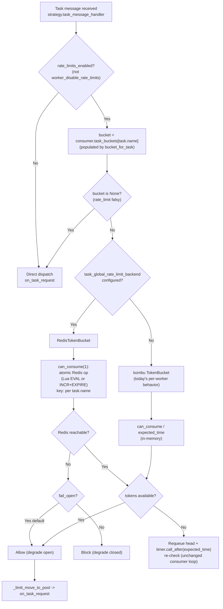

# Technical Specification

# 0. Agent Action Plan

## 0.1 Intent Clarification

### 0.1.1 Core Feature Objective

Based on the prompt, the Blitzy platform understands that the new feature requirement is to **add an opt-in, Redis-backed *global* rate limiter for Celery tasks**, so that a task's existing `rate_limit` value is enforced across the entire worker fleet rather than independently within each worker process.

Today, rate limiting is enforced **per worker process**: each `Consumer` instance builds its own in-memory token bucket for a rate-limited task via `bucket_for_task()`, which returns `TokenBucket(limit, capacity=1)` [celery/worker/consumer/consumer.py:L296-L298]. Consequently a task declared at `10/s` running across ten workers can execute at an aggregate of up to `100/s`. The feature introduces a shared coordination layer (Redis) so the configured limit holds **globally**, while preserving today's behavior byte-for-byte whenever the feature is not configured.

The discrete feature requirements, restated with technical precision, are:

- **Global enforcement of an existing `Task.rate_limit`** using Redis as shared coordination state across all workers consuming the task.
- **Opt-in activation through a single new configuration key** — a Redis URL exposed as the new-style `task_global_rate_limit_backend` (with the legacy `CELERY_GLOBAL_RATE_LIMIT_BACKEND` alias). When unset, the system uses today's per-worker token bucket.
- **Graceful fallback when Redis is unavailable**, with the failure mode being **explicit and configurable** — fail-open (allow the task) or fail-closed (block the task).
- **Preservation of the existing rate-limit expression syntax** (`"10/s"`, `"100/m"`, `"2/h"`), which is parsed today by `rate()` [celery/utils/time.py:L253-L260] against `RATE_MODIFIER_MAP` [celery/utils/time.py:L50-L54]; the parser is reused unchanged.
- **Isolation of all new limiter logic in a dedicated module** (`celery/rate_limiting/redis_rate_limiter.py`).
- **The minimum number of hook points in the worker execution path** required to consult the global limit before a task runs.
- **No new package dependency** — `redis-py` is already available through the `kombu[redis]` extra [requirements/extras/redis.txt:1].
- **Test coverage** via unit tests, plus an optional integration test that exercises real workers against Redis.

The following implicit requirements are surfaced as necessary prerequisites that the prompt does not state outright but that the implementation must satisfy:

- **Configuration plumbing** — the new key must be registered in the `NAMESPACES` registry of `celery/app/defaults.py` so that `app.conf.task_global_rate_limit_backend` resolves; otherwise the setting is invisible to the worker.
- **Interface conformance** — the Redis limiter must expose the same `can_consume(n)` / `expected_time(n)` contract as `kombu.utils.limits.TokenBucket` [celery/worker/consumer/consumer.py:L21], because the consumer's scheduling loop consumes that interface directly at `_schedule_bucket_request()` [celery/worker/consumer/consumer.py:L333-L355].
- **Activation gating with a true no-op** — the global limiter engages only when the backend is configured, `worker_disable_rate_limits` is `False` [celery/app/defaults.py:L337-L339], and the task has a truthy `rate_limit`. A `rate_limit` of `None`/`0` must remain a pure no-op (no bucket created, no Redis key written), exactly as `bucket_for_task()` returns `None` today [celery/worker/consumer/consumer.py:L296-L298].
- **Per-task key namespacing** — Redis keys must be namespaced per `task.name` (mirroring today's per-task bucket keyed by name) so that distinct tasks and distinct applications do not collide.
- **An independent Redis connection** — the limiter must open its own connection from the configured URL and must not assume that the broker or `result_backend` is Redis or even configured.
- **Reload survival** — `WorkController.reload()` refreshes consumer strategies and rate limits, and the runtime control command re-applies limits through `reset_rate_limits()` [celery/worker/consumer/consumer.py:L300-L302]; the global limiter must be re-resolved on these paths just like the local bucket.
- **Atomicity under concurrency** — token accounting must be atomic so that simultaneous workers cannot double-spend the same allowance.
- **Tolerance of Redis being unreachable at worker startup** — limiter construction must not crash worker bootstrap.

### 0.1.2 Special Instructions and Constraints

- **CRITICAL — Minimal Change Clause (strongly emphasized by the user):** make only the changes that are absolutely necessary to implement the feature. Do not refactor, optimize, or restructure unrelated code. Isolate new functionality in its own module. Annotate every edit to an existing file with an explanatory comment, and prefer the approach that requires the least modification to the existing codebase.

- **Architectural conventions to follow:** reuse the existing per-task token-bucket seam rather than introducing a parallel execution path; reuse the existing `rate()` parser for rate strings; follow the established configuration-registration pattern in `celery/app/defaults.py`; and follow the established Redis connection conventions exhibited by `celery/backends/redis.py` [celery/backends/redis.py:L198-L302].

- **Interfaces that must remain unchanged** (the global limiter is additive and orthogonal):
  - The `Task.rate_limit` attribute and its default mapping [celery/app/task.py:L250, celery/app/task.py:L398].
  - The runtime `rate_limit` remote-control command [celery/worker/control.py:L256-L291] and its client entry point `Control.rate_limit` [celery/app/control.py:L578-L596].
  - The `worker_disable_rate_limits` semantics [celery/app/defaults.py:L337-L339].
  - The worker `--concurrency`/`--autoscale` CLI flags and the public methods of `celery.app.task.Task` and `celery.worker.consumer.Consumer`.

- **Subsystems that must remain unaffected:** task retry logic, result backends, the Beat scheduler, and Canvas workflow primitives.

- **User-provided examples (preserved exactly as supplied):**
  - User Example (motivating scenario): a team integrating with a third-party API capped at 100 requests/minute sets `rate_limit="100/m"` and expects the limit to hold even with 20 workers running.
  - User Example (motivating scenario): an autoscaling deployment adds workers under load without overwhelming a downstream service, with the global limiter absorbing the increased worker count transparently.
  - User Example (configuration value): `task_global_rate_limit_backend` (legacy `CELERY_GLOBAL_RATE_LIMIT_BACKEND`) set to a Redis URL such as `redis://localhost:6379/0`.
  - User Example (rate-limit syntax that must keep working unchanged): `"10/s"`, `"100/m"`.

- **Web search requirements:** the prompt's algorithm and edge-case guidance (token bucket vs. sliding window, atomic Redis operations via `INCR`+`EXPIRE` or Lua scripting, fail-open/fail-closed degradation) was researched to validate the implementation strategy; findings are documented in §0.2.2.

### 0.1.3 Technical Interpretation

These feature requirements translate to the following technical implementation strategy, mapping each requirement to a concrete action against a specific component:

- To **enforce the global limit and expose the opt-in setting**, we will register a new `global_rate_limit_backend` option (and an optional `global_rate_limit_fail_open` toggle) in the `task` namespace of `celery/app/defaults.py`, adjacent to the existing `default_rate_limit` option [celery/app/defaults.py:L288]. Because the `task` namespace is declared with `__old__=OLD_NS` where `OLD_NS = {'celery_{0}'}`, a single option addition auto-derives **both** the new-style key `task_global_rate_limit_backend` and the legacy uppercase alias `CELERY_GLOBAL_RATE_LIMIT_BACKEND`, satisfying both naming styles named in the prompt.

- To **implement global coordination while preserving the worker's existing contract**, we will create `celery/rate_limiting/redis_rate_limiter.py` defining a `RedisTokenBucket` that subclasses `kombu.utils.limits.TokenBucket` and overrides only `can_consume()` and `expected_time()` to consult Redis atomically, inheriting the local pending-queue machinery (`add`/`pop`/`contents`/`clear_pending`) unchanged.

- To **intercept the rate check at the minimum possible hook point**, we will modify the single factory `bucket_for_task()` [celery/worker/consumer/consumer.py:L296-L298] to return a `RedisTokenBucket` when the global backend is configured, and the unchanged `TokenBucket` otherwise. Because `reset_rate_limits()` [celery/worker/consumer/consumer.py:L300-L302] funnels worker startup, SIGHUP reload, and the runtime control command through this factory, this one edit covers every bucket-creation path. The strategy module that reads the bucket [celery/worker/strategy.py:L122, celery/worker/strategy.py:L190-L203] requires **no change**.

- To **provide configurable graceful degradation**, the `RedisTokenBucket` will wrap its Redis calls so that a connection failure resolves to allow (fail-open, default) or block (fail-closed) according to the `task_global_rate_limit_fail_open` setting, and will connect lazily so an unreachable Redis at boot does not crash the worker.

- To **guarantee no-new-dependencies and test coverage**, the limiter will use `redis-py` obtained transitively through the existing `kombu[redis]` extra, and we will add `t/unit/rate_limiting/test_redis_rate_limiter.py` using `unittest.mock` (mirroring `t/unit/backends/test_redis.py`), plus an optional `t/integration/test_global_rate_limit.py` marked `@pytest.mark.integration`.

## 0.2 Repository Scope Discovery

### 0.2.1 Comprehensive File Analysis

A systematic traversal of the worker rate-limiting code path identified a single, well-defined integration seam. The per-task token bucket is created by exactly one factory and consumed through a stable interface, which makes the global limiter a drop-in substitution at the factory rather than a change scattered across the execution path.

The existing files that participate in rate limiting, and their role relative to this feature, are catalogued below:

| File | Role in Rate Limiting | Disposition | Locator |
|------|----------------------|-------------|---------|
| `celery/worker/consumer/consumer.py` | `bucket_for_task()` builds the per-task `TokenBucket`; `reset_rate_limits()` rebuilds the `task_buckets` map; `_schedule_bucket_request()`/`_limit_task()`/`_limit_post_eta()` consume the bucket interface | **MODIFY** (factory only) | `consumer.py:L296-L298`, `L300-L302`, `L333-L364` |
| `celery/app/defaults.py` | Central `NAMESPACES` config registry; `task.default_rate_limit` and `worker.disable_rate_limits` live here | **MODIFY** (add one option) | `defaults.py:L288`, `L337-L339` |
| `celery/worker/strategy.py` | Reads the bucket from `consumer.task_buckets` and dispatches via `limit_task`/`limit_post_eta` | **REFERENCE** (unchanged) | `strategy.py:L122`, `L190-L203` |
| `celery/utils/time.py` | `rate()` parses `"10/s"`-style strings to tokens/second | **REFERENCE** (unchanged) | `time.py:L253-L260`, `L50-L54` |
| `celery/app/task.py` | Declares `rate_limit = None` and the `task_default_rate_limit` mapping | **REFERENCE** (unchanged) | `task.py:L250`, `L398` |
| `celery/worker/control.py` | Runtime `rate_limit` control command; calls `reset_rate_limits()` | **REFERENCE** (composes automatically) | `control.py:L256-L291` |
| `celery/app/control.py` | Client-side `Control.rate_limit` broadcast | **REFERENCE** (unchanged) | `control.py:L578-L596` |
| `celery/backends/redis.py` | `redis-py` connection-parameter construction convention | **REFERENCE** (connection precedent) | `redis.py:L198-L302` |

The integration-point discovery resolves to the following findings:

- **Worker execution hook** — The bucket originates solely from `bucket_for_task()` [celery/worker/consumer/consumer.py:L296-L298]: `limit = rate(getattr(type, 'rate_limit', None)); return TokenBucket(limit, capacity=1) if limit else None`. Substituting a Redis-backed bucket here is the entire execution-path change.
- **Consumption interface to preserve** — The consumer's scheduler uses `bucket.pop()`, `bucket.can_consume(tokens)`, `bucket.contents.appendleft(...)`, and `bucket.expected_time(tokens)` [celery/worker/consumer/consumer.py:L333-L355], with `bucket.add(...)` in `_limit_task`/`_limit_post_eta` [celery/worker/consumer/consumer.py:L357-L364] and `bucket.clear_pending()` on close [celery/worker/consumer/consumer.py:L535-L537]. The Redis limiter must honor this full surface; subclassing `kombu.utils.limits.TokenBucket` and overriding only the rate-decision methods does so.
- **All bucket-creation paths converge** — `reset_rate_limits()` [celery/worker/consumer/consumer.py:L300-L302] is invoked at consumer initialization [celery/worker/consumer/consumer.py:L229], on SIGHUP reload, and by the runtime `rate_limit` control command which calls `state.consumer.reset_rate_limits()` [celery/worker/control.py:L284]. A single factory edit therefore covers startup, reload, and runtime override with no additional changes.
- **Configuration anchor** — The `task` namespace already hosts `default_rate_limit=Option(type='string')` [celery/app/defaults.py:L288]; the new option is registered immediately alongside it.
- **No API/model/migration surface** — Celery is a distributed task queue with no mandatory datastore and no HTTP/database models for this feature; the only persistent state is the transient per-task counter in the opt-in Redis instance. There are no database migrations, ORM models, controllers, or middleware affected.

### 0.2.2 Web Search Research Conducted

Research was conducted on distributed/global rate limiting with Redis to validate the algorithm choice, atomicity strategy, and failure handling against current best practice. The findings, synthesized from the Redis official rate-limiter documentation, the freeCodeCamp Redis+Lua rate-limiter guide, the OneUptime token-bucket and rate-limiting guides, and the Hello Interview distributed-rate-limiter breakdown, are:

- **Algorithm selection for the feature type (global task rate limiting):** The token-bucket algorithm is the standard choice for enforcing an average rate while tolerating short bursts, and it uses constant memory per key. It maps directly onto Celery's existing `kombu.utils.limits.TokenBucket` semantics, so a Redis-backed token bucket can preserve the worker's existing `can_consume`/`expected_time` contract. A sliding-window log offers stricter enforcement but consumes memory proportional to request volume and is unnecessary here.

- **Library recommendation for the specific functionality:** Mature Python options exist (the `limits` library and the Lua-based `redis-rate-limiters` package), but because the prompt forbids new dependencies, the recommended path is a small custom limiter implemented directly on `redis-py` (already available via `kombu[redis]`), which is an explicitly documented and common approach.

- **Common pattern for the integration approach (atomicity):** Redis executes Lua scripts atomically on the server, so the read-decide-update cycle cannot be interrupted, eliminating the race condition where two workers both observe an available token and both consume it. This is preferred over `WATCH`/`MULTI`/`EXEC` because it requires no client retry loop and completes in one round trip. A simpler `INCR`+`EXPIRE` fixed-window counter is also atomic and acceptable as a lighter-weight variant; the prompt explicitly permits either. Per-task keys should be namespaced by task name, following the documented "global" single-shared-key pattern adapted to one key per task.

- **Security and reliability considerations for the failure aspect:** Established guidance is to handle Redis failures explicitly and degrade gracefully — defaulting to allow (fail-open) or block (fail-closed) based on risk tolerance. This directly substantiates the prompt's requirement for an explicit, configurable fail-open/fail-closed mode. A secondary consideration is Redis Cluster, where all keys touched by one Lua script must hash to the same slot; a single key per task is unaffected by this constraint.

### 0.2.3 New File Requirements

The following new files will be created. The directories `celery/rate_limiting/` and `t/unit/rate_limiting/` were confirmed not to exist in the repository and will be created as new packages; `t/unit/` already contains an `__init__.py`, so its subpackages require one as well.

- New source files:
  - `celery/rate_limiting/__init__.py` — new package marker; optionally re-exports `RedisTokenBucket` and a small resolution helper.
  - `celery/rate_limiting/redis_rate_limiter.py` — the `RedisTokenBucket` implementation (Redis-backed, `TokenBucket`-compatible) plus its connection handling and fail-open/fail-closed logic.

- New test files:
  - `t/unit/rate_limiting/__init__.py` — test subpackage marker.
  - `t/unit/rate_limiting/test_redis_rate_limiter.py` — unit coverage of allow/block decisions, `expected_time` math, fail-open and fail-closed branches, the `rate_limit=None/0` no-op, and per-task key naming, using `unittest.mock` (mirroring `t/unit/backends/test_redis.py` [t/unit/backends/test_redis.py:L8, L87]).
  - `t/integration/test_global_rate_limit.py` (optional) — `@pytest.mark.integration` test spinning real workers against a live Redis to confirm the aggregate rate is not exceeded.

- New configuration: no new configuration *file* is introduced; the single new setting is registered in the existing `celery/app/defaults.py` registry (see §0.4.1).

## 0.3 Dependency Inventory

**This feature introduces no dependency changes — no packages are added, removed, or version-bumped.**

The implementation relies entirely on packages already present in the project:

- `kombu>=5.6.0` [requirements/default.txt:2] is a core runtime dependency and already provides `kombu.utils.limits.TokenBucket`, the base class the new `RedisTokenBucket` subclasses [celery/worker/consumer/consumer.py:L21].
- `redis-py` is supplied transitively through the existing `redis` extra, declared as `kombu[redis]` [requirements/extras/redis.txt:1] and surfaced as the installable `celery[redis]` extra [setup.py:37]. Operators who enable the global limiter already run Redis (as broker or result backend) and therefore already have this extra installed. The feature requires only that this pre-existing extra be present; it adds no new package and pins no new version.

No test dependency is added either. The unit test will mock Redis with `unittest.mock` (the pattern used by `t/unit/backends/test_redis.py`), so it runs without `redis-py` or a live Redis server — consistent with `requirements/test.txt`, which does not pull in the `redis` extra [requirements/test.txt:1-19]. `fakeredis` is deliberately **not** adopted, as it would constitute a new test-only dependency and violate the no-new-dependencies constraint.

Consequently, no edits are required to `requirements/default.txt`, `requirements/extras/redis.txt`, `requirements/test.txt`, or `setup.py`.

## 0.4 Integration Analysis

### 0.4.1 Existing Code Touchpoints

The feature integrates at exactly two existing-code locations, with a third path inheriting the behavior transparently. All other rate-limiting sites are consuming sites that operate purely on the bucket interface and require no modification.

**Direct modifications required:**

- `celery/app/defaults.py` [task namespace, after `default_rate_limit` at L288] — Register the opt-in setting(s). A single option addition is sufficient and auto-derives both key styles:
  - `global_rate_limit_backend=Option(None, type='string')` → resolves as `task_global_rate_limit_backend` (new) and `CELERY_GLOBAL_RATE_LIMIT_BACKEND` (legacy).
  - `global_rate_limit_fail_open=Option(True, type='bool')` (optional) → the explicit fail-open/fail-closed toggle.
- `celery/worker/consumer/consumer.py` [`bucket_for_task()` at L296-L298] — Substitute the bucket type when the global backend is configured. The smallest viable edit returns a `RedisTokenBucket` (carrying the same parsed `limit` and `capacity=1`, plus the backend URL, the task name for key namespacing, and the fail-open flag) instead of the local `TokenBucket`, falling back to the existing `TokenBucket` when the backend is unset. The edit is annotated with an explanatory comment per the Minimal Change Clause.

**Transparent funnel (no code change):**

- `celery/worker/consumer/consumer.py` [`reset_rate_limits()` at L300-L302] rebuilds `task_buckets` exclusively through `bucket_for_task()`. Because this method is called at consumer initialization [celery/worker/consumer/consumer.py:L229], on SIGHUP reload (via `WorkController.reload()`), and by the runtime `rate_limit` control command [celery/worker/control.py:L284], the single factory edit automatically applies across startup, reload, and runtime-override paths.

**Consuming sites left unmodified:**

- `celery/worker/strategy.py` reads the bucket via `get_bucket = consumer.task_buckets.__getitem__` [celery/worker/strategy.py:L122] and dispatches through `limit_task`/`limit_post_eta` [celery/worker/strategy.py:L190-L203]. Since it uses whatever bucket the factory placed in `task_buckets`, it needs no change.
- The consumer scheduling loop `_schedule_bucket_request()` / `_limit_task()` / `_limit_post_eta()` [celery/worker/consumer/consumer.py:L333-L364] depends only on the `TokenBucket` interface that the subclass preserves.

**Dependency injections:**

- No DI container or service-registry wiring exists or is required. The limiter is resolved lazily inside `bucket_for_task()` from `self.app.conf.task_global_rate_limit_backend`. The Redis connection is created independently by `RedisTokenBucket`, reusing the connection-parameter conventions exhibited by `celery/backends/redis.py` [celery/backends/redis.py:L198-L302]; it is **not** coupled to the broker or `result_backend`.

**Database/Schema updates:**

- None. Celery has no mandatory datastore and this feature adds none. The only persistent artifact is the transient per-task counter/bucket state held in the opt-in Redis instance (a single key per task name, with TTL/expiry managed by the limiter). There are no migrations, ORM models, or schema files involved.

### 0.4.2 Rate-Limit Decision Flow

The diagram below shows how a received task message resolves through the (unchanged) strategy and consumer into the substituted bucket, and how the global decision and failure handling occur inside `RedisTokenBucket`.



## 0.5 Technical Implementation

### 0.5.1 File-by-File Execution Plan

Every file below is either created or modified; reference-only files are listed separately in §0.6.2 as out-of-scope to edit. The plan is grouped by concern and ordered foundation-first.

**Group 1 — Core feature files (new, isolated):**

- CREATE `celery/rate_limiting/__init__.py` — New package marker. Optionally exposes `RedisTokenBucket` and a small resolver used by the consumer factory.
- CREATE `celery/rate_limiting/redis_rate_limiter.py` — Implements `RedisTokenBucket`, the Redis-backed, `TokenBucket`-compatible limiter (the main logic).

**Group 2 — Integration and configuration (modify existing, minimal + commented):**

- MODIFY `celery/app/defaults.py` — Register `global_rate_limit_backend` (and optional `global_rate_limit_fail_open`) in the `task` namespace next to `default_rate_limit` [celery/app/defaults.py:L288].
- MODIFY `celery/worker/consumer/consumer.py` — Substitute `RedisTokenBucket` for `TokenBucket` inside `bucket_for_task()` when the global backend is configured [celery/worker/consumer/consumer.py:L296-L298].

**Group 3 — Tests:**

- CREATE `t/unit/rate_limiting/__init__.py` — Test subpackage marker.
- CREATE `t/unit/rate_limiting/test_redis_rate_limiter.py` — Mock-based unit coverage.
- CREATE (optional) `t/integration/test_global_rate_limit.py` — `@pytest.mark.integration` end-to-end test.
- MODIFY (only if needed) `t/unit/worker/test_consumer.py` — A minimal assertion that `bucket_for_task()` returns a `RedisTokenBucket` when the backend is configured; primary coverage remains in the new test file.

**Group 4 — Documentation:**

- MODIFY `docs/userguide/configuration.rst` — Document `task_global_rate_limit_backend` (and the fail-open toggle) near `task_default_rate_limit`.
- MODIFY `docs/userguide/tasks.rst` — Note global vs. per-worker rate limiting in the rate-limit section.
- MODIFY `docs/getting-started/backends-and-brokers/redis.rst` — Mention Redis powering the optional global limiter.

### 0.5.2 Implementation Approach per File

- **`celery/rate_limiting/redis_rate_limiter.py`** — Define `class RedisTokenBucket(kombu.utils.limits.TokenBucket)`. Override only `can_consume(tokens=1)` and `expected_time(tokens=1)` to consult Redis atomically; inherit `add`, `pop`, `contents`, and `clear_pending` so the per-worker pending queue stays local and the consumer loop is unaffected. Use an atomic Redis operation — a small `EVAL`/`EVALSHA` Lua token-bucket script (recommended for correctness under concurrency) or an `INCR`+`EXPIRE` fixed-window counter (acceptable simpler variant) — keyed per task with a stable prefix such as `celery:global-rate-limit:<task_name>`. Derive the bucket capacity and fill rate from the already-parsed `limit` float (no re-parsing of the rate string). Connect lazily via `redis.Redis.from_url(backend_url)` so an unreachable Redis at construction does not crash the worker, and wrap every Redis call so that on `redis.exceptions.RedisError` the limiter returns allow (fail-open, default) or block (fail-closed) according to the injected flag. A representative override:

```python
def can_consume(self, tokens=1):
    try:
        return self._redis_try_consume(tokens)  # atomic EVAL / INCR+EXPIRE
    except RedisError:
        return self._fail_open  # explicit, configurable degradation
```

- **`celery/app/defaults.py`** — Add the new option(s) to the `task` `Namespace` immediately after `default_rate_limit` [celery/app/defaults.py:L288]. The existing `__old__=OLD_NS` derivation supplies both the new-style and legacy keys, so no manual alias table edit is needed.

- **`celery/worker/consumer/consumer.py`** — In `bucket_for_task()` [celery/worker/consumer/consumer.py:L296-L298], keep the existing `limit = rate(getattr(type, 'rate_limit', None))` and the `None` short-circuit unchanged; when `limit` is truthy and `self.app.conf.task_global_rate_limit_backend` is set, return a `RedisTokenBucket(limit, capacity=1, ...)`, otherwise return the existing `TokenBucket(limit, capacity=1)`. Add a brief explanatory comment. No other method in the file changes.

- **`t/unit/rate_limiting/test_redis_rate_limiter.py`** — Using `unittest.mock`, assert: `can_consume` allows then blocks according to mocked Redis return values; `expected_time` computes the correct backoff; a simulated `RedisError` yields allow under fail-open and block under fail-closed; the limiter namespaces keys by task name; and `bucket_for_task()` returns `None` (no Redis access) when `rate_limit` is `None`/`0`.

- **Documentation files** — Add prose describing the opt-in setting, the global-vs-per-worker semantics, the fail-open/fail-closed behavior, and an example value `redis://localhost:6379/0`. None of these reference Figma assets (none were provided).

### 0.5.3 User Interface Design

Not applicable. Celery has no user interface — per the technical specification's UI determination, operators interact through configuration and the command-line/event-monitoring surfaces only; there is no web, frontend, or design-system layer in the repository. This feature is configuration-only: it is activated by setting `task_global_rate_limit_backend` and surfaces no visual component. Accordingly, no Figma analysis and no Design System Compliance assessment apply to this Agent Action Plan.

## 0.6 Scope Boundaries

### 0.6.1 Exhaustively In Scope

- New global-limiter source package:
  - `celery/rate_limiting/**/*.py` — specifically `__init__.py` and `redis_rate_limiter.py`.
- New and (minimally) touched tests:
  - `t/unit/rate_limiting/**/*.py` — specifically `__init__.py` and `test_redis_rate_limiter.py`.
  - `t/integration/test_global_rate_limit.py` (optional, `@pytest.mark.integration`).
  - `t/unit/worker/test_consumer.py` (only if asserting the configured-factory path).
- Integration points (specific edits):
  - `celery/worker/consumer/consumer.py` — `bucket_for_task()` factory substitution [celery/worker/consumer/consumer.py:L296-L298].
  - `celery/app/defaults.py` — new option(s) in the `task` namespace after `default_rate_limit` [celery/app/defaults.py:L288].
- Configuration:
  - The new settings `task_global_rate_limit_backend` and (optional) `task_global_rate_limit_fail_open`, registered in `celery/app/defaults.py`. No new configuration file is introduced.
- Documentation:
  - `docs/userguide/configuration.rst` (new setting).
  - `docs/userguide/tasks.rst` (global vs. per-worker rate limiting).
  - `docs/getting-started/backends-and-brokers/redis.rst` (Redis as the limiter backend).

### 0.6.2 Explicitly Out of Scope

- **Non-Redis global backends** (Memcached, relational databases, etc.) — Redis is the only coordination backend in this iteration.
- **Per-user, per-argument, or per-queue rate limiting** — enforcement remains at the task level only.
- **Changing how rate limits are expressed** — the `rate()` parser and `RATE_MODIFIER_MAP` [celery/utils/time.py:L253-L260, L50-L54] are reused unchanged; `"10/s"`/`"100/m"` syntax is preserved.
- **The existing per-worker behavior and default** — when the global backend is unset, the path is byte-identical to today's `kombu.utils.limits.TokenBucket`; the default is not altered.
- **The runtime `rate_limit` remote-control command** — `celery/worker/control.py` [celery/worker/control.py:L256-L291] and `celery/app/control.py` [celery/app/control.py:L578-L596] are not modified; the global limiter composes with them automatically via `reset_rate_limits()`.
- **`celery/worker/strategy.py`** — the consuming dispatch site is not modified [celery/worker/strategy.py:L122, L190-L203].
- **The `Task.rate_limit` attribute/interface** [celery/app/task.py:L250, L398] and **`worker_disable_rate_limits` semantics** [celery/app/defaults.py:L337-L339] — unchanged.
- **Unrelated subsystems** — task retry logic, result backends, the Beat scheduler, and Canvas primitives are untouched.
- **Dependency manifests** — no edits to `requirements/*.txt` or `setup.py`; no packages added/removed/upgraded.
- **Performance optimizations and refactors** beyond what the feature strictly requires, per the Minimal Change Clause.
- **UI, dashboards, or monitoring surfaces** for rate-limit state — Celery has no UI.

## 0.7 Rules for Feature Addition

The following feature-specific rules and requirements, emphasized by the user, govern the implementation:

- **Minimal-change discipline (highest priority):** Implement only what is strictly necessary. Confine new logic to the `celery/rate_limiting/` package; restrict edits to existing files to the two surgical changes in `bucket_for_task()` [celery/worker/consumer/consumer.py:L296-L298] and `celery/app/defaults.py` [celery/app/defaults.py:L288]. Annotate each existing-file edit with an explanatory comment. Do not refactor, rename, reorder, or optimize surrounding code.

- **Backward compatibility and opt-in default:** When `task_global_rate_limit_backend` is not set, behavior must be identical to today — the per-worker `kombu.utils.limits.TokenBucket` path. The feature must never change the default execution semantics, and a `rate_limit` of `None`/`0` must remain a complete no-op that performs no Redis access.

- **Convention adherence:** Follow established repository patterns — register configuration through the `NAMESPACES` mechanism in `celery/app/defaults.py` (relying on the `__old__` derivation so both the new-style and legacy keys are produced from one option); reuse the `rate()` parser for rate strings [celery/utils/time.py:L253-L260]; and follow the `redis-py` connection conventions exhibited by `celery/backends/redis.py` [celery/backends/redis.py:L198-L302]. The new limiter must conform to the `TokenBucket` interface (`can_consume`/`expected_time`/`add`/`pop`/`contents`/`clear_pending`) so the unchanged consumer loop continues to work.

- **Integration with existing rate limiting:** The global limiter is additive and orthogonal to the runtime `rate_limit` control command and to `worker_disable_rate_limits`; those interfaces must continue to function unchanged, and the global limiter must be re-resolved on reload and control-driven `reset_rate_limits()` exactly as the local bucket is.

- **Reliability / failure handling:** Redis failures must be handled explicitly and configurably. The default is fail-open (allow the task) to avoid halting task processing on a coordination-layer outage, with fail-closed available via `task_global_rate_limit_fail_open=False`. Construction must tolerate Redis being unreachable at worker startup (lazy connection). Token accounting must be atomic (Lua `EVAL` or `INCR`+`EXPIRE`) so concurrent workers cannot double-spend; per-task keys must carry an expiry so stale state self-cleans.

- **Security considerations:** The limiter opens its own Redis connection from the configured URL and must not assume or reuse the broker/`result_backend` connection. Credentials embedded in the URL must be handled following the same redaction posture Celery applies elsewhere (URLs are not logged in plaintext). Keys are namespaced per task name (and prefixed) to prevent cross-task and cross-application collisions when a Redis instance is shared.

- **No new dependencies:** Use only `redis-py` available through the existing `kombu[redis]` extra; do not add runtime or test packages. Unit tests must mock Redis with `unittest.mock` so they run without a live server, mirroring `t/unit/backends/test_redis.py`.

## 0.8 Attachments

No attachments were provided for this project.

- No document or image attachments (PDFs, screenshots, diagrams) were supplied.
- No Figma frames or design URLs were supplied; consequently there is no Figma design analysis and no design-system mapping in this Agent Action Plan.
- No user-specified implementation rules were supplied (the rules list was empty); the governing constraints documented in §0.7 are derived from the feature prompt itself.

