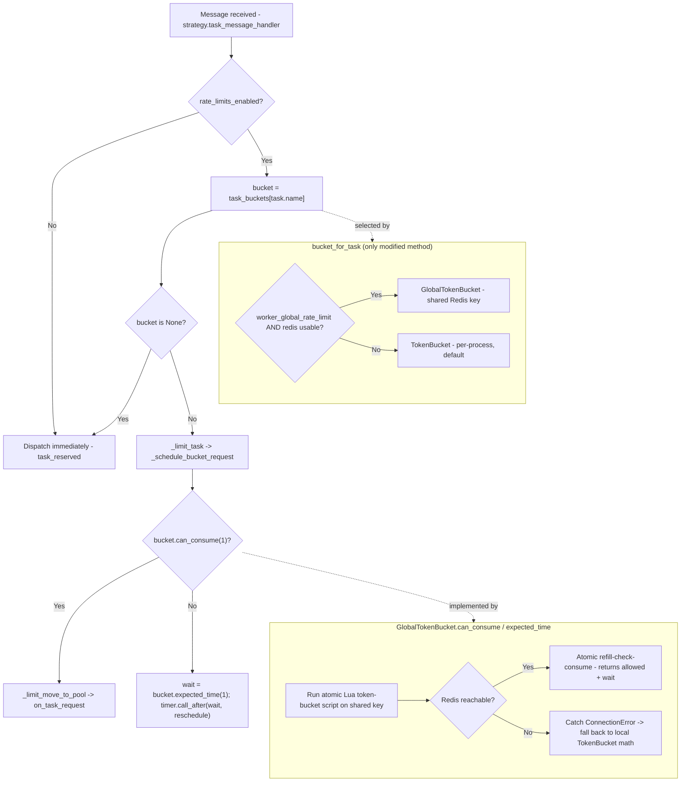

# Technical Specification

# 0. Agent Action Plan

## 0.1 Intent Clarification

### 0.1.1 Core Feature Objective

Based on the prompt, the Blitzy platform understands that the new feature requirement is to **add a Redis-backed global rate limiter to Celery so that a task's configured rate limit is enforced as a single aggregate across the entire worker pool**, rather than independently within each worker process as the framework does today.

The motivating problem is a structural property of Celery's current implementation:

- Celery's built-in rate limiting is enforced per worker process. Each worker constructs its own in-memory token bucket for a task — `bucket_for_task` returns a fresh `TokenBucket(limit, capacity=1)` for every consumer instance [celery/worker/consumer/consumer.py:L296-L298]. That bucket is a `kombu.utils.limits.TokenBucket` [celery/worker/consumer/consumer.py:L21], and the documentation notes the limit applies per worker instance near the `rate_limit` option [docs/userguide/tasks.rst:L934].
- Because the bucket is local to each process, the effective cluster-wide rate scales with the number of workers.
- User-described scenario (preserved): with 10 workers, a task configured at `10/s` can execute at up to `100/s` — ten times the intended limit.

The feature requirement, restated with technical precision:

- Replace the per-process token bucket with a token bucket whose token state is shared in Redis, so that all worker processes and nodes draw tokens from one common pool keyed per task name. The configured rate (for example `10/s`) then becomes the true ceiling for the whole pool regardless of worker count.
- Reuse and extend the existing rate-limiting mechanism ("add redis integration to **the** rate limiter") rather than introducing a parallel, disconnected subsystem.

Implicit requirements surfaced from this objective:

- **Opt-in configuration flag.** The global limiter must be activated through a new configuration option (defaulting to off) so that the default per-worker behavior — and therefore backward compatibility — is preserved for every existing deployment.
- **Redis connection configuration.** A new setting must carry the Redis URL used for the shared token state.
- **Atomic cross-process consumption.** Token consumption must be atomic across processes so two workers racing for the last token cannot both succeed (the prompt explicitly calls for "locks handled appropriately to address race conditions"). The base `kombu` `TokenBucket` is documented as "not thread safe" [kombu/utils/limits.py], which is precisely why cross-process coordination is required.
- **Graceful degradation when Redis is down.** The prompt names "Redis is DOWN" as an explicit edge case; the limiter must catch connection failures and fall back so workers keep functioning.
- **Drop-in interface compatibility.** The shared bucket must satisfy the same interface the rest of the worker already consumes (`can_consume`, `expected_time`, `add`, `pop`, `contents`, `clear_pending`, `capacity`) so that the enforcement, scheduling, reset, and shutdown paths require no changes.
- **Per-task isolation.** The shared Redis state must be keyed per task name, mirroring today's per-task `task_buckets` mapping [celery/worker/consumer/consumer.py:L228].
- **No user exposure.** The mechanism is configuration-driven and internal; it adds no end-user-facing surface.

### 0.1.2 Special Instructions and Constraints

The following directives are captured from the prompt and treated as binding constraints on the implementation:

- **Minimal-change clause (critical).** Make only the changes necessary to deliver the feature. Do not refactor, optimize, or modify unrelated existing code; do not alter existing interfaces or behaviors unless required; isolate new code in dedicated files/components where possible; document edits to existing files with clear comments; and prefer the least-modification option when several approaches exist.
- **Integrate with the existing rate limiter.** User directive: "Add redis integration to the rate limiter for enforcing the limit across workers." The work extends the current token-bucket path, not a separate framework.
- **No user exposure.** User directive: "Users should not be exposed to this." No CLI/API/UI surface is introduced beyond the two internal configuration settings.
- **Testing mandate — real Redis, no mocks.** User directive: add tests proving the rate limit is enforced across **all** workers, plus edge cases for **Redis being DOWN** and for **race conditions handled with locks**. Critically: "DO NOT mock redis — use a CONTAINER to spin up a real instance in unit tests."
- **Build and run.** Build the project per the repository README; install the Redis bundle via `pip install "celery[redis]"` [README.rst:L329]; spin up Redis in a container to confirm functionality. No secrets or environment variables are required.
- **Web search requirement.** Research the canonical pattern for atomic, distributed, Redis-backed token-bucket rate limiting to inform the implementation (documented in §0.2.2).

User Example (preserved exactly as the operative scenario): a task limited to `10/s` running on 10 workers reaches up to `100/s` because each worker enforces `10/s` independently — the global limiter must hold the pool to `10/s`.

### 0.1.3 Technical Interpretation

These feature requirements translate to the following technical implementation strategy, mapping each requirement to a concrete action:

- To enforce one rate across the pool, we will **create** an isolated module `celery/worker/global_ratelimit.py` defining a `GlobalTokenBucket` that subclasses `kombu.utils.limits.TokenBucket` and overrides `can_consume()` / `expected_time()` to draw tokens from a shared Redis key via an atomic Lua token-bucket script.
- To activate it without changing default behavior, we will **modify** the single selection point `bucket_for_task` [celery/worker/consumer/consumer.py:L296-L298] to return the `GlobalTokenBucket` when the new flag is enabled and Redis is usable, and otherwise return the existing `TokenBucket`.
- To expose configuration, we will **modify** the worker namespace in `celery/app/defaults.py` [celery/app/defaults.py:L325-L375] to add `global_rate_limit` and `global_rate_limit_url` options following the established `Option(...)` pattern.
- To handle races atomically, the consume/refill cycle executes inside a server-side Lua script (atomic on Redis), eliminating the read-outside-transaction race window.
- To survive Redis outages, the bucket catches `redis.exceptions.ConnectionError` (and a missing `redis` import) and delegates to the inherited local `TokenBucket` math.
- To validate, we will **create** container-based tests using the repository's existing `RedisContainer` fixtures [t/smoke/conftest.py:L66-L101].
- To document, we will **modify** `docs/userguide/configuration.rst` near the existing `worker_disable_rate_limits` setting [docs/userguide/configuration.rst:L3590-L3592].


## 0.2 Repository Scope Discovery

### 0.2.1 Comprehensive File Analysis

The rate-limiting code path was traced end-to-end. The mechanism is small and well-isolated, which makes a minimal-change integration feasible. The table below enumerates every existing file relevant to the feature and its disposition.

| File | Locator | Role in rate limiting | Disposition |
|------|---------|-----------------------|-------------|
| `celery/worker/consumer/consumer.py` | `bucket_for_task` [L296-L298] | Builds the per-task `TokenBucket`; the single point that decides which bucket a task gets | MODIFY (selection logic + one import) |
| `celery/worker/consumer/consumer.py` | `reset_rate_limits` [L300-L303] | Rebuilds `task_buckets` for all tasks via `bucket_for_task` | UNCHANGED (auto-applies the global bucket) |
| `celery/worker/consumer/consumer.py` | `_schedule_bucket_request` [L333-L355], `_limit_task` [L357-L359], `_limit_post_eta` [L361-L364] | Drive `bucket.pop()` / `can_consume()` / `expected_time()` / `contents` | UNCHANGED (operate on the generic bucket interface) |
| `celery/worker/consumer/consumer.py` | shutdown loop [L534-L537] | Calls `bucket.clear_pending()` on every bucket | UNCHANGED (inherited from `TokenBucket`) |
| `celery/worker/strategy.py` | `task_message_handler` [L121-L125, L190-L203] | Enforcement: `bucket = get_bucket(task.name)` then `limit_task`/`limit_post_eta` | UNCHANGED (consumes `task_buckets[name]` generically) |
| `celery/app/defaults.py` | worker `Namespace` [L325-L375], `disable_rate_limits` [L337-L339] | Configuration registry | MODIFY (add two `Option(...)` entries) |
| `celery/app/control.py` | `rate_limit` [L578] | Runtime control command | UNCHANGED (triggers `reset_rate_limits`) |
| `celery/worker/control.py` | `rate_limit` [L259-L284] | Worker-side handler → `state.consumer.reset_rate_limits()` | UNCHANGED (global bucket auto-applies on runtime change) |
| `celery/app/task.py` | `rate_limit` attr [L250], fallback [L398] | Per-task `rate_limit` declaration | UNCHANGED |
| `celery/utils/time.py` | `rate()` [L253] | Parses `"10/s"` → tokens/sec float | REFERENCE (reused as-is) |
| `celery/backends/redis.py` | `import redis` [L11/L27], `from_url`/`_params_from_url` [L359] | Existing redis-py usage pattern | REFERENCE (style precedent; not modified) |
| `kombu/utils/limits.py` | `TokenBucket` | Base class for the new bucket | REFERENCE (external dependency, subclassed) |

Integration-point discovery (where the feature connects to the system):

- **API/handler endpoints.** Celery exposes no HTTP API; the closest equivalent is the message-strategy handler `task_message_handler` [celery/worker/strategy.py:L190-L203], which already selects and drives the bucket and therefore needs no change.
- **Database models/migrations.** None. The feature stores transient token state in Redis, not in any relational store; there are no models or migrations.
- **Service/handler classes to modify.** Only the `Consumer.bucket_for_task` method [celery/worker/consumer/consumer.py:L296-L298].
- **Middleware/interceptors.** The worker bootstep `Tasks` [celery/worker/consumer/tasks.py:L20] calls `update_strategies()` on start [celery/worker/consumer/tasks.py:L29-L31]; it requires no change because strategies already consume the generic bucket.
- **Configuration.** The worker namespace in `celery/app/defaults.py` [celery/app/defaults.py:L325-L375] is the only configuration surface touched.

A repository-wide search confirmed there are no pre-existing `global_rate_limit` / `GlobalTokenBucket` / "distributed rate" symbols anywhere under `celery/` or `docs/`, so the feature is net-new with no naming collisions.

### 0.2.2 Web Search Research Conducted

Research focused on the canonical, production-proven pattern for atomic distributed token-bucket rate limiting, to ensure the cross-worker race-condition requirement is satisfied correctly.

- **Best practice for distributed token-bucket limiting.** The consensus across the Redis official documentation rate-limiter guides (redis.io) and multiple practitioner write-ups (freecodecamp, hellointerview, oneuptime) is to implement the refill-check-consume cycle inside a server-side Lua script executed via `EVAL`/`EVALSHA`. Redis runs Lua scripts atomically, so the entire decision is race-condition free in a distributed deployment.
- **Why Lua over `MULTI`/`EXEC`.** A `WATCH`/`MULTI`/`EXEC` approach reads the bucket state before the transaction, so two callers can read the same token count and both admit a request (over-admission). Moving read-calculate-update into a single Lua script closes that window. This directly informs the "locks handled appropriately to address race conditions" requirement.
- **Library support for the integration approach.** The `redis-py` client's `register_script()` returns a callable that loads the script once and invokes it via `EVALSHA`, transparently falling back to `EVAL` if the script is evicted — matching the recommended script lifecycle without bespoke caching logic.
- **State representation.** The recommended representation is a Redis hash holding `tokens` and `last_refill`, with lazy refill computed from elapsed time and a TTL set so idle keys expire automatically.
- **Global vs. per-key limits.** A single shared key produces one pool-wide limit; here the key is namespaced per task name so each task keeps an independent global bucket.
- **Connection construction.** `redis.from_url("redis://...")` is the idiomatic constructor (used by the `redis-rate-limiters` package and Celery's own Redis backend), aligning with the planned `worker_global_rate_limit_url` setting.

These findings confirm the chosen design: a `TokenBucket` subclass whose `can_consume()` invokes an atomic Lua token-bucket script over a shared per-task key, with `expected_time()` derived from the returned token deficit, and graceful fallback on `redis.exceptions.ConnectionError`.

### 0.2.3 New File Requirements

New source file:

- `celery/worker/global_ratelimit.py` — Defines `GlobalTokenBucket(kombu.utils.limits.TokenBucket)`, the Redis client construction (`redis.from_url`), the registered Lua token-bucket script, and the graceful-fallback logic. Placed in `celery/worker/` to match the existing module layout (`autoscale.py`, `control.py`, `heartbeat.py`, `state.py`, `strategy.py`, `worker.py`).

New test files (real Redis container, no mocks):

- `t/unit/worker/test_global_ratelimit.py` — Behavioral tests for `GlobalTokenBucket` against a live `RedisContainer`: aggregate consumption across multiple bucket instances sharing one Redis key stays at or below the configured rate (simulating multiple workers); Redis-down fallback; and concurrent consumption without over-admission.
- `t/smoke/tests/test_global_ratelimit.py` — End-to-end multi-worker test asserting a rate-limited task executes at or below the configured rate pool-wide, reusing the existing `redis_test_container` fixtures [t/smoke/conftest.py:L66-L101].
- Optional small `conftest.py` fixture supplying a standalone `RedisContainer` for the unit module, mirroring the smoke configuration [t/smoke/conftest.py:L66-L101].

New configuration: none as separate files — the two new settings are registered in the existing `celery/app/defaults.py` worker namespace [celery/app/defaults.py:L325-L375]; documentation is added to `docs/userguide/configuration.rst`.


## 0.3 Dependency Inventory

**No dependency manifest changes are required** — no packages are added, updated, or removed. Every library the feature needs is already declared, because Redis support is an established, documented extra of Celery.

The packages relevant to this feature (all already present) are:

| Package | Registry | Version constraint (source) | Resolved (verified) | Purpose for this feature |
|---------|----------|-----------------------------|----------------------|--------------------------|
| `redis` (redis-py) | PyPI | transitive via `kombu[redis]` [requirements/extras/redis.txt:L1] | 6.4.0 | Redis client for the shared token state: `from_url`, `register_script`/`eval`/`evalsha` (atomic Lua), `lock` |
| `kombu` | PyPI | `kombu>=5.6.0` [requirements/default.txt:L2] | 5.6.2 | Provides `kombu.utils.limits.TokenBucket`, the base class the new bucket subclasses |
| `pytest-celery[all]` | PyPI | `pytest-celery[all]>=1.3.0` [requirements/test.txt:L2] | 1.3.x | Supplies `RedisContainer` / `pytest_docker_tools` fixtures for the real-Redis container tests |
| `pytest` | PyPI | `pytest==9.0.3` [requirements/test.txt:L1] | 9.0.3 | Test runner |
| `pytest-timeout` | PyPI | `pytest-timeout==2.4.0` [requirements/test.txt:L5] | 2.4.0 | Bounds container/concurrency test runtime |

Rationale and notes:

- `redis-py` is pulled in transitively by the `kombu[redis]` extra [requirements/extras/redis.txt:L1], which is exactly what the README documents installing for Redis support (`pip install "celery[redis]"`) [README.rst:L329]. The global limiter reuses this same client, so deploying the feature requires only the already-documented `celery[redis]` bundle.
- The container test infrastructure is already available through `pytest-celery[all]` [requirements/test.txt:L2]; the existing `t/smoke/conftest.py` already builds a `RedisContainer` [t/smoke/conftest.py:L66-L101]. The "real Redis container, no mocks" mandate therefore needs no new test dependency.
- **Lazy-import nuance.** Because `redis-py` is optional (present only when `celery[redis]` is installed), the new module must import `redis` lazily and degrade gracefully (fall back to the local `TokenBucket`) when the import is missing or the connection fails — this avoids adding a hard runtime dependency and preserves backward compatibility for non-Redis installations.


## 0.4 Integration Analysis

### 0.4.1 Existing Code Touchpoints

The integration deliberately concentrates all behavioral change at one method, leveraging the fact that every downstream consumer already operates on the abstract bucket interface.

Direct modifications required:

- `celery/worker/consumer/consumer.py` — add one import of the new module (alongside `from celery.worker import loops` [celery/worker/consumer/consumer.py:L34]) and modify `bucket_for_task` [celery/worker/consumer/consumer.py:L296-L298] to return a `GlobalTokenBucket` when `app.conf.worker_global_rate_limit` is enabled and a Redis URL is resolvable, else the existing `TokenBucket`.
- `celery/app/defaults.py` — add two options to the worker namespace [celery/app/defaults.py:L325-L375], placed after `disable_rate_limits` [celery/app/defaults.py:L337-L339].

Touchpoints that require no change because they consume the generic bucket interface:

- Enforcement: `task_message_handler` reads `bucket = get_bucket(task.name)` and dispatches via `limit_task`/`limit_post_eta` [celery/worker/strategy.py:L190-L203]; `get_bucket` is just `task_buckets.__getitem__` [celery/worker/strategy.py:L122].
- Scheduling/retry loop: `_schedule_bucket_request` uses `bucket.pop()`, `bucket.can_consume()`, `bucket.contents`, and `bucket.expected_time()` [celery/worker/consumer/consumer.py:L333-L355].
- Bucket population/reset: `reset_rate_limits` rebuilds all buckets through `bucket_for_task` [celery/worker/consumer/consumer.py:L300-L303], so the global bucket is adopted automatically.
- Runtime control: the `rate_limit` control command [celery/worker/control.py:L259-L284] ends in `state.consumer.reset_rate_limits()` [celery/worker/control.py:L284], meaning a live rate change re-selects the global bucket with no change to the control path.
- Shutdown: the cleanup loop calls `bucket.clear_pending()` on each bucket [celery/worker/consumer/consumer.py:L534-L537]; `GlobalTokenBucket` inherits `clear_pending()` from `TokenBucket`.

Dependency injection / wiring: none beyond configuration — the bucket is selected at construction time in `bucket_for_task`; there is no service container to register.

Database / schema updates: none — token state lives in Redis, not in any persistent schema.

### 0.4.2 Control Flow Integration

Because `GlobalTokenBucket` honors the same interface as `TokenBucket`, it slots into the existing flow at exactly one place. The diagram below shows the unchanged enforcement path (white) and the single new decision and component (the global bucket consulting Redis).



Key integration guarantees:

- The shared Redis key is namespaced per task name, so concurrent workers running the same task contend on one bucket while different tasks remain independent (mirroring the per-task `task_buckets` map [celery/worker/consumer/consumer.py:L228]).
- Atomicity is provided by the Lua script (the entire refill-check-consume runs server-side in one step), satisfying the race-condition requirement without a separate client-side lock.
- When Redis is unreachable, `can_consume`/`expected_time` fall back to the inherited local behavior, so a worker continues to function (degraded to per-worker limiting) rather than failing.


## 0.5 Technical Implementation

### 0.5.1 File-by-File Execution Plan

Every file below is created or modified. Modes: **CREATE** (new file), **UPDATE** (edit existing), **REFERENCE** (read-only, reused without edit).

Group 1 — Core feature (new, isolated):

- CREATE `celery/worker/global_ratelimit.py` — `GlobalTokenBucket(kombu.utils.limits.TokenBucket)`, Redis client construction, the registered atomic Lua token-bucket script, and graceful fallback.

Group 2 — Integration (minimal edits):

- UPDATE `celery/worker/consumer/consumer.py` — add one import near the `from celery.worker import loops` line [celery/worker/consumer/consumer.py:L34]; change `bucket_for_task` [celery/worker/consumer/consumer.py:L296-L298] to select the global bucket when enabled, with a clear explanatory comment per the minimal-change clause.
- UPDATE `celery/app/defaults.py` — add `global_rate_limit` and `global_rate_limit_url` options to the worker namespace [celery/app/defaults.py:L325-L375], after `disable_rate_limits` [celery/app/defaults.py:L337-L339].

Group 3 — Tests (real Redis container, no mocks):

- CREATE `t/unit/worker/test_global_ratelimit.py` — aggregate-rate, Redis-down fallback, and concurrency/atomicity tests against a live `RedisContainer`.
- CREATE `t/smoke/tests/test_global_ratelimit.py` — end-to-end multi-worker pool-wide rate assertion reusing `redis_test_container` [t/smoke/conftest.py:L66-L101].
- UPDATE `t/unit/worker/test_consumer.py` — assert `bucket_for_task` returns `GlobalTokenBucket` when enabled and the existing `TokenBucket` otherwise; keep `test_taskbuckets_defaultdict` green [t/unit/worker/test_consumer.py:L58-L60].
- CREATE (optional) a `conftest.py` fixture exposing a standalone `RedisContainer` for the unit module.

Group 4 — Documentation:

- UPDATE `docs/userguide/configuration.rst` — document the two new settings next to `worker_disable_rate_limits` [docs/userguide/configuration.rst:L3590-L3592].
- UPDATE (optional) `docs/userguide/tasks.rst` — cross-reference the global option near the per-worker `rate_limit` caveat [docs/userguide/tasks.rst:L934].

Group 5 — Reference only (no edit):

- REFERENCE `celery/worker/strategy.py` (enforcement consumes the bucket) [celery/worker/strategy.py:L190-L203]; `celery/utils/time.py` `rate()` [celery/utils/time.py:L253]; `celery/backends/redis.py` (redis-py client style) [celery/backends/redis.py:L359]; `kombu/utils/limits.py` (`TokenBucket` base); `README.rst` (build) [README.rst:L329].

### 0.5.2 Implementation Approach per File

- `celery/worker/global_ratelimit.py` — Subclass `TokenBucket`, accepting the fill rate plus Redis connection details and a per-task key. The class shape:

```python
class GlobalTokenBucket(TokenBucket):
    def __init__(self, fill_rate, capacity=1, *, redis_url, key, client=None): ...
```

  Build the client once via `redis.from_url(redis_url)` (mirroring `celery/backends/redis.py` [celery/backends/redis.py:L359]) and register the Lua script via `client.register_script(LUA)` so calls use `EVALSHA` with automatic `EVAL` fallback. The script stores a hash `{tokens, last_refill}` under the shared key, lazily refills `min(capacity, tokens + elapsed * fill_rate)`, and atomically consumes when sufficient, returning `[allowed, wait_seconds]` and setting a TTL. Override `can_consume(tokens=1)` to invoke the script and return the allowed flag (caching `wait`); override `expected_time(tokens=1)` to return that wait. Keep `add()`, `pop()`, `contents`, `clear_pending()`, and `capacity` inherited so the bucket is a drop-in. Wrap Redis calls so `redis.exceptions.ConnectionError` (and a missing `redis` import) degrade to `super().can_consume()` / `super().expected_time()`.

- `celery/worker/consumer/consumer.py` — Keep the existing default path intact and branch only when enabled:

```python
if limit and self.app.conf.worker_global_rate_limit and url:
    return GlobalTokenBucket(limit, capacity=1, redis_url=url, key=type.name)
```

  Wrap construction in `try/except` so a startup-time Redis failure falls back to `TokenBucket(limit, capacity=1)`.

- `celery/app/defaults.py` — Add two options following the established pattern, e.g. `global_rate_limit=Option(False, type='bool')` and `global_rate_limit_url=Option(None, type='string')`; the worker namespace prefix yields the config keys `worker_global_rate_limit` and `worker_global_rate_limit_url` (confirmed by `disable_rate_limits` → `worker_disable_rate_limits` [celery/app/defaults.py:L337-L339]).

- Tests — Use the repository's `RedisContainer` fixtures [t/smoke/conftest.py:L66-L101] to spin up a real Redis. The aggregate test instantiates two or more `GlobalTokenBucket` objects pointing at the same container and one key, drives many `can_consume()` calls over a window, and asserts the total admitted count is at or below the configured rate. The Redis-down test points the bucket at a stopped/closed Redis and asserts it falls back without raising. The concurrency test issues parallel `can_consume()` calls and asserts no over-admission beyond capacity.

- Documentation — Describe both settings, default values, the pool-wide semantics, and the Redis-down fallback behavior near the existing rate-limit settings.

There are no user-provided Figma URLs to reference in any file (none were provided).

### 0.5.3 User Interface Design

User Interface Design is **Not Applicable**. Celery is a library embedded by host applications and has no presentation layer; the technical specification's UI determination explicitly excludes any UI surface and confirms all catalogued features are non-UI (tech-spec §7.1). The prompt likewise states "Users should not be exposed to this." The only operator-facing surface introduced is the two configuration settings, which are textual configuration, not a UI. Accordingly, no design-system catalog, component mapping, or token mapping applies, and the Design System Compliance sub-section is intentionally omitted.


## 0.6 Scope Boundaries

### 0.6.1 Exhaustively In Scope

- New core module:
    - `celery/worker/global_ratelimit.py` — `GlobalTokenBucket`, Redis client, atomic Lua script, graceful fallback.
- Integration edits (existing files):
    - `celery/worker/consumer/consumer.py` — `bucket_for_task` selection [L296-L298] plus one new import.
    - `celery/app/defaults.py` — two new worker-namespace options [L325-L375].
- Tests (real Redis container; no mocks):
    - `t/**/*global_ratelimit*.py` — new unit and smoke tests.
    - `t/unit/worker/test_consumer.py` — updated `bucket_for_task` assertions.
    - Optional `conftest.py` Redis-container fixture for the unit module.
- Configuration surface (settings keys):
    - `worker_global_rate_limit` (bool, default `False`).
    - `worker_global_rate_limit_url` (string, default `None`).
- Documentation:
    - `docs/userguide/configuration.rst` — new settings near `worker_disable_rate_limits` [docs/userguide/configuration.rst:L3590-L3592].
    - `docs/userguide/tasks.rst` (optional) — cross-reference near the per-worker `rate_limit` caveat [docs/userguide/tasks.rst:L934].
- No Figma assets are in scope (none were provided).

### 0.6.2 Explicitly Out of Scope

- The default per-worker rate-limiting path remains the behavior when the feature is disabled; the existing `TokenBucket` branch in `bucket_for_task` is preserved unchanged.
- The enforcement, scheduling, reset, runtime-control, and shutdown paths are not modified — `celery/worker/strategy.py` [L190-L203], `reset_rate_limits` [celery/worker/consumer/consumer.py:L300-L303], `_schedule_bucket_request`/`_limit_task`/`_limit_post_eta` [celery/worker/consumer/consumer.py:L333-L364], the runtime `rate_limit` control [celery/worker/control.py:L259-L284], and the shutdown `clear_pending` loop [celery/worker/consumer/consumer.py:L534-L537].
- `celery/backends/redis.py` and any broker/result-backend code are reference-only; the new module uses its own isolated Redis client and does not modify them.
- `requirements/*` manifests are not changed (redis-py is already available via `kombu[redis]`; container test infrastructure via `pytest-celery[all]`).
- Out of scope entirely: alternative rate-limiting algorithms; refactors or performance optimizations of unrelated code; new CLI/API/UI surfaces; changes to Beat scheduling, Canvas/workflow composition, result backends, autoscaling, or prefetch logic; and any feature beyond the single stated concern — that the configured rate limit is not enforced across the entire worker pool.


## 0.7 Rules for Feature Addition

No separate machine-readable implementation rules were supplied (the project rules list is empty). The following requirements are therefore derived from the directives explicitly emphasized in the prompt and are binding on the implementation.

- Patterns and conventions to follow:
    - Subclass the existing `kombu.utils.limits.TokenBucket` and preserve its public interface (`can_consume`, `expected_time`, `add`, `pop`, `contents`, `clear_pending`, `capacity`) so the new bucket is a drop-in; this keeps every existing call site unchanged and honors the minimal-change clause.
    - Isolate all new logic in the dedicated module `celery/worker/global_ratelimit.py`, consistent with the `celery/worker/` package layout, and add only a single selection branch plus one import to existing code.
    - Register new configuration through the worker `Namespace` using the existing `Option(...)` style [celery/app/defaults.py:L325-L375].
    - Construct the Redis client with `redis.from_url(...)`, matching the precedent in `celery/backends/redis.py` [celery/backends/redis.py:L359].
- Integration requirements with the existing feature:
    - Extend "the rate limiter" rather than building a parallel system — the feature plugs into the existing `task_buckets` → `bucket_for_task` → strategy enforcement path [celery/worker/consumer/consumer.py:L296-L298].
    - Default behavior must be unchanged: the global limiter is opt-in (`worker_global_rate_limit` defaults to `False`), guaranteeing backward compatibility.
- Reliability / correctness requirements:
    - Atomic, race-free token consumption across workers via a server-side Lua script (no read-outside-transaction window); locks/atomicity must prevent over-admission when multiple workers contend.
    - Graceful degradation when Redis is down — catch `redis.exceptions.ConnectionError` and fall back to local `TokenBucket` semantics so workers continue running.
    - Per-task key isolation so distinct tasks maintain independent global buckets.
- Testing requirements (explicit and non-negotiable):
    - Tests must prove the rate limit holds across **all** workers (aggregate ≤ configured rate).
    - Tests must cover the **Redis-down** edge case and **race-condition / lock** behavior.
    - **Do not mock Redis** — use a **container** to spin up a real Redis instance in tests, reusing the repository's `RedisContainer` fixtures [t/smoke/conftest.py:L66-L101].
- Delivery requirements:
    - Build per the repository README; install via `pip install "celery[redis]"` [README.rst:L329]. No secrets or environment variables are required.
    - Document any edits to existing files with clear comments, and prefer the least-modification option where alternatives exist.
- Non-exposure requirement:
    - The feature must not introduce any end-user-facing surface ("Users should not be exposed to this"); it is configuration-driven and internal.


## 0.8 Attachments

- Attachments provided: **None.** No PDF, image, or document attachments were supplied with this request.
- Figma designs provided: **None.** No Figma frames or URLs were supplied; consequently there is no design analysis, no design-system catalog, and no design-to-system mapping for this feature (consistent with §0.5.3, which establishes that no UI is involved).

For traceability, the external materials referenced in the prompt (not file attachments) are:

- Celery rate-limit documentation — `https://docs.celeryq.dev/en/stable/userguide/tasks.html#rate-limits` — cited by the user to describe the existing per-worker rate-limit semantics that motivate the feature.
- Repository `README.rst` — cited as the build/installation source; relevant lines include the Redis bundle install instruction `pip install "celery[redis]"` [README.rst:L329].


