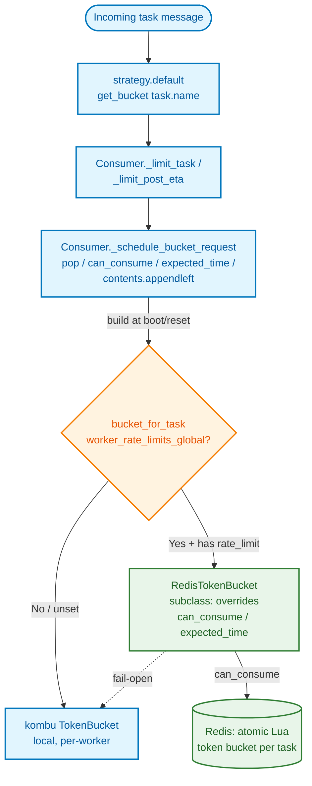

# Technical Specification

# 0. Agent Action Plan

## 0.1 Intent Clarification

This section translates the user's request into a precise, implementation-ready statement of intent for the Blitzy platform. The feature targets the Celery distributed task queue (version `5.6.2` per `[celery/__init__.py:L27]`), specifically the worker-side task rate-limiting subsystem (existing feature **F-010**, per Technical Specification §4.10.2).

### 0.1.1 Core Feature Objective

Based on the prompt, the Blitzy platform understands that the new feature requirement is to add an **opt-in, Redis-backed global (cluster-wide) rate limiter for Celery tasks**, so that a task's existing `rate_limit` (for example `"10/s"`) becomes the *aggregate* ceiling across **all** workers rather than being enforced independently by each worker.

The motivating problem is rooted in current behavior: Celery enforces `Task.rate_limit` with an in-memory token bucket constructed per worker. The documentation itself states this is a per-worker limit — <cite index="2-11">the token bucket algorithm is a popular rate limiting approach that allows bursts of traffic while maintaining an average rate limit over time</cite>, but Celery's bucket lives only inside one worker process `[docs/userguide/tasks.rst:L1032-L1035]`. Consequently, the effective cluster rate equals `rate_limit × number_of_workers`; ten workers configured for `"10/s"` admit ~100/s in aggregate, which overruns third-party API quotas and triggers HTTP 429 throttling. The current documented workaround — restricting the task to a single queue — does not scale and breaks under autoscaling `[docs/userguide/tasks.rst:L1033-L1035]`.

The clarified, enumerated requirements are:

- **R1 — Opt-in flag.** Introduce a worker setting `worker_rate_limits_global` (boolean, default `False`) that gates the new behavior. When unset or `False`, rate limiting must remain byte-for-byte identical to today's local token-bucket path.
- **R2 — Coordinating Redis URL.** Introduce a worker setting `worker_rate_limit_url` (string, default `None`) naming the coordinating Redis. When `None`, resolve from `result_backend`, then `broker_url`, when either uses a Redis scheme `[celery/app/defaults.py:L205-L208,celery/app/defaults.py:L83-L84]`.
- **R3 — Bucket selection.** When the flag is enabled and a task declares a `rate_limit`, the consumer's bucket factory must return a Redis-backed bucket instead of the in-memory `kombu.utils.limits.TokenBucket` `[celery/worker/consumer/consumer.py:L296-L298]`.
- **R4 — Atomic distributed enforcement.** A new `RedisTokenBucket` must enforce the limit via a single atomic Lua script over a per-task Redis hash. The refill-check-consume cycle runs server-side so concurrent workers cannot double-spend tokens, and refill timing uses Redis server time to be immune to worker clock skew.
- **R5 — Fail-open resilience.** On a Redis connection or timeout error, the limiter must log a (throttled) warning and fall back to a local token-bucket decision, degrading to today's per-worker behavior rather than halting task consumption.
- **R6 — Runtime control parity.** The existing broadcast control command `app.control.rate_limit(task_name, rate)` must continue to work and now take effect cluster-wide, because bucket state lives in Redis keyed by task name and `reset_rate_limits()` rebuilds at the same key `[celery/worker/control.py:L256-L284]`.
- **R7 — Documentation.** Document both new settings in the configuration reference and document the new global behavior in the task user guide.
- **R8 — Test coverage.** Add unit and integration tests proving cluster-wide enforcement, and extend existing defaults/consumer tests without altering existing cases.

Implicit requirements and prerequisites surfaced during analysis:

- **Implicit (critical) — subclass the kombu bucket.** Although the prompt characterizes the new bucket's `add()` as a "no-op," the consumer's request-scheduling path relies on the **full** kombu `TokenBucket` queue protocol: `add()` enqueues a deferred request, `pop()` / `contents.appendleft()` requeue it, and `clear_pending()` drains it on shutdown `[celery/worker/consumer/consumer.py:L333-L364,celery/worker/consumer/consumer.py:L535-L537]`. A pure no-op `add()` would cause `pop()` to raise `IndexError` and tasks would never reach the pool. The correct minimal-change design is therefore for `RedisTokenBucket` to **subclass** `kombu.utils.limits.TokenBucket` and override only `can_consume()` and `expected_time()`, inheriting the deque-based request-queue machinery unchanged. The per-worker request **queue** stays local; only the **token decision** becomes global. Subclassing does not modify kombu, honoring the do-not-touch constraint.
- **Implicit — lazy redis import.** There is currently no `import redis` anywhere in `celery/worker/` (verified by repository scan), so the new module must import `redis` lazily inside the enabled branch to keep the default-off path import-free and connection-free.
- **Implicit — own client, not the result backend.** The limiter must open and cache its **own** Redis client, mirroring the import-guard and `ImproperlyConfigured` validation pattern of the result backend `[celery/backends/redis.py:L26-L31,celery/backends/redis.py:L204]` without reusing or modifying it.
- **Implicit — pool-agnostic and non-blocking.** The change must work across prefork, eventlet, gevent, and solo pools; a short Redis socket timeout is required so a slow Redis cannot stall the eventlet/gevent hub.

### 0.1.2 Special Instructions and Constraints

The user emphasized a strict **Minimal Change Clause**: the total footprint is one new module, approximately six changed lines in `consumer.py`, two new settings in `defaults.py`, documentation, and tests. No refactoring of existing code is permitted (for example, `reset_rate_limits()` must not be "cleaned up"), and duck-typing/subclassing is preferred over introducing an abstraction, registry, or plugin layer.

Explicit **Do-Not-Touch** directives (treated as reference-only):

- `kombu` and `kombu.utils.limits.TokenBucket` — external dependency; subclass, never edit.
- `celery/worker/strategy.py` — consumes the bucket via `task_buckets.__getitem__`, `_limit_task`, and `_limit_post_eta` `[celery/worker/strategy.py:L122-L125,celery/worker/strategy.py:L190-L203]`.
- `celery/worker/control.py` — the `rate_limit` broadcast command `[celery/worker/control.py:L256-L284]`.
- `celery/backends/redis.py` — the result backend; a validation pattern reference only.
- `celery/app/task.py` — the `Task.rate_limit` attribute.
- The prefork/eventlet/gevent/solo pool implementations.

**Contracts to keep unchanged:** the `Task.rate_limit` string format (`"10/s"`, `"100/m"`, `"50/h"`, or a number) parsed by `celery.utils.time.rate()` `[celery/utils/time.py:L253-L260]`; the `app.control.rate_limit` API and reply shape; the bucket protocol consumed by `strategy.default()` and `Consumer._limit_task()`; the `task_buckets` `defaultdict` shape `[celery/worker/consumer/consumer.py:L228]`; and the public setting names `worker_disable_rate_limits` `[celery/app/defaults.py:L337-L339]` and `task_default_rate_limit` `[celery/app/defaults.py:L288]`.

Preserved user-provided usage examples (verbatim intent):

- **User Example (static configuration):** set `worker_rate_limits_global = True` (with an optional `worker_rate_limit_url` Redis URL) and define `@app.task(rate_limit="10/s")`; scaling from 1 to 10 workers keeps observed throughput at approximately 10/s.
- **User Example (runtime adjustment):** `app.control.rate_limit("tasks.send_sms", "5/m")` takes effect cluster-wide because bucket state lives in Redis keyed by task name.

**Web search requirement:** the prompt requires implementation to follow established distributed rate-limiting practice. Research was conducted to corroborate the Redis token-bucket-with-Lua pattern and the redis-py scripting API (documented in §0.2.2); no additional library is mandated.

### 0.1.3 Technical Interpretation

These feature requirements translate to the following technical implementation strategy:

- To make the per-task limit cluster-wide, **create** `celery/worker/rate_limits.py` containing `RedisTokenBucket` (a `kombu.utils.limits.TokenBucket` subclass), a module-level Lua script, redis-py `register_script` registration, and a cached `get_limiter_client(app)` factory.
- To activate the new bucket only when requested, **modify** `Consumer.bucket_for_task()` `[celery/worker/consumer/consumer.py:L296-L298]` with an `app.conf.worker_rate_limits_global` branch (~6 lines, lazy import), leaving `reset_rate_limits()` structurally intact `[celery/worker/consumer/consumer.py:L300-L303]`.
- To expose configuration, **modify** the `worker` namespace in `celery/app/defaults.py` to add the two `Option` entries adjacent to `disable_rate_limits` `[celery/app/defaults.py:L325-L374]`.
- To document the feature, **modify** `docs/userguide/configuration.rst` (Worker section) and **extend** the per-worker note in `docs/userguide/tasks.rst` `[docs/userguide/tasks.rst:L1032-L1035]`.
- To validate the feature, **create** `t/unit/worker/test_rate_limits.py` and `t/integration/test_global_rate_limit.py`, and **extend** `t/unit/app/test_defaults.py` and `t/unit/worker/test_consumer.py`.

Because the new bucket is interface-compatible with the existing one, the entire downstream pipeline — `strategy.default()` → `Consumer._limit_task()` / `_limit_post_eta()` → `_schedule_bucket_request()` → timer rescheduling — remains untouched, and the three callers of `reset_rate_limits()` automatically rebuild the new bucket type when the flag is enabled `[celery/worker/consumer/consumer.py:L229,celery/worker/control.py:L284,celery/worker/worker.py:L275]`.

## 0.2 Repository Scope Discovery

This section maps the feature to concrete files in the existing repository, enumerates every integration point that touches the rate-limit machinery, records the external research that informed the design, and lists the new files to be created.

### 0.2.1 Comprehensive File Analysis and Integration Point Discovery

A full-repository scan for every rate-limit symbol (`bucket_for_task`, `task_buckets`, `reset_rate_limits`, `_limit_task`, `_limit_post_eta`, `_schedule_bucket_request`, `TokenBucket`, `disable_rate_limits`) yields the complete set of affected and adjacent files below.

The single existing definition of the bucket factory is the only behavioral edit site:

```python
def bucket_for_task(self, type):
    limit = rate(getattr(type, 'rate_limit', None))
    return TokenBucket(limit, capacity=1) if limit else None
```

This is `[celery/worker/consumer/consumer.py:L296-L298]`, called once per registered task by `reset_rate_limits()` `[celery/worker/consumer/consumer.py:L300-L303]`.

**Existing files requiring modification:**

| File | Locator | Role | Change |
|------|---------|------|--------|
| `celery/worker/consumer/consumer.py` | `L296-L298` | Bucket factory (`bucket_for_task`) | Add `worker_rate_limits_global` branch (~6 lines, lazy import) |
| `celery/app/defaults.py` | `L325-L374` (worker namespace) | Settings registry | Add `rate_limits_global` and `rate_limit_url` Options |
| `docs/userguide/configuration.rst` | `~L3590-L3597` (Worker section) | Settings reference | Document both new settings |
| `docs/userguide/tasks.rst` | `L1032-L1035` | `Task.rate_limit` guide | Extend with the global-limiter subsection |

**Integration points — consumed/triggered automatically, requiring no edit:**

| Integration point | Locator | Why no change is needed |
|-------------------|---------|--------------------------|
| `reset_rate_limits()` caller — consumer boot | `[celery/worker/consumer/consumer.py:L229]` | Rebuilds buckets at boot; picks up new bucket type when flag on |
| `reset_rate_limits()` caller — runtime control | `[celery/worker/control.py:L284]` | `app.control.rate_limit` rebuild path; propagates cluster-wide |
| `reset_rate_limits()` caller — worker reload | `[celery/worker/worker.py:L275]` | `WorkController.reload()` rebuild; auto-benefits |
| `strategy.default()` bucket consumption | `[celery/worker/strategy.py:L122-L125,celery/worker/strategy.py:L190-L203]` | Interface-compatible; talks only `can_consume`/`expected_time` |
| `_schedule_bucket_request` / `_limit_task` / `_limit_post_eta` | `[celery/worker/consumer/consumer.py:L333-L364]` | Uses inherited kombu queue protocol (`pop`/`contents`/`add`) |
| Shutdown drain (`clear_pending`) | `[celery/worker/consumer/consumer.py:L535-L537]` | Inherited from kombu `TokenBucket` |
| Config plumbing (`disable_rate_limits`) | `[celery/worker/worker.py:L407-L408,celery/worker/components.py:L243]` | Deliberately **not** replicated; new settings read from `app.conf` |

The data and control flow, with the new branch isolated to a single decision point, is:



**Reference-only and explicitly excluded files** discovered during the scan: `celery/backends/redis.py` (result backend; URL-validation pattern reference) `[celery/backends/redis.py:L26-L31]`; `celery/events/snapshot.py` (an unrelated `TokenBucket` use for the events-camera max rate) `[celery/events/snapshot.py:L43]`; `docs/userguide/extending.rst` (documents the `bucket_for_task` extension seam — optional, outside the prompt's named docs scope) `[docs/userguide/extending.rst:L563-L570]`; and the reference test suites `t/unit/worker/test_strategy.py` and `t/unit/worker/test_control.py` that validate the contracts which must not break.

### 0.2.2 Web Search Research Conducted

Research validated the standard implementation approach for distributed rate limiting and the redis-py scripting API:

- **Best practice for the feature type (global rate limiting).** The canonical distributed token-bucket stores state in a Redis hash and runs the entire refill-check-consume cycle inside one server-side Lua script. <cite index="2-12,2-13">Multiple application servers can share the same rate limit counters; the core of this implementation is a Lua script that runs atomically on the Redis server, which ensures that checking and updating the token bucket happens in a single operation, preventing race conditions in distributed environments.</cite> This directly maps to the feature's goal of one shared bucket per task type across all workers.
- **Atomicity rationale.** <cite index="5-10,5-11,5-12,5-13">Redis executes Lua scripts atomically on the server; no other command runs between the script's reads and writes; unlike MULTI/EXEC, you can use if/then logic to branch on values you just read, and unlike WATCH, there's no retry loop.</cite> This justifies the single-script design over a multi-command WATCH/MULTI transaction.
- **Operational caveats.** <cite index="5-16,5-17,5-18">Lua scripts block the Redis event loop while they run, so scripts should be kept short and avoid expensive operations.</cite> The feature's script issues only a handful of fast hash operations. Additionally, <cite index="5-19,5-20,5-21">in Redis Cluster, all keys accessed by a script must hash to the same slot, but single-key algorithms such as the token bucket aren't affected</cite> — the per-task single-key design is cluster-safe by construction.
- **Library recommendation and integration pattern.** Python implementations are built directly on redis-py. <cite index="11-5,11-6,11-7,11-8,11-9">redis-py supports the EVAL, EVALSHA, and SCRIPT commands, but exposes a Script object that makes scripting much easier to use; to create one, use the register_script function on a client instance passing the Lua code, which returns a Script instance you can use throughout your code.</cite> Crucially for reliability, <cite index="13-37,13-38">the Script object ensures the Lua script is loaded into Redis's script cache, and in the event of a NOSCRIPT error it will load the script and retry executing it.</cite> This is exactly the lazy, self-healing registration the feature needs, so no manual EVALSHA/`SCRIPT LOAD` bookkeeping is required. The redis-py `register_script` API is stable across redis-py 2.x through 7.x, so no minimum-version floor is introduced.
- **Key-naming pattern.** The common Redis rate-limiter key conventions include a <cite index="2-17">global pattern — a single limit shared across all requests</cite>; the feature adopts a per-task variant, `celery:rate_limit:{app}:{task_name}`, giving one global bucket per task type.
- **Design choice — server time.** To remain immune to worker clock skew, the script derives "now" from Redis server time rather than a client-supplied timestamp, consistent with the atomic single-round-trip approach above.

### 0.2.3 New File Requirements

- `celery/worker/rate_limits.py` — the sole new logic module: the redis import guard, the module-level Lua script, redis-py `register_script` registration, the `RedisTokenBucket(TokenBucket)` subclass (overriding `can_consume`/`expected_time`), the fail-open local shadow, and the cached `get_limiter_client(app)` factory.
- `t/unit/worker/test_rate_limits.py` — unit coverage with a mocked `redis.Redis` (mirroring the `unittest.mock` + `ContextMock` pattern in `[t/unit/backends/test_redis.py:L87]`; fakeredis is not a project dependency): script invocation, key scheme, subclass/inheritance, `ImproperlyConfigured` paths, client resolution/caching, and fail-open behavior.
- `t/integration/test_global_rate_limit.py` — integration coverage exercising two workers against one real Redis (already provisioned by CI per `[.github/workflows/integration-tests.yml:L31-L38]`), asserting the aggregate observed rate approximates the configured limit rather than `limit × worker_count`, with a single-worker baseline.

No new configuration files (such as YAML) are required; the feature's configuration surface consists entirely of the two settings added to `celery/app/defaults.py`.

## 0.3 Dependency and Integration Analysis

### 0.3.1 Dependency Impact

This feature introduces **no dependency changes** — no additions, updates, or removals. The only third-party library it uses, redis-py, is already declared transitively through Celery's existing `redis` extra: `requirements/extras/redis.txt` contains the single line `kombu[redis]` `[requirements/extras/redis.txt:L1]`, and the `redis` extra is registered in `setup.py` `[setup.py:L123-L125]`. Celery declares no direct redis-py version pin, inheriting whatever `kombu[redis]` resolves; the `register_script` API used here is stable across redis-py 2.x–7.x, so no version floor is warranted.

redis-py is therefore already present on both test paths: the unit-CI requirements pull it in via `requirements/test-ci-base.txt`, and the integration requirements via `requirements/test-integration.txt`. No dependency manifest (`setup.py`, `requirements/*.txt`, `pyproject.toml`) is modified, and the optional dependency inventory table is omitted accordingly.

The only operator-facing prerequisite is a documentation note rather than a code dependency: to *use* the global limiter, an operator must have the redis extra installed (`pip install "celery[redis]"`) and a reachable Redis — precisely the environment of anyone already using a Redis broker or result backend. When the feature is enabled but `redis` is not importable, the new module raises `ImproperlyConfigured`, mirroring the result backend's guard `[celery/backends/redis.py:L204]`. When the feature is disabled (the default), no `redis` import is attempted at all.

### 0.3.2 Existing Code Touchpoints

**Direct modification (single site):**

- `Consumer.bucket_for_task()` `[celery/worker/consumer/consumer.py:L296-L298]` — add a branch returning `RedisTokenBucket` when `self.app.conf.worker_rate_limits_global` is truthy and the task has a `limit`; otherwise the existing `TokenBucket` path is unchanged.

**Configuration surface:**

- `celery/app/defaults.py` worker namespace `[celery/app/defaults.py:L325-L374]` — two new `Option` entries adjacent to `disable_rate_limits` `[celery/app/defaults.py:L337-L339]`, flattened by `defaults.flatten()` to `worker_rate_limits_global` and `worker_rate_limit_url`.

**Automatic, no-edit integrations** (the new bucket flows through these because it is interface-compatible and is rebuilt at the same `task_buckets` keys):

- The three `reset_rate_limits()` callers: consumer boot `[celery/worker/consumer/consumer.py:L229]`, runtime control `[celery/worker/control.py:L284]`, and worker reload `[celery/worker/worker.py:L275]`.
- The strategy bucket consumers `[celery/worker/strategy.py:L122-L125,celery/worker/strategy.py:L190-L203]`.
- The request-queue machinery `_schedule_bucket_request` / `_limit_task` / `_limit_post_eta` and shutdown `clear_pending` `[celery/worker/consumer/consumer.py:L333-L364,celery/worker/consumer/consumer.py:L535-L537]`, which depend on the kombu queue protocol inherited by the subclass.

**Config plumbing deliberately not touched:** unlike `worker_disable_rate_limits`, which is plumbed through the `WorkController` `[celery/worker/worker.py:L407-L408]` and `components.py` `[celery/worker/components.py:L243]` into `Consumer.__init__`, the two new settings are read directly from `self.app.conf` inside `bucket_for_task`. This avoids edits to `worker.py` and `components.py` and keeps the consumer change to roughly six lines.

**Dependency injection / database:** not applicable. Celery has no DI container; wiring is the `app.conf` read plus the existing `task_buckets` mapping. There is no database schema or migration — the only external state is the per-task Redis hash (key scheme `celery:rate_limit:{app.main or 'celery'}:{task_name}`), created at runtime by the Lua script and expired by a TTL.

## 0.4 Technical Implementation

### 0.4.1 File-by-File Execution Plan

Every file below must be created or modified; reference files are read for pattern/contract fidelity and must not change.

| Mode | File | Purpose |
|------|------|---------|
| CREATE | `celery/worker/rate_limits.py` | `RedisTokenBucket` subclass, module-level Lua script, `register_script`, `get_limiter_client(app)`, fail-open shadow |
| UPDATE | `celery/worker/consumer/consumer.py` | Branch `bucket_for_task()` on `worker_rate_limits_global` (~6 lines, lazy import) `[celery/worker/consumer/consumer.py:L296-L298]` |
| UPDATE | `celery/app/defaults.py` | Add `rate_limits_global` + `rate_limit_url` to the worker namespace `[celery/app/defaults.py:L325-L374]` |
| UPDATE | `docs/userguide/configuration.rst` | Document both settings in the Worker section |
| UPDATE | `docs/userguide/tasks.rst` | Extend the per-worker note with the global subsection `[docs/userguide/tasks.rst:L1032-L1035]` |
| CREATE | `t/unit/worker/test_rate_limits.py` | Unit tests with mocked `redis.Redis` |
| CREATE | `t/integration/test_global_rate_limit.py` | Two-worker integration test against real Redis |
| UPDATE | `t/unit/app/test_defaults.py` | Assert the two new settings resolve to their defaults |
| UPDATE | `t/unit/worker/test_consumer.py` | Append bucket-selection cases (existing cases untouched) |
| REFERENCE | `celery/worker/strategy.py`, `celery/worker/control.py`, `celery/worker/worker.py`, `celery/worker/components.py` | Bucket consumers / `reset_rate_limits` callers / plumbing — unchanged |
| REFERENCE | `celery/backends/redis.py` | Redis URL validation + `ImproperlyConfigured` pattern `[celery/backends/redis.py:L26-L31,celery/backends/redis.py:L204]` |
| REFERENCE | `kombu.utils.limits.TokenBucket`, `celery/utils/time.py`, `celery/exceptions.py`, `celery/utils/log.py` | Superclass + `rate()` `[celery/utils/time.py:L253-L260]` + `ImproperlyConfigured` `[celery/exceptions.py:L206]` + `get_logger` `[celery/utils/log.py:L97]` |
| REFERENCE | `t/unit/backends/test_redis.py`, `t/unit/conftest.py`, `t/integration/conftest.py`, `t/integration/tasks.py`, `tox.ini`, `.github/workflows/integration-tests.yml` | Mocking pattern, app fixtures, broker/backend env, integration env + CI Redis service |

### 0.4.2 Implementation Approach per File

**`celery/worker/rate_limits.py` (create) — establishes the feature foundation:**

- A redis import guard at module top mirroring the backend (`try: import redis ... except ImportError: redis = None`) `[celery/backends/redis.py:L26-L31]`, plus a "redis missing" message reused when the feature is enabled without redis installed.
- A module-level Lua string implementing the token bucket: it reads the per-task hash (`tokens`, `last_refill`), initializes to capacity on first use, computes refill from elapsed Redis server time (`redis.call('TIME')`), conditionally decrements, writes back, sets a TTL via `EXPIRE`, and returns an `(allowed, wait_ms)` pair (integers, since Lua truncates floats — the wait is converted to seconds client-side).
- `class RedisTokenBucket(TokenBucket)` calling `super().__init__(fill_rate, capacity)` and storing `client`, `key`, and `client.register_script(LUA)`. It overrides only:
  - `can_consume(tokens=1)` — runs the script, caches the returned wait, returns a bool; on `redis` connection/timeout errors it logs a throttled warning via the module logger and delegates to a lazily-built local `TokenBucket` shadow (fail-open).
  - `expected_time(tokens=1)` — returns the wait cached by `can_consume`, avoiding a second round trip.
  - It inherits `contents`, `add()`, `pop()`, and `clear_pending()` unchanged, so the per-worker request queue used by `_schedule_bucket_request` keeps working `[celery/worker/consumer/consumer.py:L333-L364]`.
- `get_limiter_client(app)` resolves the URL (`worker_rate_limit_url` → `result_backend` → `broker_url` when Redis-scheme), validates the scheme (`redis`/`rediss`/`redis+socket`) raising `ImproperlyConfigured` otherwise, builds one `redis.Redis` per app with short socket/connect timeouts (so eventlet/gevent hubs are not stalled), and caches it for reuse.

**`celery/worker/consumer/consumer.py` (modify) — integrates with the existing system.** The factory gains a guarded branch; the original body remains as the fallback:

```python
if limit and self.app.conf.worker_rate_limits_global:
    from celery.worker.rate_limits import RedisTokenBucket, get_limiter_client
    return RedisTokenBucket(limit, capacity=1, client=..., key=...)
```

The lazy import keeps the default-off path import-free, and `reset_rate_limits()` is left untouched `[celery/worker/consumer/consumer.py:L300-L303]`.

**`celery/app/defaults.py` (modify) — exposes configuration.** Two `Option` entries are added inside the worker `Namespace`:

```python
rate_limits_global=Option(False, type='bool'),
rate_limit_url=Option(None, type='string'),
```

`defaults.flatten()` derives the public names `worker_rate_limits_global` and `worker_rate_limit_url`.

**Documentation (modify) — documents usage and configuration.** `configuration.rst` gains `.. setting::` blocks for both settings in the Worker section; `tasks.rst` gains a short subsection after the existing per-worker note `[docs/userguide/tasks.rst:L1032-L1035]` explaining the opt-in global behavior, the URL fallback, the redis-extra requirement, and the fail-open-to-per-worker degradation.

**Tests (create/extend) — ensure quality.** `test_defaults.py` asserts the two settings resolve to `False`/`None`. `test_consumer.py` appends cases (global-off → `TokenBucket`; global-on with a patched `get_limiter_client` → `RedisTokenBucket`; no `rate_limit` → `None`), without altering existing cases such as `test_taskbuckets_defaultdict` `[t/unit/worker/test_consumer.py:L57-L60]`. The new `test_rate_limits.py` mocks `redis.Redis`/`register_script` and verifies script parsing, the key scheme, the subclass relationship and inherited queue methods, the `ImproperlyConfigured` paths, client resolution/caching, and fail-open warning logging. The new `test_global_rate_limit.py` runs under the integration-redis toxenv and asserts aggregate throughput across two workers approximates the configured limit.

### 0.4.3 User Interface Design

Not applicable. Celery is a backend distributed task queue library; this feature is a configuration-gated, server-side behavioral change with no user interface, no component library, and no design system. No Figma references are provided, and the Design System Alignment Protocol does not apply.

## 0.5 Scope Boundaries

### 0.5.1 Exhaustively In Scope

The complete in-scope set is nine files (three created, six modified), grouped by purpose; trailing wildcards indicate the test patterns that apply:

- **Core feature module:**
  - `celery/worker/rate_limits.py` (create) — `RedisTokenBucket`, Lua script, `get_limiter_client`, fail-open shadow.
- **Integration point:**
  - `celery/worker/consumer/consumer.py` — `bucket_for_task()` branch only `[celery/worker/consumer/consumer.py:L296-L298]`.
- **Configuration:**
  - `celery/app/defaults.py` — worker namespace settings `worker_rate_limits_global`, `worker_rate_limit_url` `[celery/app/defaults.py:L325-L374]`.
- **Documentation:**
  - `docs/userguide/configuration.rst` — Worker section, both settings.
  - `docs/userguide/tasks.rst` — `Task.rate_limit` global subsection `[docs/userguide/tasks.rst:L1032-L1035]`.
- **Tests:**
  - `t/unit/worker/test_rate_limits.py` (create) and `t/unit/worker/*rate_limit*.py`.
  - `t/integration/test_global_rate_limit.py` (create) and `t/integration/*global_rate*.py`.
  - `t/unit/app/test_defaults.py` (extend) — assert new settings present.
  - `t/unit/worker/test_consumer.py` (extend) — append bucket-selection cases, existing cases unchanged.
- **Runtime state (created at execution, not a source file):** the per-task Redis hash key `celery:rate_limit:{app.main or 'celery'}:{task_name}` with a TTL.

Every enumerated requirement maps to at least one in-scope file: R1/R2 → `defaults.py` (+ docs); R3 → `consumer.py`; R4/R5 → `rate_limits.py`; R6 → satisfied by the unchanged `reset_rate_limits()` callers; R7 → the two docs files; R8 → the four test files.

### 0.5.2 Explicitly Out of Scope

- **Do-not-touch production code:** `kombu` / `kombu.utils.limits.TokenBucket` (subclassed, never edited); `celery/worker/strategy.py`; `celery/worker/control.py`; `celery/worker/worker.py`; `celery/worker/components.py`; `celery/backends/redis.py` (result backend — pattern reference only, not reused); `celery/app/task.py` (`Task.rate_limit`); and the prefork/eventlet/gevent/solo pool implementations.
- **Unrelated existing usage:** `celery/events/snapshot.py`, which uses `kombu` `TokenBucket` for the events-camera max rate `[celery/events/snapshot.py:L43]`, is untouched.
- **Optional documentation:** `docs/userguide/extending.rst`, which documents the `bucket_for_task` extension seam `[docs/userguide/extending.rst:L563-L570]`, is outside the prompt's named docs scope and is left unchanged per the minimal-change clause.
- **No dependency, build, or schema changes:** `setup.py`, `requirements/*.txt`, and `pyproject.toml` are unchanged (redis-py is already transitive via `kombu[redis]`); there is no database, migration, or DI container wiring.
- **Non-implemented capabilities (deferred by design):** rate limiting keyed by anything other than task name (no per-argument or per-tenant limits); coordination backends other than Redis (memcached/etcd/database); fairness or ordering guarantees between workers; producer-side backpressure; Redis Cluster multi-key support beyond the single-key script; and exactly-once accounting under Redis failover (best-effort during outage, documented). The per-worker semantics of `task_default_rate_limit` and `worker_disable_rate_limits` are unchanged.

## 0.6 Rules for Feature Addition

The user did not supply separate implementation rules (the rules set is empty), so the binding rules below are derived from the directives emphasized in the feature prompt. They govern how downstream implementation must proceed.

- **Minimal-change footprint.** The implementation must remain confined to one new module, an approximately six-line branch in `bucket_for_task` `[celery/worker/consumer/consumer.py:L296-L298]`, two settings in `defaults.py`, documentation, and tests. No unrelated refactoring is permitted; in particular, `reset_rate_limits()` `[celery/worker/consumer/consumer.py:L300-L303]` must not be restructured.
- **Pattern/convention rules — subclass, do not abstract.** Prefer duck-typing and subclassing over any abstraction, registry, or plugin layer. `RedisTokenBucket` must subclass `kombu.utils.limits.TokenBucket` and override only `can_consume()` and `expected_time()`, inheriting the request-queue protocol (`add`, `pop`, `contents`, `clear_pending`) so that `_schedule_bucket_request` continues to function `[celery/worker/consumer/consumer.py:L333-L364]`. Mirror the result backend's redis import-guard and URL-validation conventions `[celery/backends/redis.py:L26-L31,celery/backends/redis.py:L204]` without reusing the backend's client.
- **Integration rules — backward compatibility.** All existing contracts must be preserved: the `Task.rate_limit` string format and its `rate()` parser `[celery/utils/time.py:L253-L260]`; the `app.control.rate_limit` command and reply `[celery/worker/control.py:L256-L284]`; the bucket protocol consumed by `strategy.default()` `[celery/worker/strategy.py:L190-L203]`; the `task_buckets` `defaultdict` shape `[celery/worker/consumer/consumer.py:L228]`; and the public names `worker_disable_rate_limits` `[celery/app/defaults.py:L337-L339]` and `task_default_rate_limit` `[celery/app/defaults.py:L288]`. With `worker_rate_limits_global` unset, behavior must be byte-for-byte identical to today's local path, executing zero new imports and opening no connection. Settings are read directly from `app.conf` rather than re-plumbing through `worker.py`/`components.py`.
- **Performance and scalability rules.** Enforcement must be a single atomic Lua round trip per admission decision (no multi-command transactions), keeping the script short because it blocks the Redis event loop. The limiter must cache one client and one registered script per worker, set a TTL on each key so idle task buckets self-expire, and cache the wait returned by `can_consume()` so `expected_time()` performs no extra round trip. Sub-`1/s` rates (for example `"1/m"` → fill rate `1/60`) must yield a strictly positive `expected_time`, preventing a hot reschedule loop.
- **Security rules.** Validate the Redis URL scheme (`redis://`, `rediss://`, `redis+socket://`) and raise `ImproperlyConfigured` `[celery/exceptions.py:L206]` on an invalid or missing configuration, including when `redis` is not installed. TLS (`rediss://`) must be supported via redis-py's URL handling. Connection credentials embedded in the URL must never be written to logs — warnings should reference the task name and, at most, the host, not the full URL. The fail-open behavior is an explicit availability-over-strictness trade-off and must be documented as such.
- **Correctness rules.** Refill timing must use Redis server time (`redis.call('TIME')`) so worker clock skew is irrelevant, and the key prefix must include the app name (`celery:rate_limit:{app.main or 'celery'}:{task_name}`) so two apps sharing one Redis do not collide.

## 0.7 Attachments

No attachments were provided for this project. The attachment review returned no files — there are no PDFs, images, documents, or other uploaded artifacts associated with the request.

No Figma designs were provided. There are therefore no frame names or Figma URLs to enumerate, and no design-to-system mapping is applicable. All requirements, examples, and constraints documented in this Agent Action Plan are derived solely from the user's textual prompt and the existing repository.

