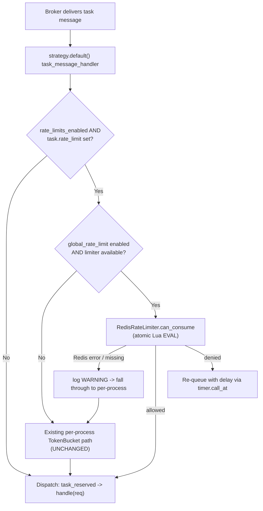

# Technical Specification

# 0. Agent Action Plan

## 0.1 Intent Clarification

This section restates the user's request in precise technical language, surfaces the implicit requirements that the Blitzy platform detected, and translates the feature into a concrete implementation strategy. The target repository is the **Celery** distributed task queue, version 5.6.2 with release series `recovery` [celery/__init__.py:L25-L27].

### 0.1.1 Core Feature Objective

Based on the prompt, the Blitzy platform understands that the new feature requirement is to **introduce a Redis-backed, cluster-wide (global) rate limiter for Celery tasks**. Today, Celery enforces a task's `rate_limit` on a per-worker-process basis: the per-process token bucket is constructed from the task's `rate_limit` attribute and consulted independently inside each worker [celery/worker/consumer/consumer.py:L296-L298]. Consequently, a task configured at `"10/s"` can execute at up to N×10/s across N worker processes. The objective of this feature is to coordinate consumption through a shared Redis store so that the configured rate becomes a **true aggregate ceiling** across all workers in the cluster, regardless of how many worker processes are running.

The feature is **strictly additive, opt-in, and default-off**. The following enumerates each feature requirement with enhanced clarity:

- **New isolated module** — Create a self-contained package `celery/rate_limiting/` housing the global rate-limiting logic, so the feature is cleanly isolated from existing subsystems.
- **Atomic Redis algorithm** — Implement a token-bucket (or sliding-window) algorithm executed inside Redis using an **atomic Lua script**, eliminating cross-worker race conditions (Time-Of-Check-To-Time-Of-Use hazards) when multiple workers consume tokens concurrently.
- **Per-task opt-in via the existing parameter** — Reuse the **existing** `rate_limit` task attribute (currently defaulting to `None` [celery/app/task.py:L250]) as the per-task rate specification, gated by a new global enablement flag so that global limiting only engages when explicitly switched on.
- **Minimal worker hook** — Insert a minimal consultation of the global limiter into the worker's task-dispatch path at `celery/worker/strategy.py`, invoked just before a task with a configured `rate_limit` is dispatched, only when the global limiter is enabled [celery/worker/strategy.py:L190-L208].
- **New configuration keys** — Register two new configuration settings in `celery/app/defaults.py` to enable the feature and supply the Redis backend URL.
- **Graceful fallback** — If Redis is unreachable or the Redis client library is not installed, log a warning through Celery's existing logging infrastructure and **fall back to the existing per-process behavior**; the worker must never crash.
- **Re-queue with delay, not drop** — When a task is denied by the global limiter, re-queue it with a delay by reusing Celery's existing retry/countdown and timer mechanism, mirroring the per-process delayed-requeue path; rate-limited tasks must never be silently dropped.

**Implicit requirements and prerequisites detected.** The Blitzy platform surfaced the following requirements that are not stated literally but are necessary for a correct, mergeable implementation:

- **Optional Redis dependency** — The Redis client (`redis-py`) is **not** a hard dependency of Celery; it is supplied optionally via the `kombu[redis]` extra [requirements/extras/redis.txt:L1] and exposed through the `redis` extra in packaging [setup.py:L37]. The new module must therefore import Redis **lazily and guarded**, mirroring the optional-import pattern already used by the Redis result backend [celery/backends/redis.py:L26-L30], so default installations that lack Redis continue to work.
- **Documentation quality gates** — Adding settings to `celery/app/defaults.py` triggers the `configcheck` Sphinx gate, and adding a new public module triggers the `apicheck` gate; both are enforced in the test matrix [tox.ini:L104-L112]. New settings must be documented in `docs/userguide/configuration.rst`, and the new module must be registered in `docs/reference/`.
- **Test package conventions** — New test directories must include `__init__.py` package markers to match the repository's existing test-layout convention.
- **Window-reset and crash semantics** — Redis keys must expire so that rate windows reset at 1s/1m/1h boundaries, and a worker crashing mid-execution must not permanently consume tokens; an unset or zero `rate_limit` must be a no-op for the global limiter.

### 0.1.2 Special Instructions and Constraints

- **CRITICAL — Minimal-change mandate (emphasized twice in the prompt):** Make ONLY the changes necessary to add this feature. Do NOT refactor, optimize, or otherwise modify existing code unless directly required to integrate the feature. Isolate all new logic inside the new module, document every edit to an existing file with an inline comment explaining its purpose, and always choose the approach that requires the least modification to existing files.
- **Reuse existing services — do not re-implement:** The implementation must leverage the following existing facilities rather than duplicating them:
  - Rate-string parsing — the `rate()` helper that converts strings such as `"100/m"`, `"2/h"`, and `"0.5/s"` to a float tasks-per-second value [celery/utils/time.py:L253-L261].
  - Redis connection management patterns from the Redis result backend [celery/backends/redis.py:L26-L30].
  - The logging infrastructure `celery.utils.log.get_logger` [celery/utils/log.py:L97].
  - The retry/countdown and timer-based delayed-requeue mechanism used by the per-process limiter [celery/worker/consumer/consumer.py:L333-L364].
- **Components that must remain untouched:** the existing per-process rate limiter (must behave exactly as today); all broker integrations (Redis/RabbitMQ/SQS); all result backends; the beat scheduler and the chord/group/chain/canvas primitives; and the existing configuration system (new keys are ADD-only — no existing `Option` may be refactored).
- **Interfaces that must remain unchanged:** the `@app.task` decorator signature and its existing parameters; the `Task` base-class public interface; the `celery worker` CLI (additive flags only, none changed or removed); and all kombu/broker-facing interfaces.

The user provided the following examples, preserved here exactly:

- **User Example (configuration):**

<pre>
CELERY_GLOBAL_RATE_LIMIT_ENABLED = True
CELERY_GLOBAL_RATE_LIMIT_BACKEND_URL = "redis://localhost:6379/0"
</pre>

- **User Example (task definition):**

<pre>
@app.task(rate_limit="10/m")
def my_task():
    ...
</pre>

### 0.1.3 Technical Interpretation

These feature requirements translate to the following technical implementation strategy:

- To **introduce the global rate-limiting capability**, we will **create** a new isolated package `celery/rate_limiting/` containing an abstract base limiter (`base.py`), a concrete Redis implementation (`redis_rate_limiter.py`), and a package initializer (`__init__.py`) exporting the public API and a factory.
- To **guarantee atomicity across workers**, we will **implement** the token-bucket refill-and-consume logic as a single Redis Lua script evaluated with one `EVAL`, so the check-and-consume is indivisible and immune to cross-worker races.
- To **honor per-task opt-in without changing public interfaces**, we will **reuse** the existing `rate_limit` task attribute [celery/app/task.py:L250] as the rate source and **gate** all global behavior behind a new enablement flag, so tasks and the decorator signature remain unchanged.
- To **engage the limiter at execution time**, we will **modify** the worker dispatch strategy `celery/worker/strategy.py` to consult the global limiter immediately before a rate-limited task is handed off, and to re-queue with delay on denial [celery/worker/strategy.py:L190-L208].
- To **make the feature configurable**, we will **register** two new settings in `celery/app/defaults.py` whose legacy uppercase aliases match the user's exact examples (`CELERY_GLOBAL_RATE_LIMIT_ENABLED` and `CELERY_GLOBAL_RATE_LIMIT_BACKEND_URL`).
- To **ensure resilience**, we will **wrap** all Redis interaction in guarded error handling that logs a single warning and falls through to the unchanged per-process path on any failure.
- To **satisfy CI quality gates**, we will **extend** `docs/userguide/configuration.rst` and `docs/reference/` so the new settings and module are documented.

## 0.2 Repository Scope Discovery

This section catalogs every existing file that participates in the feature, the integration points where new and existing code meet, the external research performed, and the new files to be created. The repository is a Python package; no `.blitzyignore` files exist anywhere in the tree, so no paths are restricted from analysis.

### 0.2.1 Comprehensive File Analysis and Integration Points

The per-process rate-limiting machinery that the global limiter must coordinate with — and the reusable utilities it must leverage — were located precisely in the codebase. The table below enumerates the existing files relevant to the feature and the role each plays.

| Existing File | Locator | Role for This Feature |
|---------------|---------|------------------------|
| `celery/worker/strategy.py` | [L190-L208] | **Primary integration point.** The `default()` task-message handler decides whether to dispatch, delay, or rate-limit a task. The global-limiter consultation is inserted here. |
| `celery/worker/consumer/consumer.py` | [L296-L298], [L333-L364] | **Pattern to mirror (not modify).** Builds the per-process `TokenBucket` and performs delayed requeue via `expected_time` + `timer.call_after`. |
| `celery/app/defaults.py` | [L29-L63], [L325-L339] | **Configuration registration.** `Option`/`Namespace` builders and the `worker` namespace (home of `disable_rate_limits`) define the pattern for adding the two new settings. |
| `celery/app/task.py` | [L250], [L398] | **Rate-limit source.** Defines the `rate_limit = None` attribute reused as the per-task rate; optional additive hook site. |
| `celery/utils/time.py` | [L253-L261] | **Reused parser.** `rate()` converts `"10/s"`/`"100/m"`/`"1000/h"` to tasks-per-second. Must NOT be re-implemented. |
| `celery/utils/log.py` | [L97] | **Reused logging.** `get_logger(__name__)` for the fallback warning. |
| `celery/backends/redis.py` | [L26-L30], [L189], [L209-L213] | **Reference pattern.** Guarded optional `import redis` and `ConnectionPool` construction — the template for the new module's connection handling and graceful degradation. |

**Integration-point discovery.** Celery is a backend task-execution library, so the conventional web integration points map as follows:

- **API endpoints connecting to the feature** — None. Celery exposes no HTTP/RPC surface (confirmed in §7.1); the feature surfaces only through configuration and the existing CLI.
- **Database models / migrations affected** — None. The feature's state lives entirely in Redis keys; no relational schema or migration is involved.
- **Service classes requiring updates** — The worker dispatch strategy [celery/worker/strategy.py:L190-L208] is the single service-level call site that must consult the new limiter.
- **Controllers / handlers to modify** — The `task_message_handler` closure inside `default()` is the handler that gates dispatch [celery/worker/strategy.py:L190-L208].
- **Middleware / interceptors impacted** — The per-process `TokenBucket` flow in the consumer [celery/worker/consumer/consumer.py:L333-L364] is the conceptual interceptor whose behavior the global limiter layers onto; it is mirrored, not altered.
- **Configuration subsystem** — The `NAMESPACES` registry in `celery/app/defaults.py` [celery/app/defaults.py:L66] must gain the two new settings.

The following diagram situates the new module within the existing worker execution path:

### 0.2.2 Web Search Research Conducted

The following external research informed the dependency and algorithm decisions:

- **Distributed rate-limiting algorithm** — Confirmed that a token-bucket implemented as a single atomic Redis Lua script is the standard pattern for cross-process coordination, because the read-modify-write of the bucket executes indivisibly server-side, removing the race condition inherent in multi-round-trip `GET`/`SET` sequences.
- **`fakeredis` package version** — Verified the current stable release of `fakeredis` is **2.35.1** on PyPI. `fakeredis` is a pure-Python implementation of the Redis protocol that allows tests to run without a live Redis server.
- **`fakeredis` Lua support** — Confirmed that execution of Lua scripts under `fakeredis` requires the library's Lua extra (`fakeredis[lua]`), which is necessary because the limiter is implemented as a Lua script.
- **`fakeredis` failure simulation** — Confirmed `fakeredis` can emulate a connection error (via a `FakeServer` whose `connected` flag is disabled), enabling the unit test that verifies the graceful-fallback-to-per-process behavior.
- **`redis-py` availability model** — Confirmed `redis-py` is supplied to Celery transitively through `kombu[redis]` rather than as a direct hard dependency, validating the decision to import it lazily and avoid adding it to `requirements/default.txt`.

### 0.2.3 New File Requirements

The following new files will be created. Test directories receive `__init__.py` markers to conform to the repository's package-based test layout.

- **New source files:**
  - `celery/rate_limiting/__init__.py` — package initializer exporting the public API (`BaseRateLimiter`, `RedisRateLimiter`) and a factory that returns a configured limiter when global limiting is enabled, otherwise `None`.
  - `celery/rate_limiting/base.py` — `BaseRateLimiter` abstract base class defining the limiter contract (`can_consume(task_name, rate)`-style interface) for current and future backends.
  - `celery/rate_limiting/redis_rate_limiter.py` — `RedisRateLimiter` concrete implementation: guarded optional Redis import, connection pool from the configured backend URL, the atomic Lua token-bucket script, per-task keying, TTL-based window reset, and graceful error handling.
- **New test files:**
  - `t/unit/rate_limiting/__init__.py` — test package marker.
  - `t/unit/rate_limiting/test_redis_rate_limiter.py` — unit coverage with mocked Redis (`fakeredis[lua]` / `unittest.mock`): aggregate cap across simulated workers, disabled-flag leaves behavior unchanged, Redis-unreachable fallback emits a warning, tasks without `rate_limit` are unaffected, `"10/s"`/`"100/m"`/`"1000/h"` formats, `None`/`0` no-op, Lua atomicity, and window reset.
  - `t/integration/rate_limiting/__init__.py` — test package marker.
  - `t/integration/rate_limiting/test_global_rate_limit.py` — integration coverage exercising multiple simulated workers against a running Redis to assert aggregate throughput respects the configured ceiling.
- **New documentation files (CI-gate driven):**
  - `docs/reference/celery.rate_limiting.rst` (and per-submodule stubs) registered in `docs/reference/index.rst`, required to keep the `apicheck` gate green [tox.ini:L104-L108].

No new standalone configuration file is required: the feature's settings are registered in the existing `celery/app/defaults.py` and documented in the existing `docs/userguide/configuration.rst`, consistent with how every other Celery setting is defined.

## 0.3 Dependency Inventory

The dependency footprint of this feature is intentionally minimal. Exactly one new manifest entry is introduced — a development/test dependency — and no existing package is updated or removed.

### 0.3.1 Package Registry

| Package | Registry | Version | Change | Purpose |
|---------|----------|---------|--------|---------|
| `fakeredis[lua]` | PyPI | `>=2.35.1` | **ADD** to `requirements/test.txt` | Pure-Python Redis used to unit-test the limiter without a live server. The `[lua]` extra is required because the limiter is implemented as a Redis Lua script; `fakeredis` can also emulate connection errors to exercise the graceful-fallback path. The `>=` style matches existing entries in `requirements/test.txt`. |
| `redis` (`redis-py`) | PyPI | governed by `kombu[redis]` (no pin added) | **No manifest change** | Runtime Redis client used when the global limiter is enabled. It is **not** in `requirements/default.txt` [requirements/default.txt:L1-L10]; it is provided optionally through `kombu[redis]` [requirements/extras/redis.txt:L1] and the packaging `redis` extra [setup.py:L37]. It is imported lazily so default installs are unaffected. |

The version `2.35.1` is the current stable `fakeredis` release verified during research; it is a real published version, not a placeholder.

### 0.3.2 Dependency Updates

- **Manifest changes:**
  - `requirements/test.txt` — add `fakeredis[lua]>=2.35.1`. This is the **only** manifest file modified by the feature.
  - `requirements/default.txt` — **not modified.** Adding a hard `redis-py` dependency here is intentionally avoided: it would violate the minimal-change mandate and break lightweight installations that do not use Redis. The runtime client is instead resolved through the existing optional `kombu[redis]` extra and imported under a guard.
- **Import updates:** None to existing files. Consistent with the minimal-change mandate, no existing module's imports are rewritten. The new module introduces its own imports only:
  - Guarded Redis import inside `celery/rate_limiting/redis_rate_limiter.py`, mirroring `celery/backends/redis.py` [celery/backends/redis.py:L26-L30].
  - `from celery.utils.time import rate` to reuse the existing parser [celery/utils/time.py:L253].
  - `from celery.utils.log import get_logger` for the fallback warning [celery/utils/log.py:L97].
- **External reference updates:** Beyond `requirements/test.txt`, no build files (`setup.py`, `pyproject.toml`) require dependency edits, because the runtime client continues to flow through the pre-existing `redis` extra [setup.py:L37].

## 0.4 Integration Analysis

This section documents exactly where new code attaches to existing code. Every touchpoint is additive and, per the minimal-change mandate, accompanied by an inline comment in the implementation.

### 0.4.1 Existing Code Touchpoints

- **Direct modifications required:**
  - `celery/worker/strategy.py` — In the `default()` strategy, the cached dispatch locals are gathered around lines 119–125 (e.g., `rate_limits_enabled`, `get_bucket`, `limit_task`, `limit_post_eta`) [celery/worker/strategy.py:L119-L127]. A reference to the global limiter is cached alongside them. The consultation itself is inserted into the dispatch decision region immediately before `task_reserved(req)` is called [celery/worker/strategy.py:L205-L208], invoked only when global limiting is enabled and the task declares a `rate_limit`.
  - `celery/app/defaults.py` — Register the two new settings by adding an isolated `global_rate_limit` namespace to the `NAMESPACES` registry [celery/app/defaults.py:L66], following the `Namespace`/`Option` builder pattern [celery/app/defaults.py:L29-L63] and the legacy-alias style used by `disable_rate_limits` [celery/app/defaults.py:L337-L339].
  - `celery/app/task.py` *(optional)* — If per-task opt-out beyond the global flag proves necessary, add a single additive attribute adjacent to the existing `rate_limit` declaration [celery/app/task.py:L250]; its default preserves current behavior.
- **Dependency injection / wiring:**
  - The limiter is instantiated once from `app.conf` (reading the two new settings) and attached to the worker consumer as an attribute, mirroring how the per-process buckets are held as `consumer.task_buckets` [celery/worker/consumer/consumer.py:L228]. The strategy reads this attribute through the consumer it already receives, so no new parameter threads through the public call signatures.
  - The factory in `celery/rate_limiting/__init__.py` returns `None` when global limiting is disabled, so the wiring is a no-op in the default configuration.
- **Database / schema updates:** None. The feature stores its state exclusively in Redis keys (one key per task name, e.g., `celery:global_rate_limit:{task_name}`) with TTL-based expiry; there is no relational schema, ORM model, or migration involved.
- **Re-queue mechanism (mirrored, not modified):** On denial, the task is re-queued with a computed delay using the consumer's timer, mirroring the per-process delayed-requeue path that combines `expected_time` with `timer.call_after`/`call_at` [celery/worker/consumer/consumer.py:L333-L364], [celery/worker/strategy.py:L193-L196]. The existing per-process code is reused conceptually but left unchanged.

## 0.5 Technical Implementation

This section defines the concrete, file-by-file execution plan, the approach for each file, and the (non-applicable) user-interface considerations.

### 0.5.1 File-by-File Execution Plan

Every file listed here must be created or modified. Modes: **CREATE** (new file), **MODIFY** (minimal, inline-commented edit to an existing file), **OPTIONAL** (only if design requires), **REFERENCE** (read-only anchor, not edited).

| Group | Mode | File | Action |
|-------|------|------|--------|
| Core feature | CREATE | `celery/rate_limiting/__init__.py` | Export `BaseRateLimiter`, `RedisRateLimiter`; provide `get_global_rate_limiter(app)` factory returning a limiter or `None`. |
| Core feature | CREATE | `celery/rate_limiting/base.py` | Define `BaseRateLimiter` abstract base class (limiter contract). |
| Core feature | CREATE | `celery/rate_limiting/redis_rate_limiter.py` | Implement Redis token bucket via atomic Lua, guarded import, connection pool, graceful errors. |
| Integration | MODIFY | `celery/worker/strategy.py` | Consult the global limiter before dispatch; re-queue with delay on denial; warn and fall through on error [celery/worker/strategy.py:L190-L208]. |
| Integration | MODIFY | `celery/app/defaults.py` | Register `global_rate_limit` namespace with two `Option`s (add-only) [celery/app/defaults.py:L66]. |
| Integration | OPTIONAL | `celery/app/task.py` | Additive attribute near `rate_limit` if per-task opt-out is needed [celery/app/task.py:L250]. |
| Tests | CREATE | `t/unit/rate_limiting/__init__.py` | Test package marker. |
| Tests | CREATE | `t/unit/rate_limiting/test_redis_rate_limiter.py` | Unit tests with mocked Redis (`fakeredis[lua]`). |
| Tests | CREATE | `t/integration/rate_limiting/__init__.py` | Test package marker. |
| Tests | CREATE | `t/integration/rate_limiting/test_global_rate_limit.py` | Integration tests, multiple workers, aggregate throughput. |
| Dependency | MODIFY | `requirements/test.txt` | Add `fakeredis[lua]>=2.35.1`. |
| Documentation | MODIFY | `docs/userguide/configuration.rst` | Add `.. setting::` blocks for both keys (required by `configcheck`) [tox.ini:L110-L112]. |
| Documentation | MODIFY | `docs/reference/celery.rate_limiting.rst` + `docs/reference/index.rst` | Add `automodule` stub and toctree entry (required by `apicheck`) [tox.ini:L104-L108]. |
| Reference | REFERENCE | `celery/backends/redis.py`, `celery/utils/time.py`, `celery/utils/log.py`, `celery/worker/consumer/consumer.py`, `requirements/extras/redis.txt`, `setup.py`, `tox.ini` | Read-only anchors for patterns and gates; not edited. |

### 0.5.2 Implementation Approach per File

- **`celery/rate_limiting/base.py`** — Establish the feature foundation: an abstract `BaseRateLimiter` exposing a `can_consume(task_name, rate)` method that returns whether the request is allowed and, if not, the seconds to wait. This contract isolates the worker hook from any specific backend, leaving room for future stores without re-touching the strategy.
- **`celery/rate_limiting/redis_rate_limiter.py`** — Implement the concrete Redis backend:
  - Guard the client import so a missing library degrades gracefully rather than raising at import time:

<pre>
try:
    import redis
except ImportError:
    redis = None  # graceful fallback when redis-py is absent
</pre>

  - Build a connection pool once from the configured backend URL (connection pooling addresses high-concurrency round-trip latency), mirroring the result backend's `ConnectionPool` usage [celery/backends/redis.py:L209-L213].
  - Register and evaluate a single Lua token-bucket script so check-and-consume is atomic. The script refills based on elapsed time, consumes if tokens are available, and sets a TTL so windows reset and a crashed worker never permanently holds tokens:

<pre>
-- KEYS[1]=bucket; ARGV=rate, capacity, now, requested
-- refill, then consume-or-deny atomically; PEXPIRE for window reset
</pre>

  - Convert the task's existing `rate_limit` string to tokens-per-second by reusing `rate()` [celery/utils/time.py:L253]; an unset or zero rate is treated as a no-op (limiter not consulted).
  - On a missing client or any `redis` error, log one warning via `get_logger(__name__)` [celery/utils/log.py:L97] and signal fallback.
- **`celery/rate_limiting/__init__.py`** — Expose the public classes and the `get_global_rate_limiter(app)` factory, which reads the two settings and returns a `RedisRateLimiter` when enabled or `None` otherwise.
- **`celery/worker/strategy.py`** — Integrate with the existing system at the established dispatch decision point [celery/worker/strategy.py:L190-L208]: when the global limiter is present and the task has a `rate_limit`, consult it; on denial re-queue with a delay using the consumer timer (mirroring `limit_post_eta` [celery/worker/strategy.py:L195]); on any error log a warning and fall through to the unchanged per-process path. Annotate the inserted block with an inline comment.
- **`celery/app/defaults.py`** — Add the `global_rate_limit` namespace with `enabled` (bool, default `False`) and `backend_url` (string, default `None`), supplying legacy uppercase aliases so the user's exact `CELERY_GLOBAL_RATE_LIMIT_ENABLED` and `CELERY_GLOBAL_RATE_LIMIT_BACKEND_URL` names resolve. Add-only, inline-commented.
- **`celery/app/task.py`** *(optional)* — Only if a per-task opt-out beyond the global flag is required; a single additive attribute whose default preserves today's behavior.
- **Test files** — Ensure quality by implementing comprehensive coverage: unit tests use `fakeredis[lua]` and `unittest.mock` (single/multi-worker aggregate cap, disabled-flag unchanged, Redis-unreachable fallback-with-warning, no-`rate_limit` unaffected, multiple rate formats, `None`/`0` no-op, atomicity, window reset); integration tests drive multiple simulated workers against a live Redis to confirm the aggregate ceiling.
- **Documentation files** — Document usage and configuration: add `.. setting::` blocks to `docs/userguide/configuration.rst` (following the format of the existing `task_default_rate_limit` block [docs/userguide/configuration.rst:L721-L735]) and an `automodule` reference stub registered in `docs/reference/index.rst`. These edits keep the `configcheck` and `apicheck` gates green [tox.ini:L104-L112].

No file references a user-provided Figma URL, because no Figma attachments were provided.

### 0.5.3 User Interface Design

**Not applicable.** Celery is a backend distributed task-queue library invoked from within host applications and does not provide a user interface (§7.1). The feature surfaces exclusively through configuration settings and the existing command-line worker; there is no screen, component, or visual artifact to design. Consequently, no design-system or component-library alignment applies to this feature.

## 0.6 Scope Boundaries

This section draws the precise boundary between what the implementation will and will not touch. Trailing wildcards denote whole groups of files.

### 0.6.1 Exhaustively In Scope

- **Feature source files:** `celery/rate_limiting/**/*.py` — `__init__.py`, `base.py`, `redis_rate_limiter.py`.
- **Unit tests:** `t/unit/rate_limiting/**/*.py` — `__init__.py`, `test_redis_rate_limiter.py`.
- **Integration tests:** `t/integration/rate_limiting/**/*.py` — `__init__.py`, `test_global_rate_limit.py`.
- **Integration points (minimal, inline-commented edits):**
  - `celery/worker/strategy.py` — global-limiter consultation in the dispatch region [celery/worker/strategy.py:L190-L208].
  - `celery/app/defaults.py` — new `global_rate_limit` namespace (add-only) [celery/app/defaults.py:L66].
  - `celery/app/task.py` — optional additive attribute near `rate_limit` [celery/app/task.py:L250].
- **Configuration documentation:** `docs/userguide/configuration.rst` — `.. setting::` blocks for `global_rate_limit_enabled` and `global_rate_limit_backend_url` (required by the `configcheck` gate [tox.ini:L110-L112]).
- **API reference documentation:** `docs/reference/celery.rate_limiting.rst` and the `docs/reference/index.rst` toctree (required by the `apicheck` gate [tox.ini:L104-L108]).
- **Dependency manifest:** `requirements/test.txt` — add `fakeredis[lua]>=2.35.1`.

The two documentation paths are **implicit** in-scope additions: they are not named literally in the prompt, but the repository's CI quality gates [tox.ini:L104-L112] fail unless the new settings and module are documented.

### 0.6.2 Explicitly Out of Scope

The following are out of scope per the prompt and must not be implemented:

- Rate limiting via any store other than Redis (e.g., Memcached, SQL).
- Any UI or dashboard for monitoring rate limits.
- Dynamic runtime rate-limit changes without a worker restart.
- Rate limiting at the broker / queue-ingestion level.
- Changes to celery beat scheduling.

The following existing components must remain untouched (regression guard):

- The existing per-process rate limiter (kombu `TokenBucket` flow in `celery/worker/consumer/consumer.py` and `celery/worker/strategy.py`) — it must behave exactly as today; global limiting is strictly additive, opt-in, and default-off.
- All broker integrations (Redis/RabbitMQ/SQS) and all result backends.
- The beat scheduler and the chord/group/chain/canvas primitives.
- The existing configuration system — new keys are ADD-only; no existing `Option` is refactored.
- Public interfaces — the `@app.task` decorator signature and parameters, the `Task` public interface, the `celery worker` CLI (additive flags only), and all kombu/broker-facing interfaces.
- `requirements/default.txt` — not modified; `redis-py` remains optional via the `kombu[redis]` extra.
- Existing test files — not modified; only new test files are added.

## 0.7 Rules for Feature Addition

No separate user-specified rule set was provided for this project. The rules below are the feature-specific requirements the user emphasized within the prompt and must be honored by all downstream implementation.

- **Minimal-change discipline (emphasized twice):** Make only the changes necessary to add the feature. Do not refactor or optimize unrelated code. Isolate all new logic in `celery/rate_limiting/`, document every edit to an existing file with an inline comment, and prefer the lowest-modification approach at every decision point.
- **Reuse existing conventions — do not re-implement:** Use the existing `rate()` parser for rate strings [celery/utils/time.py:L253], the result backend's optional-import and connection-pool patterns [celery/backends/redis.py:L26-L30], the existing logging helper [celery/utils/log.py:L97], and the existing timer-based delayed-requeue mechanism [celery/worker/consumer/consumer.py:L333-L364]. Follow the `Option`/`Namespace` configuration convention when registering settings [celery/app/defaults.py:L29-L63].
- **Opt-in and backward-compatible:** The feature must be default-off and engage only when explicitly enabled and when a task declares a `rate_limit`. With the feature disabled, behavior must be byte-for-byte identical to today.
- **Atomicity / correctness:** The token check-and-consume must be a single atomic Redis Lua evaluation, eliminating cross-worker race conditions.
- **Resilience (never crash):** A missing Redis client or an unreachable Redis server must produce a single logged warning and a fall-through to the existing per-process behavior — never a worker crash.
- **No task loss:** Tasks denied by the limiter must be re-queued with a delay, never dropped.
- **Scalability:** Use Redis connection pooling and key TTLs so the limiter performs under high concurrency and so windows reset cleanly at 1s/1m/1h boundaries without unbounded key growth.
- **Security:** The Redis backend URL is a configuration value (it may embed credentials). Treat it as the existing Redis backend treats connection URLs — sanitize before logging, consistent with the URL-sanitization helpers used by the result backend [celery/backends/redis.py:L10]. Do not log raw credentials in the fallback warning.
- **Interface stability:** The `@app.task` decorator signature, the `Task` public interface, the `celery worker` CLI (additive flags only), and all kombu/broker-facing interfaces must remain unchanged.

## 0.8 Attachments

- **File attachments:** None provided. The project contains no uploaded documents, images, or PDFs.
- **Figma designs:** None provided. No Figma frames or URLs were supplied, and the feature has no user-interface surface (§7.1); therefore no design-to-component mapping or design-system alignment applies.
- **External references cited in the request:** The implementation references the public Celery codebase (the target repository) and the verified PyPI release of `fakeredis` (`2.35.1`) used for unit testing. No other external URLs were provided.

