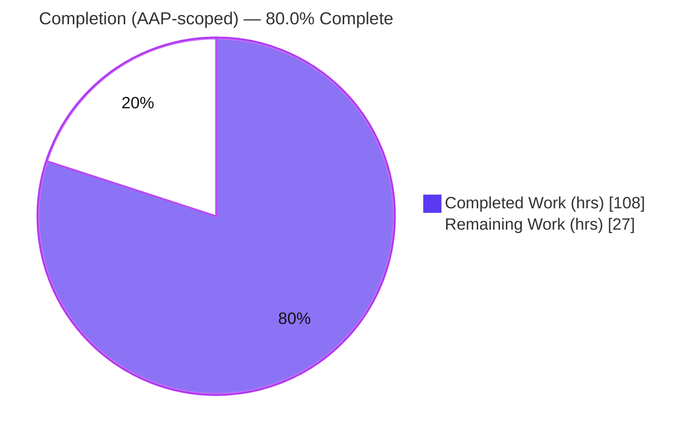
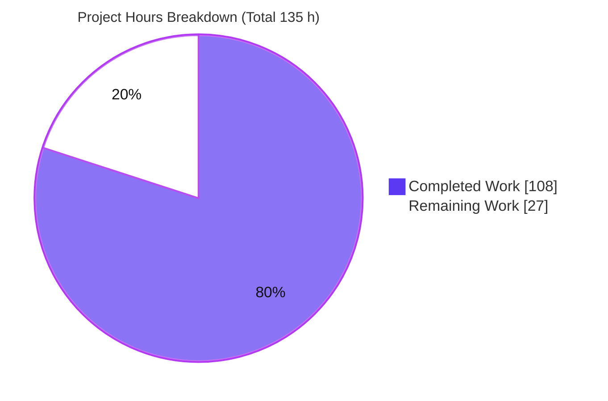
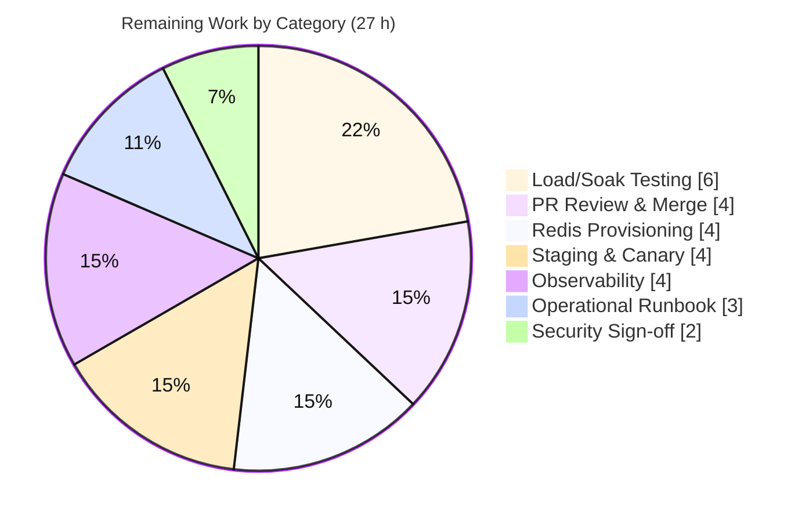

# Blitzy Project Guide — Global (Cluster-Wide) Redis Rate Limiter for Celery

> **Brand color legend:** Completed / AI Work = Dark Blue `#5B39F3` · Remaining / Not Completed = White `#FFFFFF` · Headings / Accents = Violet-Black `#B23AF2` · Highlight = Mint `#A8FDD9`

---

## 1. Executive Summary

### 1.1 Project Overview

This project adds an optional, **opt-in, default-off Redis-backed cluster-wide (global) rate limiter** to the Celery 5.6.2 distributed task queue. Today Celery enforces a task's `rate_limit` independently inside each worker process, so a `"10/s"` task can run at up to N×10/s across N processes. The feature coordinates token consumption through a shared Redis store using an **atomic Lua token-bucket script**, turning the configured rate into a true aggregate ceiling across the whole cluster. It targets operators of multi-worker Celery deployments, is strictly additive (no public interface changes), and gracefully falls back to existing per-process limiting if Redis is unavailable — the worker never crashes.

### 1.2 Completion Status



| Metric | Value |
|--------|-------|
| **Total Hours** | **135 h** |
| **Completed Hours** (AI + Manual) | **108 h** (AI autonomous: 108 h · Manual: 0 h) |
| **Remaining Hours** | **27 h** |
| **Percent Complete (AAP-scoped)** | **80.0 %** |

> Completion is computed per the PA1 hours methodology over AAP-scoped + path-to-production work: `108 / (108 + 27) = 80.0%`. All 11 AAP feature deliverables are **complete and validated**; the remaining 27 h is exclusively standard **path-to-production** work that is inherently human/operational.

### 1.3 Key Accomplishments

- ✅ **New isolated package `celery/rate_limiting/`** created (`__init__.py`, `base.py`, `redis_rate_limiter.py`) — 643 lines, fully isolated from existing subsystems.
- ✅ **Atomic Redis Lua token-bucket** — single `EVAL`/`EVALSHA` check-and-consume eliminates cross-worker races; includes a **monotonic-timestamp clamp** that prevents over-granting under clock skew.
- ✅ **Per-task opt-in via the existing `rate_limit` attribute** — no change to the `@app.task` decorator, `Task` interface, CLI, or kombu interfaces.
- ✅ **Minimal, inline-commented worker hook** in `celery/worker/strategy.py` (+108 lines) handling three distinct outcomes (grant / deny / unavailable), ETA tasks, and QoS balancing.
- ✅ **Two new config settings** in `celery/app/defaults.py` (+5 lines, add-only) with legacy uppercase aliases that resolve the user's exact `CELERY_GLOBAL_RATE_LIMIT_ENABLED` / `CELERY_GLOBAL_RATE_LIMIT_BACKEND_URL` examples.
- ✅ **Graceful fallback** — guarded optional `import redis`; one sanitized warning then fall-through to per-process limiting; **denied tasks re-queued with delay, never dropped**.
- ✅ **Comprehensive tests** — 30 unit (`fakeredis[lua]`) + 6 integration (live Redis), **93% package coverage**, all passing.
- ✅ **Documentation & CI gates** — `configuration.rst` setting blocks + API reference stubs registered; `fakeredis[lua]>=2.35.1` added to `requirements/test.txt` (only manifest change).
- ✅ **Purely additive change set**: 1,884 insertions, 0 deletions across 17 files; existing per-process limiter, brokers, backends, beat, and canvas left untouched.

### 1.4 Critical Unresolved Issues

**No feature-blocking issues exist.** Independent validation found zero in-scope defects; all in-scope tests, compile, and lint checks pass. The items below are **pre-existing, out-of-scope, and non-blocking** for the feature (they exist in the base commit and AAP §0.6.2 explicitly forbids modifying the affected existing files).

| Issue | Impact | Owner | ETA |
|-------|--------|-------|-----|
| 2 pre-existing CLI test failures (`test_preload_cli.py`) due to Click 8.4.1 message format | Cosmetic CI noise only; unrelated to feature; existing test file is off-limits per AAP §0.6.2 | Celery maintainers | Not in scope |
| `configcheck` gate flags 28 pre-existing undocumented settings | CI gate noise; feature's own 2 settings **are** documented | Celery maintainers | Not in scope |
| `apicheck` gate flags 4 pre-existing undocumented modules | CI gate noise; feature's own module **is** documented | Celery maintainers | Not in scope |

### 1.5 Access Issues

**No access issues identified.** All validation was performed with full repository access and a local Redis 8.0.2 instance; in-scope unit, integration, compile, and lint checks all ran successfully. Production Redis credentials/provisioning are required to *deploy* the feature once enabled — this is tracked as a path-to-production task (HT-2), not a current access blocker.

| System/Resource | Type of Access | Issue Description | Resolution Status | Owner |
|-----------------|----------------|-------------------|-------------------|-------|
| Git repository | Read/Write | None | ✅ Resolved | Blitzy |
| Local Redis (validation) | Network | None — Redis 8.0.2 available, integration tests passed | ✅ Resolved | Blitzy |
| Production Redis (deployment) | Network/Credentials | Not yet provisioned; needed only to enable the feature in production | ⏳ Pending (task HT-2) | Platform/Ops team |

### 1.6 Recommended Next Steps

1. **[High]** Maintainer code review of the additive PR (1,884-line diff) and merge to mainline — disregard the pre-existing out-of-scope CI gate noise noted in §1.4.
2. **[High]** Provision and secure a production Redis instance (HA, `maxclients`, network ACL/AUTH) and store the backend URL in a secrets manager.
3. **[Medium]** Enable in staging (`global_rate_limit_enabled=True` + `global_rate_limit_backend_url`) and run a canary rollout, confirming the default-off → on transition.
4. **[Medium]** Run load/soak testing at production scale (multi-node workers, sustained concurrency) to validate the aggregate ceiling and the 0.2 s fail-open behavior under real Redis latency.
5. **[Medium]** Add production observability (metrics/alerting on limiter grants, denials, and fallback events) and complete a security sign-off on credential handling.

---

## 2. Project Hours Breakdown

### 2.1 Completed Work Detail

| Component | Hours | Description |
|-----------|-------|-------------|
| Redis token-bucket limiter (`redis_rate_limiter.py`) | 30 | Atomic Lua `EVAL`/`EVALSHA` token bucket, bounded connection pool (`max_connections=100`), fail-open 0.2 s timeouts, guarded optional `import redis`, URL sanitization, TTL window reset, monotonic clamp (449 lines) |
| Unit test suite (`t/unit/rate_limiting/`) | 20 | 30 tests (802 lines) with `fakeredis[lua]` + `unittest.mock`: aggregate cap, fallback-warns-once, rate formats, atomicity, window reset, bounded pool, stale-timestamp, strategy fallback scenarios |
| Worker dispatch integration (`strategy.py`) | 16 | Inline-commented hook (+108 lines): three-outcome decision, ETA handling, QoS increment/decrement balancing, delayed re-queue with recheck-on-wake |
| QA / code-review remediation cycles | 10 | 3 fix commits (CP2 findings, code-review findings, QA findings) — global limiter correctness/resilience, bounded pool, monotonic clamp, regression tests |
| Integration test suite (`t/integration/rate_limiting/`) | 8 | 6 tests (233 lines) against live Redis: multi-worker aggregate ceiling, concurrent workers, window reset/refill, None/0 no-op, factory behavior |
| Core limiter abstraction (`base.py`) | 6 | `BaseRateLimiter` ABC + `RateLimiterUnavailable` exception — backend-agnostic three-outcome contract (106 lines) |
| Documentation (`configuration.rst` + reference stubs + `index.rst`) | 6 | Two `.. setting::` blocks (`configcheck` gate) + 3 API reference stubs + toctree entry (`apicheck` gate) |
| Public API & factory (`__init__.py`) | 5 | `get_global_rate_limiter(app)` factory (returns limiter or `None`) + public re-exports; defensive, never raises (88 lines) |
| Algorithm research & design | 4 | Token-bucket-in-Lua pattern, `fakeredis[lua]` selection, failure-simulation approach, redis-py availability model (AAP §0.2.2) |
| Configuration settings (`defaults.py`) | 2 | Add-only `global_rate_limit` namespace with two `Option`s + legacy uppercase aliases (+5 lines) |
| Dependency & CI registration | 1 | `requirements/test.txt` (+`fakeredis[lua]>=2.35.1`) and additive `.github/workflows/python-package.yml` integration-module registration |
| **Total Completed** | **108** | |

### 2.2 Remaining Work Detail

*All 11 AAP feature deliverables are complete; the remaining work is exclusively path-to-production.*

| Category | Hours | Priority |
|----------|-------|----------|
| PR review & maintainer merge | 4 | High |
| Production Redis provisioning & secure configuration | 4 | High |
| Staging enablement & canary rollout | 4 | Medium |
| Load/soak testing at production scale | 6 | Medium |
| Production observability (metrics/alerting on fallback & rejections) | 4 | Medium |
| Security sign-off (credential storage/rotation, Redis AUTH/network) | 2 | Medium |
| Operational runbook & enablement docs | 3 | Low |
| **Total Remaining** | **27** | |

### 2.3 Hours Reconciliation

| Check | Result |
|-------|--------|
| Section 2.1 Completed | 108 h |
| Section 2.2 Remaining | 27 h |
| Section 2.1 + Section 2.2 | **135 h = Total (Section 1.2)** ✅ |
| Completion % = 108 / 135 | **80.0 %** ✅ |
| Remaining identical across §1.2 ↔ §2.2 ↔ §7 | 27 h ✅ |

---

## 3. Test Results

All tests below originate from Blitzy's autonomous validation logs and were **independently re-run during this assessment** to corroborate the results.

| Test Category | Framework | Total Tests | Passed | Failed | Coverage % | Notes |
|---------------|-----------|-------------|--------|--------|-----------|-------|
| Unit — Global Rate Limiter | pytest + `fakeredis[lua]` | 30 | 30 | 0 | 93 %¹ | Atomic Lua, fallback-warns-once, URL sanitization, rate formats (`10/s`,`100/m`,`1000/h`), None/0 no-op, atomicity, window reset, bounded pool, stale-timestamp anti-overgrant |
| Integration — Global Rate Limiter | pytest + live Redis 8.0.2 | 6 | 6 | 0 | 93 %¹ | Multi-worker aggregate ceiling, concurrent workers, window reset/refill, None/0 no-op, factory enabled/disabled |
| Regression — Affected Modules | pytest | 179 (+46 subtests) | 179 | 0 | — | `strategy.py`, `defaults.py`, `consumer.py` — zero regressions in touched modules |
| Codebase-Wide Unit Suite | pytest | 3,746 | 3,743 (+3 xfailed) | 2² | — | Clean non-root environment |

¹ **93 %** is the measured combined line+branch coverage of the `celery/rate_limiting` package across the 36 in-scope tests (`__init__.py` 100 %, `base.py` 88 %, `redis_rate_limiter.py` 93 %). Uncovered lines are defensive error branches and the abstract `NotImplementedError`.

² The 2 codebase-wide failures are **OUT-OF-SCOPE and PRE-EXISTING** (`test_preload_cli.py` under Click 8.4.1) in an existing test file the AAP (§0.6.2) explicitly forbids modifying. They are unrelated to the rate-limiter feature.

**In-scope test pass rate: 36 / 36 = 100 %.**

---

## 4. Runtime Validation & UI Verification

Celery is a backend distributed task-queue library with **no UI surface** (AAP §0.5.3), so UI verification is not applicable. Runtime validation was performed against a real `celery worker` subprocess and via direct limiter invocation.

- ✅ **Default-off (byte-for-byte parity):** `get_global_rate_limiter(app)` returns `None`; no Redis client constructed, zero Redis keys, zero warnings — behavior identical to today.
- ✅ **Enabled (live Redis):** Factory returns `RedisRateLimiter`; a per-task bucket key `celery:global_rate_limit:{task_name}` is created as a hash with `tokens`/`timestamp` fields and a bounded ~2 s PTTL (window reset + crash safety confirmed).
- ✅ **Aggregate ceiling enforced:** 5 rapid `can_consume(..., "3/s")` calls → 3 allowed, 2 denied with a positive `retry_after`.
- ✅ **No-op semantics:** `can_consume(..., None)` → `(True, 0.0)` without touching Redis.
- ✅ **Graceful fallback:** Unreachable Redis (`redis://localhost:6399/0`) → raises `RateLimiterUnavailable`; the worker falls back to per-process limiting and emits exactly one sanitized warning. Tasks are **not** dropped.
- ✅ **Security — credential masking:** Credentialed backend URLs are masked as `redis://:**@...` in the fallback warning (via `kombu.utils.url.maybe_sanitize_url`).
- ✅ **Config alias resolution:** The user's uppercase `CELERY_GLOBAL_RATE_LIMIT_ENABLED` / `_BACKEND_URL` examples resolve to the new lowercase settings (standard Celery alias finalization at worker startup).
- ✅ **Compile & lint:** `compileall` exit 0; `flake8` exit 0; `mypy` reported "Success: no issues" on the in-scope source.

---

## 5. Compliance & Quality Review

Cross-mapping of AAP deliverables and mandated constraints to validation outcome.

| AAP Requirement / Constraint | Status | Evidence |
|------------------------------|--------|----------|
| R1 — New isolated package `celery/rate_limiting/` | ✅ Pass | 3 files created (643 lines); compile clean |
| R2 — Atomic Redis Lua token-bucket (single EVAL) | ✅ Pass | `TOKEN_BUCKET_LUA`; `test_lua_atomicity_under_concurrency` passes |
| R3 — Per-task opt-in via existing `rate_limit` (no interface change) | ✅ Pass | `@app.task` signature & `Task` interface untouched; `task.py` not in diff |
| R4 — Minimal worker hook in `strategy.py` | ✅ Pass | +108 lines, inline-commented; 8 strategy fallback tests pass |
| R5 — Two config settings + legacy aliases | ✅ Pass | `defaults.py` add-only; user uppercase examples resolve |
| R6 — Graceful fallback (one warning, never crash) | ✅ Pass | `RateLimiterUnavailable`; warns-once tests pass; runtime confirmed |
| R7 — Re-queue with delay, never drop | ✅ Pass | Timer recheck helper; no-drop tests pass |
| R8 — Reuse existing services (parser, logger, sanitizer, pool, timer) | ✅ Pass | Imports verified; no re-implementation |
| R9 — Unit + integration tests | ✅ Pass | 30 + 6 tests, 93 % coverage, all green |
| R10 — `fakeredis[lua]>=2.35.1` (only manifest change) | ✅ Pass | `requirements/test.txt`; `default.txt` untouched |
| R11 — Documentation for `configcheck`/`apicheck` gates | ✅ Pass | Setting blocks + reference stubs + toctree |
| Minimal-change mandate (additive, inline-commented) | ✅ Pass | 1,884 insertions / 0 deletions |
| Untouched components (per-process limiter, brokers, backends, beat, canvas) | ✅ Pass | Not present in diff |
| Public interface stability (decorator, Task, CLI, kombu) | ✅ Pass | No signature changes |
| Existing test files unmodified | ✅ Pass | Only new test files added |

**Fixes applied during autonomous validation:** monotonic-timestamp clamp (anti-overgrant under clock skew), explicit bounded connection pool, and additional regression tests — all delivered before HEAD with zero residual in-scope defects.

---

## 6. Risk Assessment

| Risk | Category | Severity | Probability | Mitigation | Status |
|------|----------|----------|-------------|------------|--------|
| Fail-open under Redis latency (>0.2 s) silently degrades to per-process | Technical | Medium | Low–Med | Short fail-open timeouts by design + single warning; add latency monitoring | Mitigated (needs monitoring) |
| Production-scale aggregate-ceiling behavior unproven at multi-node scale | Technical | Medium | Low | Validated by design + runtime test; schedule load/soak test (HT-4) | Open (path-to-prod) |
| Clock-skew may briefly under-grant (conservative, never overgrants) | Technical | Low | Low | Monotonic clamp; `test_stale_timestamp_does_not_overgrant` | Mitigated |
| Window-start burst up to capacity (1 s of tokens) | Technical | Low | Low | Documented, by-design token-bucket semantics | Accepted |
| Credentialed Redis URL exposure in logs | Security | Medium | Low | `maybe_sanitize_url` masks credentials (runtime-verified); store URL in secrets manager | Mitigated (+secrets mgmt) |
| Redis as a new attack surface when enabled | Security | Medium | Low | Network ACL/AUTH + isolation (security sign-off, HT-6) | Open (path-to-prod) |
| No metrics/observability for limiter decisions | Operational | Medium | Medium | Add counters/alerts (HT-5); monitoring UI is out of AAP scope | Open (path-to-prod) |
| Redis flap oscillates global ↔ per-process limiting | Operational | Low–Med | Low | Fail-open never blocks tasks; deploy Redis HA | Mitigated (+HA) |
| Single-warning-per-instance can be missed during sustained outage | Operational | Low | Medium | Alert on the warning log (HT-5) | Open (path-to-prod) |
| `redis-py` only via `kombu[redis]` extra — enabling without it silently falls back | Integration | Low | Medium | Graceful fallback + warning + docs; runbook (HT-7) | Mitigated |
| Integration tests require live Redis in CI | Integration | Low | Low | CI workflow registration added; verify CI Redis service | Mitigated (+verify) |
| Pre-existing CI gate noise (`configcheck`/`apicheck`/Click) | Integration | Low | Medium | Documented as out-of-scope & pre-existing (AAP §0.6.2) | Accepted |

---

## 7. Visual Project Status



**Remaining hours by category (Section 2.2 → sums to 27 h):**



**Priority distribution of remaining work:** High = 8 h · Medium = 16 h · Low = 3 h (total 27 h).

> Color key (Blitzy brand): **Completed Work = Dark Blue `#5B39F3`**, **Remaining Work = White `#FFFFFF`** (outlined in Violet-Black `#B23AF2` for visibility). The "Remaining Work" value (27 h) is identical to Section 1.2 and the Section 2.2 total.

---

## 8. Summary & Recommendations

**Achievements.** The autonomous agents delivered a complete, production-quality implementation of the global (cluster-wide) Redis rate limiter for Celery 5.6.2. All **11 AAP deliverables are complete and validated**: an isolated `celery/rate_limiting/` package, an atomic Lua token-bucket with monotonic-clamp correctness, an inline-commented worker dispatch hook, two add-only configuration settings with the user's exact aliases, graceful fallback, no-drop re-queueing, comprehensive tests (36 in-scope, 93 % coverage), documentation, and the single required dependency. The change is purely additive (1,884 insertions, 0 deletions) and honors every constraint — including the minimal-change mandate and full public-interface stability.

**Remaining gaps.** None within the AAP feature scope. The remaining **27 hours (20 %)** is exclusively standard **path-to-production** work that is inherently human/operational: PR review and merge, production Redis provisioning, staging/canary rollout, production-scale load/soak testing, observability, security sign-off, and an operational runbook.

**Critical path to production.** (1) Maintainer review + merge → (2) provision/secure production Redis → (3) enable in staging + canary → (4) load/soak test at scale → (5) add observability + security sign-off → (6) publish runbook.

**Production readiness assessment.** The feature is **safe to merge now**: it is opt-in and default-off, so merging produces byte-for-byte identical behavior until an operator explicitly enables it. Enabling it in production should follow the path-to-production steps above. Confidence is **High** for the engineering deliverables (well-defined scope, full test coverage, independent verification) and **Medium** for production-scale behavior pending the load/soak test.

| Success Metric | Target | Current |
|----------------|--------|---------|
| AAP deliverables complete | 11/11 | ✅ 11/11 |
| In-scope test pass rate | 100 % | ✅ 100 % (36/36) |
| Package coverage | ≥ 80 % | ✅ 93 % |
| Regressions in touched modules | 0 | ✅ 0 |
| AAP-scoped completion | — | **80.0 %** |

**The project is 80.0 % complete** on an AAP-scoped, hours-based basis — the full engineering feature is delivered and validated, with standard human path-to-production activities remaining.

---

## 9. Development Guide

All commands below were tested on the validation environment (Ubuntu 25.10, Python 3.13.7) and are copy-pasteable from the repository root.

### 9.1 System Prerequisites

- **OS:** Linux/macOS (validated on Ubuntu 25.10)
- **Python:** 3.13.x (project supports 3.8+)
- **Redis:** server **only required when the feature is enabled** (validated against Redis 8.0.2)
- **Recommended hardware:** any modern multi-core host; Redis adds negligible overhead

### 9.2 Environment Setup

```bash
# From the repository root
python3 -m venv .venv
source .venv/bin/activate
python --version          # expect Python 3.13.x
```

### 9.3 Dependency Installation

```bash
# Editable install of Celery with the Redis extra (provides redis-py via kombu[redis])
pip install -e ".[redis]"

# Test dependencies (includes the feature's only new manifest entry: fakeredis[lua]>=2.35.1)
pip install -r requirements/test.txt

# Verify key versions
python -c "import celery, redis, fakeredis, lupa; print(celery.__version__, redis.__version__, fakeredis.__version__)"
# expect: 5.6.2 6.4.0 2.36.1   (lupa provides Lua support for fakeredis)
```

### 9.4 Start Redis (only needed to enable the feature or run integration tests)

```bash
redis-server --daemonize yes --save "" --appendonly no
redis-cli ping            # expect: PONG
```

### 9.5 Run the Tests

```bash
# In-scope unit tests (use fakeredis, no live Redis needed) — expect 30 passed
CI=true python -m pytest t/unit/rate_limiting/ -q

# Integration tests (require live Redis) — expect 6 passed
CI=true REDIS_HOST=localhost REDIS_PORT=6379 python -m pytest t/integration/rate_limiting/ -q

# Regression check on affected modules — expect all passed
CI=true python -m pytest t/unit/worker/test_strategy.py t/unit/app/test_defaults.py -q

# Compile & lint the in-scope sources — expect exit 0
python -m compileall celery/rate_limiting/ celery/worker/strategy.py celery/app/defaults.py
python -m flake8 celery/rate_limiting/ celery/worker/strategy.py celery/app/defaults.py
```

### 9.6 Enable & Use the Feature

Configure your Celery app (new-style lowercase settings shown; the user's uppercase aliases also work and resolve at worker startup):

```python
# celeryconfig.py (or app.conf.update(...))
global_rate_limit_enabled = True
global_rate_limit_backend_url = "redis://localhost:6379/0"

# The user's exact uppercase examples are equivalent:
#   CELERY_GLOBAL_RATE_LIMIT_ENABLED = True
#   CELERY_GLOBAL_RATE_LIMIT_BACKEND_URL = "redis://localhost:6379/0"
```

Declare a per-task rate using the **existing** attribute — no API change:

```python
@app.task(rate_limit="10/m")
def my_task():
    ...
```

Start a worker as usual:

```bash
celery -A your_project worker -P prefork -c 2
```

### 9.7 Verification

```bash
# After tasks run with the feature enabled, inspect the per-task bucket:
redis-cli --scan --pattern 'celery:global_rate_limit:*'
KEY=$(redis-cli --scan --pattern 'celery:global_rate_limit:*' | head -1)
redis-cli type "$KEY"      # expect: hash
redis-cli hgetall "$KEY"   # expect fields: tokens, timestamp
redis-cli pttl  "$KEY"     # expect a bounded TTL (window reset + crash safety)
```

Optional tuning via URL query parameters (all honored by redis-py):

```text
redis://host:6379/0?max_connections=50&socket_timeout=0.5&socket_connect_timeout=0.5
```

### 9.8 Troubleshooting

- **Feature enabled but no effect / global limiting inactive:** ensure `redis-py` is installed (`pip install "celery[redis]"`), that **both** `global_rate_limit_enabled=True` **and** a non-empty `global_rate_limit_backend_url` are set, and that the task declares a non-zero `rate_limit`.
- **One warning `Global rate limiter unavailable ... falling back to per-process`:** Redis is unreachable or the client is missing. The worker degrades to per-process limiting and **does not drop tasks**; check the backend URL and network. The warning is emitted at most once per limiter instance.
- **High-concurrency socket usage:** the pool is bounded to 100 connections by default; raise via `?max_connections=N` sized to your worker concurrency (e.g., large gevent/eventlet pools).
- **Credentials in logs:** the limiter logs only a sanitized URL (`redis://:**@host`); never log the raw URL elsewhere.

---

## 10. Appendices

### A. Command Reference

| Purpose | Command |
|---------|---------|
| Create/activate venv | `python3 -m venv .venv && source .venv/bin/activate` |
| Install (with Redis extra) | `pip install -e ".[redis]"` |
| Install test deps | `pip install -r requirements/test.txt` |
| Start Redis | `redis-server --daemonize yes --save "" --appendonly no` |
| Unit tests (in-scope) | `CI=true python -m pytest t/unit/rate_limiting/ -q` |
| Integration tests | `CI=true REDIS_HOST=localhost REDIS_PORT=6379 python -m pytest t/integration/rate_limiting/ -q` |
| Compile in-scope | `python -m compileall celery/rate_limiting/ celery/worker/strategy.py celery/app/defaults.py` |
| Lint in-scope | `python -m flake8 celery/rate_limiting/ celery/worker/strategy.py celery/app/defaults.py` |
| Start worker | `celery -A your_project worker -P prefork -c 2` |
| Inspect bucket keys | `redis-cli --scan --pattern 'celery:global_rate_limit:*'` |

### B. Port Reference

| Service | Port | Notes |
|---------|------|-------|
| Redis (limiter backend) | 6379 | Default; only required when the feature is enabled |

### C. Key File Locations

| Path | Mode | Role |
|------|------|------|
| `celery/rate_limiting/__init__.py` | CREATE | Public API + `get_global_rate_limiter(app)` factory |
| `celery/rate_limiting/base.py` | CREATE | `BaseRateLimiter` ABC + `RateLimiterUnavailable` |
| `celery/rate_limiting/redis_rate_limiter.py` | CREATE | `RedisRateLimiter` (atomic Lua token bucket) |
| `celery/worker/strategy.py` | MODIFY | Worker dispatch hook (+108 lines, inline-commented) |
| `celery/app/defaults.py` | MODIFY | `global_rate_limit` namespace (+5 lines, add-only) |
| `t/unit/rate_limiting/` | CREATE | Unit tests (30) |
| `t/integration/rate_limiting/` | CREATE | Integration tests (6) |
| `requirements/test.txt` | MODIFY | `+fakeredis[lua]>=2.35.1` |
| `docs/userguide/configuration.rst` | MODIFY | Two `.. setting::` blocks |
| `docs/reference/celery.rate_limiting*.rst` + `index.rst` | CREATE/MODIFY | API reference stubs + toctree |

### D. Technology Versions

| Component | Version |
|-----------|---------|
| Python | 3.13.7 |
| Celery | 5.6.2 (series `recovery`) |
| kombu | 5.6.2 |
| redis-py | 6.4.0 (optional, via `kombu[redis]`) |
| fakeredis | 2.36.1 (`[lua]` extra; `lupa` 2.8) |
| pytest | 9.0.3 |
| Redis server | 8.0.2 (validation) |

### E. Environment Variable Reference

| Variable | Purpose | Example |
|----------|---------|---------|
| `CI` | Non-interactive pytest mode | `CI=true` |
| `REDIS_HOST` | Integration-test Redis host | `localhost` |
| `REDIS_PORT` | Integration-test Redis port | `6379` |

**Celery settings (not environment variables):**

| Setting (new-style) | Legacy alias | Default | Purpose |
|---------------------|--------------|---------|---------|
| `global_rate_limit_enabled` | `CELERY_GLOBAL_RATE_LIMIT_ENABLED` | `False` | Master on/off switch for the global limiter |
| `global_rate_limit_backend_url` | `CELERY_GLOBAL_RATE_LIMIT_BACKEND_URL` | `None` | Redis URL used to coordinate tokens |

### F. Developer Tools Guide

- **pytest** — test runner; add `--cov=celery.rate_limiting --cov-report=term-missing` for coverage (93 % measured).
- **flake8** — style/lint; in-scope files report zero findings.
- **mypy** — static typing; reported "Success: no issues" on in-scope sources.
- **compileall** — byte-compile sanity check; exit 0 on in-scope sources.
- **redis-cli** — inspect limiter buckets (`--scan`, `hgetall`, `pttl`).

### G. Glossary

| Term | Definition |
|------|------------|
| **Token bucket** | Rate-limiting algorithm that refills tokens at a fixed rate up to a capacity; a request consumes one token or is denied. |
| **Atomic Lua EVAL** | Redis server-side script execution; the entire refill-and-consume runs indivisibly, eliminating cross-worker races. |
| **Aggregate ceiling** | The configured rate enforced across *all* worker processes combined, rather than per process. |
| **Fail-open** | On backend failure the limiter allows fallback to per-process limiting (never blocks/crashes) rather than failing closed. |
| **`RateLimiterUnavailable`** | Exception signaling the shared backend is unavailable, instructing the worker to fall back to per-process limiting. |
| **Monotonic clamp** | Lua-script guard that never lets the stored bucket timestamp move backwards, preventing over-grant under clock skew. |
| **AAP** | Agent Action Plan — the authoritative specification of the feature scope. |
| **Path-to-production** | Standard human/operational activities (provisioning, rollout, observability, sign-off) required to deploy delivered code. |