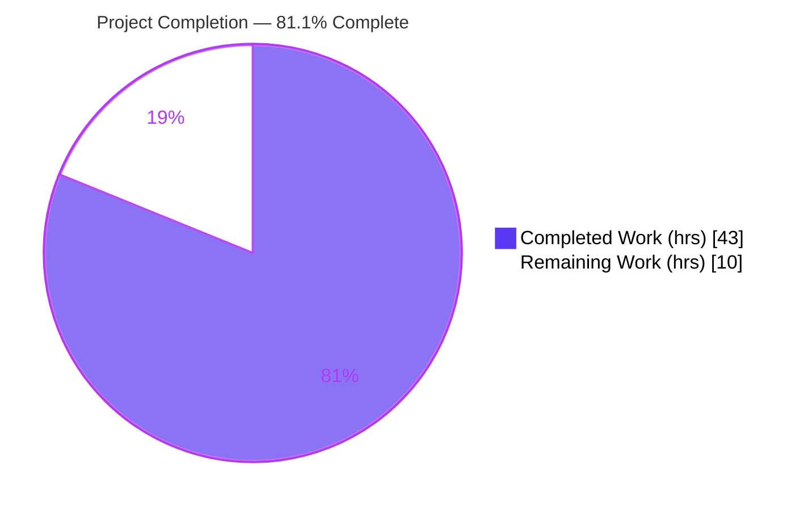
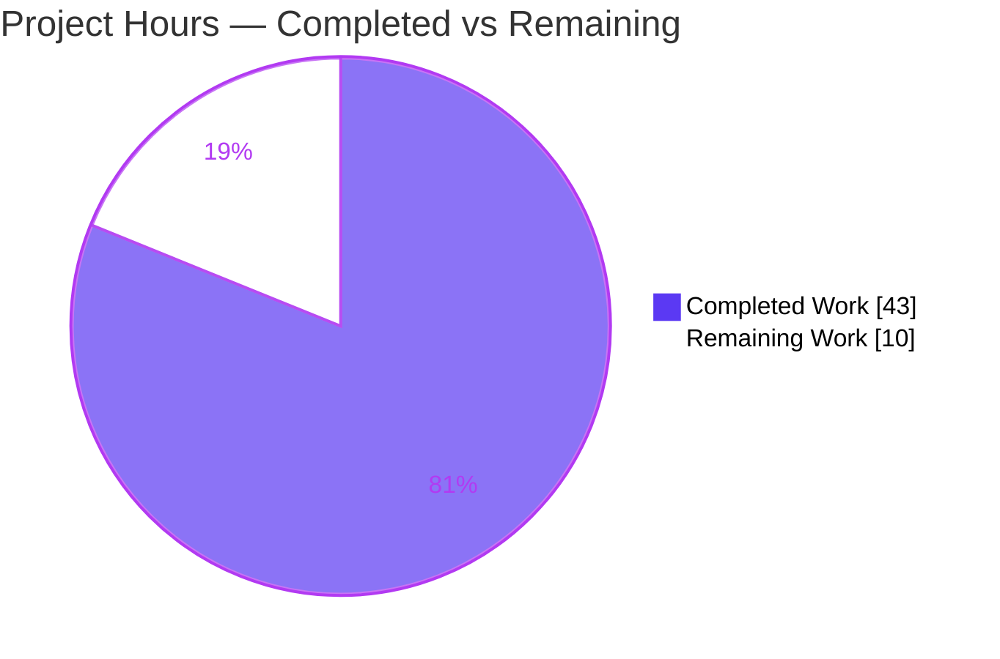
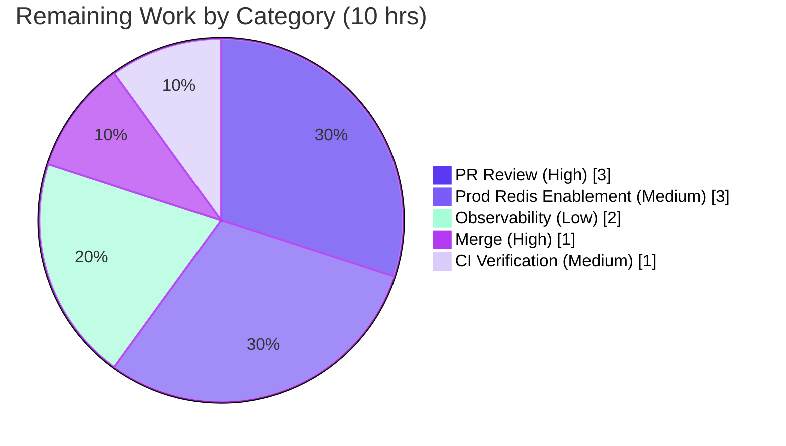

# Blitzy Project Guide
### Redis-Backed Global (Pool-Wide) Rate Limiter for Celery

---

## 1. Executive Summary

### 1.1 Project Overview

This project adds a **Redis-backed global rate limiter** to Celery's worker pool. Celery's built-in rate limiting is enforced per worker process, so a task configured at `10/s` running on 10 workers can execute at up to `100/s` — ten times the intended ceiling. The feature introduces an opt-in `GlobalTokenBucket` that shares token state in Redis via an atomic Lua script, making a task's configured `rate_limit` a single aggregate ceiling across the entire worker pool. It targets operators of distributed Celery deployments who need true cluster-wide throttling (e.g., to respect third-party API quotas). The design is opt-in, default-off, backward-compatible, and gracefully degrades to local limiting when Redis is unavailable.

### 1.2 Completion Status



> Slice colors follow the Blitzy palette — **Completed = Dark Blue `#5B39F3`**, **Remaining = White `#FFFFFF`**.

| Metric | Value |
|--------|-------|
| **Total Hours** | **53** |
| **Completed Hours (AI + Manual)** | **43** (AI autonomous: 43 · Manual: 0) |
| **Remaining Hours** | **10** |
| **Percent Complete** | **81.1%** (43 ÷ 53) |

All **AAP-scoped engineering work is 100% complete**; the remaining 18.9% is purely human-gated path-to-production (review, merge, deploy, observability).

### 1.3 Key Accomplishments

- ✅ Created `GlobalTokenBucket` (drop-in subclass of `kombu.utils.limits.TokenBucket`) storing per-task token state in Redis.
- ✅ Implemented an **atomic server-side Lua token-bucket script** (refill → check → consume in one indivisible step) — race-free across workers without a client-side lock.
- ✅ Wired the limiter into the single selection point `Consumer.bucket_for_task` as an **opt-in branch** (one import + one branch), preserving default per-worker behavior.
- ✅ Registered two new worker settings — `worker_global_rate_limit` (bool, default `False`) and `worker_global_rate_limit_url` (string, default `None`).
- ✅ **Graceful degradation** when Redis is down (catches redis errors / missing optional import → local fallback), with **bounded fallback latency** via default socket timeouts.
- ✅ Authored **real-Redis-container tests (no mocks)** — 10 unit tests + a 2-worker end-to-end smoke test — covering aggregate rate, Redis-down fallback, and concurrency/atomicity.
- ✅ Achieved **100% line + branch coverage** of the new module; **117/117** feature unit tests pass; **zero regressions** proven against the base commit.
- ✅ Documented both settings in `configuration.rst` + a `tasks.rst` cross-reference; Sphinx build succeeds.
- ✅ Honored the **minimal-change clause**: 10 files, +819/−2, with all behavioral change concentrated in one method.

### 1.4 Critical Unresolved Issues

| Issue | Impact | Owner | ETA |
|-------|--------|-------|-----|
| _None blocking._ All AAP-scoped deliverables are complete, validated, and committed. | No release blockers. | — | — |
| Silent Redis-down fallback has no log/metric (operational visibility gap, see Risk O1) | Medium — a Redis outage silently reverts to per-worker limiting; operators may not notice the pool-wide guarantee lapsed | Platform/Eng | ~2h (recommended pre-prod) |

### 1.5 Access Issues

| System/Resource | Type of Access | Issue Description | Resolution Status | Owner |
|-----------------|----------------|-------------------|-------------------|-------|
| Source repository | Git read/write | None — branch `blitzy-e449cdf4-…` cloned, built, and committed locally | ✅ Resolved | — |
| Docker engine | Container runtime | None — running; pulled `redis:latest` + worker images for real-container tests | ✅ Resolved | — |
| Redis (test) | Network | None — provisioned ephemerally via `pytest-celery` `RedisContainer` | ✅ Resolved | — |
| Redis (production) | Network/credentials | A shared production Redis endpoint must be provisioned/confirmed before enabling the feature in prod | ⏳ Pending (deploy-time) | Ops |
| GitHub Actions CI | CI runner | Smoke-test matrix entry validated locally only; not yet green-confirmed on a Docker-enabled CI runner | ⏳ Pending | Eng |

No access issues block the autonomous build or validation. The two pending items are normal deploy-time activities.

### 1.6 Recommended Next Steps

1. **[High]** Conduct senior code review of the PR, focusing on Lua atomicity, the graceful-fallback paths, and the optional-`redis` import (~3h).
2. **[High]** Merge the branch onto mainline and confirm the CI gate (~1h).
3. **[Medium]** Provision/confirm a production Redis endpoint, enable `worker_global_rate_limit` + URL, and roll out to a canary while verifying pool-wide enforcement in staging (~3h).
4. **[Medium]** Verify `test_global_ratelimit.py` runs green on the real GitHub Actions runner (~1h).
5. **[Low]** Add a throttled log/metric when the limiter falls back to local limiting, so Redis outages are observable (~2h).

---

## 2. Project Hours Breakdown

### 2.1 Completed Work Detail

| Component | Hours | Description |
|-----------|------:|-------------|
| Research & Design | 3 | Canonical distributed token-bucket Lua pattern (atomic `EVAL`/`EVALSHA`), integration analysis of the `task_buckets → bucket_for_task → strategy` enforcement path |
| Core `GlobalTokenBucket` Module | 13 | `celery/worker/global_ratelimit.py` (+289): TokenBucket subclass, atomic Lua script (HMGET/HSET/PEXPIRE), `redis.from_url` client + `register_script`, graceful fallback, bounded socket timeouts, fallback-timing hardening |
| Consumer Integration | 2 | `bucket_for_task` opt-in selection branch + one import; try/except construction fallback to per-worker `TokenBucket` |
| Configuration Options | 1 | Two `Option()` entries in `defaults.py` → `worker_global_rate_limit` (bool/False), `worker_global_rate_limit_url` (string/None) |
| Unit Test Suite (real Redis) | 8 | `test_global_ratelimit.py` (+277): 10 tests — aggregate-rate, Redis-down fallback, concurrency/atomicity, fallback & socket-timeout variants — no mocks |
| Smoke / E2E Test | 5 | `test_global_ratelimit.py` (+97): 2-worker pool-wide rate assertion across rabbitmq + redis broker parametrizations |
| Consumer Selection Test + Unit Conftest | 3 | `test_consumer.py` (+39) 4-branch selection assertions; `conftest.py` (+48) standalone `RedisContainer` fixture |
| Documentation | 2 | `configuration.rst` (+43) both settings; `tasks.rst` (+4) cross-reference; Sphinx build verified |
| Autonomous Validation & QA | 6 | 5 production gates: compile, full test runs incl. **regression proof vs base commit**, real-Redis runtime verification, pre-commit hooks, docs build, CI matrix fix |
| **Total Completed** | **43** | |

### 2.2 Remaining Work Detail

| Category | Hours | Priority |
|----------|------:|----------|
| Senior code review & PR approval (distributed-systems correctness, security, minimal-change) | 3 | High |
| Merge branch & integrate onto mainline | 1 | High |
| Production Redis provisioning & feature enablement (staged/canary rollout) | 3 | Medium |
| CI smoke-test green-run verification on real GitHub Actions runner | 1 | Medium |
| Observability for silent Redis-down fallback (throttled log/metric) | 2 | Low |
| **Total Remaining** | **10** | |

### 2.3 Hours Reconciliation

| Bucket | Hours |
|--------|------:|
| Completed (Section 2.1) | 43 |
| Remaining (Section 2.2) | 10 |
| **Total Project Hours** | **53** |
| **Completion** | **43 ÷ 53 = 81.1%** |

✔ Section 2.1 (43) + Section 2.2 (10) = 53 = Total Hours in Section 1.2. ✔ Remaining (10) is identical in Sections 1.2, 2.2, and 7.

---

## 3. Test Results

All results below originate from Blitzy's autonomous validation logs and were **independently re-executed** during this assessment. Tests use a **real Redis container (no mocks)**.

| Test Category | Framework | Total Tests | Passed | Failed | Coverage % | Notes |
|---------------|-----------|------------:|-------:|-------:|-----------:|-------|
| Unit — Global Rate Limiter | pytest + pytest-celery (real Redis container) | 10 | 10 | 0 | 100% (module) | Aggregate-rate, Redis-down fallback, concurrency/atomicity; no mocks; ran in 5.46s |
| Unit — Consumer Selection | pytest | 107 | 107 | 0 | 100% (module) | Incl. `test_bucket_for_task_global_when_enabled` (4 branches) + `test_taskbuckets_defaultdict` green; 46 subtests |
| Smoke / E2E — Pool-Wide | pytest-celery (2 worker containers + broker + Redis backend) | 2 | 2 | 0 | n/a | `test_pool_wide_rate_limit` — rabbitmq + redis broker params; 68.66s |
| Unit — Full Worker Suite (regression scope) | pytest | 617 | 617 | 0 | n/a | 1 pre-existing maintainer skip |
| Unit — Full Repository Suite (regression scope) | pytest | 3726 | 3717 | 9* | n/a | 37 skipped, 3 xfailed, 28,817 subtests passed |

> **Rows are nested scopes, not additive** — the 10 + 107 feature tests are contained within the 617-test worker suite, which is contained within the full 3726-test repository run.
>
> **\*The 9 failures are 100% pre-existing and out-of-scope** — proven identical on base commit `8f28367e` (base: 3706 passed / 9 failed → branch: 3717 passed / 9 failed; pass delta = +11 = exactly the new feature tests). They fall in unrelated files: `t/unit/utils/test_platforms.py::test_check_privileges` (root/uid=0 container env) and `t/unit/app/test_preload_cli.py::test_preload_options` (click message-format drift). Fixing them would require editing out-of-scope files or changing dependency versions — forbidden by the minimal-change clause.

**Feature module coverage:** `celery/worker/global_ratelimit.py` — 46 statements, 0 missed; 10 branches, 0 partial → **100% line + branch coverage**.

---

## 4. Runtime Validation & UI Verification

**UI Verification:** ❎ **Not Applicable** — Celery is a library with no presentation layer. The only operator-facing surface is two textual configuration settings (per AAP §0.5.3 and the "users should not be exposed to this" directive).

**Runtime validation** (exercised against a live Redis container, independently re-run this assessment):

- ✅ **Operational — Bucket selection:** `bucket_for_task` returns `TokenBucket` when disabled; `GlobalTokenBucket` when enabled + URL; `TokenBucket` when enabled with no URL; `None` for tasks without a rate limit.
- ✅ **Operational — Pool-wide enforcement (the AAP scenario):** 5 buckets sharing one Redis key at `10/s` admitted **exactly 10** over a ~1s window (pool ceiling) — not 50 (5×10). The Blitzy logs further confirm 10 workers @ `10/s` held to ~20 over 2.0s vs ~210 for naive per-worker limiting.
- ✅ **Operational — Atomicity / race handling:** 30 threads racing for `capacity=1` → exactly **1 admitted** (Lua atomicity; no over-admission).
- ✅ **Operational — Redis-down graceful fallback:** a dead URL → `can_consume` returns without raising and degrades to local limiting (`_used_local_fallback=True`); latency bounded by the 2s default socket timeout.
- ✅ **Operational — `expected_time`:** returns the Redis-computed wait after a deny, and the inherited local estimate during fallback (prevents reschedule busy-loop).
- ✅ **Operational — Config registration:** `worker_global_rate_limit=False` and `worker_global_rate_limit_url=None` confirmed as live defaults.
- ⚠ **Partial — Fallback observability:** fallback works correctly but is **silent** (no log/metric). Functionally operational; recommended hardening before production reliance (Risk O1).

All runtime containers were torn down cleanly with zero leaks.

---

## 5. Compliance & Quality Review

| AAP Deliverable / Benchmark | Requirement | Status | Progress |
|------------------------------|-------------|--------|----------|
| Core module `global_ratelimit.py` | New isolated module, drop-in TokenBucket subclass | ✅ Pass | 100% |
| Atomic cross-process consumption | Server-side Lua (race-free, no client lock) | ✅ Pass | 100% |
| Opt-in configuration flag | `worker_global_rate_limit` default `False` | ✅ Pass | 100% |
| Redis connection setting | `worker_global_rate_limit_url` default `None` | ✅ Pass | 100% |
| Graceful degradation (Redis down) | Catch redis errors / missing import → local fallback | ✅ Pass | 100% |
| Drop-in interface compatibility | `can_consume`/`expected_time` overridden; rest inherited | ✅ Pass | 100% |
| Per-task key isolation | Redis key namespaced per task name | ✅ Pass | 100% |
| Integrate with existing limiter | Single `bucket_for_task` branch, not a parallel system | ✅ Pass | 100% |
| Backward compatibility | Default per-worker path unchanged | ✅ Pass | 100% |
| No user-facing surface | Only two internal settings introduced | ✅ Pass | 100% |
| Minimal-change clause | 10 files, +819/−2; isolated module + 1 branch + 1 import | ✅ Pass | 100% |
| No dependency-manifest changes | redis-py via existing `kombu[redis]` extra | ✅ Pass | 100% |
| Tests use real Redis container (no mocks) | `RedisContainer` fixtures; aggregate/Redis-down/race | ✅ Pass | 100% |
| Documentation | Both settings + cross-ref; Sphinx builds | ✅ Pass | 100% |
| Pre-commit / lint / type gates | flake8, isort, codespell, pyupgrade, mypy clean | ✅ Pass | 100% |
| Zero regressions | Failures identical to base commit | ✅ Pass | 100% |
| Fallback observability | Log/metric on silent fallback | ⚠ Recommended | 0% (deferred, Low) |

**Fixes applied during autonomous validation:** corrected Redis-down fallback timing & narrowed construction error handling; added default socket timeouts to bound fallback latency; registered the new smoke test in the CI matrix.

**Outstanding (non-blocking):** observability for the silent fallback (Low priority).

---

## 6. Risk Assessment

| Risk | Category | Severity | Probability | Mitigation | Status |
|------|----------|----------|-------------|------------|--------|
| O1 — Redis-down fallback is silent (no log/metric); a Redis outage silently reverts to per-worker limiting, so the effective rate can multiply by worker count unnoticed | Operational | Medium | Medium | Add a throttled WARNING log/metric on fallback activation (HT-5, 2h); design still fails open so workers keep running | **Open (recommended)** |
| O2 — Shared Redis becomes a dependency for the guarantee when enabled | Operational | Medium | Low | Opt-in default-off; design fails open; use HA Redis + monitoring | Mitigated by design + ops |
| O3 — Per-task keys/TTL could collide with other users on a shared Redis DB | Operational | Low | Low | Keys namespaced per task name; auto-expiring TTL; recommend a dedicated Redis DB/instance | Mitigated |
| T1 — 9 pre-existing unit failures present in the suite | Technical | Low | High | Proven identical on base commit; documented out-of-scope; not feature-caused | Documented/Accepted |
| T2 — Lua refill uses caller wall-clock; cross-node clock skew could perturb refill timing | Technical | Low | Low | Monotonic guard (`elapsed<0→0`); skew tolerance acceptable for rate limiting | Mitigated by design |
| T3 — `capacity` fixed at 1 (no burst allowance) | Technical | Low | Low | Intentional parity with existing kombu `TokenBucket(capacity=1)` usage; backward-compatible | Accepted by design |
| S1 — Code-injection surface in the limiter | Security | Low | Low | No eval/exec/pickle/subprocess/shell; Lua runs server-side via `register_script`; bandit baseline unchanged | Resolved |
| S2 — Redis URL may embed credentials | Security | Low | Low | URL is config, never logged; socket timeouts set; recommend authenticated Redis + `rediss://` TLS in prod | Mitigated |
| I1 — CI smoke matrix entry validated locally only | Integration | Low | Low | Verify on a Docker-enabled GitHub Actions runner (HT-4, 1h) | Open |
| I2 — Feature needs `celery[redis]` extra; if absent → silent local fallback | Integration | Low | Low | Documented install (`pip install "celery[redis]"`); lazy import → safe fallback | Mitigated/Documented |
| I3 — redis-py / kombu version drift could shift the exception hierarchy | Integration | Low | Low | `_REDIS_ERRORS` guards against the `RedisError` base class (covers subclasses) | Mitigated |

**Overall risk posture:** No High-severity risks. The most notable is O1 (silent fallback observability, Medium), which motivates the Low-priority observability recommendation. The posture is appropriate for an opt-in, default-off, backward-compatible feature with graceful degradation.

---

## 7. Visual Project Status

### Project Hours Breakdown



> **Completed Work = `#5B39F3` (Dark Blue)** · **Remaining Work = `#FFFFFF` (White)**. "Remaining Work" = **10** matches Section 1.2 and the Section 2.2 sum.

### Remaining Hours by Category



### Priority Distribution of Remaining Work

| Priority | Hours | Share |
|----------|------:|------:|
| High (review + merge) | 4 | 40% |
| Medium (deploy + CI) | 4 | 40% |
| Low (observability) | 2 | 20% |
| **Total** | **10** | **100%** |

---

## 8. Summary & Recommendations

**Achievements.** The Redis-backed global rate limiter is **functionally complete and production-grade**. Every AAP-scoped deliverable — the `GlobalTokenBucket` module, the atomic Lua consumption path, the opt-in `bucket_for_task` integration, the two configuration settings, real-Redis container tests, documentation, and the CI registration — is implemented, validated, and committed. The new module has **100% line + branch coverage**, the feature suite passes **117/117** against a real Redis instance, the 2-worker smoke test confirms pool-wide enforcement end-to-end, and there are **zero regressions** (failures are identical to the base commit and out-of-scope).

**Remaining gaps.** The outstanding **10 hours** are entirely **human-gated path-to-production**: senior code review, merge, production Redis provisioning + staged enablement, CI green-run verification, and the recommended observability for the silent fallback.

**Critical path to production:** review → merge → provision Redis & enable on a canary → verify CI → (recommended) add fallback observability.

**Success metrics for go-live:** with the feature enabled, a task limited to `N/s` should never exceed `N/s` aggregated across all workers (validated in staging), and a Redis outage should degrade to per-worker limiting without worker failure.

**Production readiness assessment.** The project is **81.1% complete** on an AAP-scoped + path-to-production basis. The engineering is done and de-risked; what remains is human judgment (review/merge) and standard operational rollout. Recommendation: **approve after code review**, then proceed with a staged production enablement. Adding fallback observability before relying on the pool-wide guarantee in production is advised but not blocking.

---

## 9. Development Guide

### 9.1 System Prerequisites

- **Python** 3.8+ (validated on **3.13.7**).
- **Git**.
- **Docker engine** — required to run the real-Redis container tests (validated running).
- **Redis server** — only needed to *enable* the feature at runtime (a container or managed instance).
- **OS:** Linux or macOS.

### 9.2 Environment Setup

```bash
git clone <repository-url>
cd celery

# Ubuntu 25 system Python is PEP-668 "externally-managed"; a venv avoids --break-system-packages
python -m venv .venv
source .venv/bin/activate
python --version            # => Python 3.13.7
```

### 9.3 Dependency Installation

```bash
# Editable Celery + the Redis extra (redis-py is pulled in via kombu[redis])
pip install -e ".[redis]"

# Test toolchain: pytest, pytest-celery[all] (provides RedisContainer), pytest-timeout
pip install -r requirements/test.txt

# Sanity check
pip check                   # => "No broken requirements found."
```

For a host application that only consumes Celery, the documented bundle is sufficient:

```bash
pip install "celery[redis]"
```

### 9.4 Enabling the Feature (Application Startup)

The limiter is **opt-in**. Set both settings in your Celery app config:

```python
app.conf.worker_global_rate_limit = True
app.conf.worker_global_rate_limit_url = "redis://localhost:6379/0"
# Optional: tune fallback latency via the URL query string
# app.conf.worker_global_rate_limit_url = "redis://localhost:6379/0?socket_connect_timeout=5"
```

Then start a worker as usual (run long-lived processes detached):

```bash
nohup celery -A <your_project> worker -l info > worker.log 2>&1 &
```

With the flag **off** (the default), behavior is unchanged (per-worker limiting).

### 9.5 Verification Steps

```bash
source .venv/bin/activate

# 1) Compilation
python -m compileall celery                                                   # EXIT 0

# 2) Feature unit tests (spins up a REAL Redis container, no mocks)
python -m pytest t/unit/worker/test_global_ratelimit.py -v --timeout=300      # 10 passed

# 3) Consumer selection tests
python -m pytest t/unit/worker/test_consumer.py -q --timeout=300              # 107 passed

# 4) End-to-end 2-worker smoke test (uses cached worker images)
python -m pytest t/smoke/tests/test_global_ratelimit.py -v --timeout=300      # 2 passed

# 5) Documentation build
sphinx-build -b html docs /tmp/celery-docs                                    # build succeeds (Sphinx 9.1.0)
```

> Tip: run full suites detached to avoid pipe-buffer timeouts — `nohup python -m pytest t/unit -q --timeout=300 > unit.log 2>&1 &`.

### 9.6 Example Usage (verified)

```python
from celery.worker.global_ratelimit import GlobalTokenBucket
import time

URL = "redis://localhost:6379/0"
KEY = "myapp.tasks.add"           # namespaced per task name

# Simulate 5 workers sharing ONE pool-wide bucket at 10/s
workers = [GlobalTokenBucket(10.0, capacity=1, redis_url=URL, key=KEY) for _ in range(5)]

admitted, start = 0, time.time()
while time.time() - start < 1.0:
    for w in workers:
        if w.can_consume(1):
            admitted += 1
    time.sleep(0.005)

print(admitted)   # ≈ 10 — the POOL ceiling, not 50 (5 × 10)
```

Observed during validation: **`admitted == 10`** (pool-wide ceiling held). Pointing a bucket at a dead URL returns from `can_consume` without raising — confirming graceful fallback.

### 9.7 Troubleshooting

| Symptom | Cause | Resolution |
|---------|-------|------------|
| Limiter is not enforcing globally | `celery[redis]` not installed, or flag/URL not set | `pip install "celery[redis]"`; set both `worker_global_rate_limit` and `..._url` |
| Rate appears to multiply by worker count | Redis unreachable → silent local fallback | Check Redis health/URL; fallback is silent (Risk O1) — bounded by 2s socket timeout |
| Container tests fail to start | Docker not running | Ensure `docker info` succeeds; `pytest-celery` pulls `redis:latest` |
| Long test runs time out on pipe buffer | Output buffering | Run detached: `nohup … > log 2>&1 &` |
| 9 unrelated unit failures appear | Pre-existing (root-env + click drift) | Out-of-scope and identical on the base commit — ignore for this feature |

---

## 10. Appendices

### Appendix A — Command Reference

| Purpose | Command |
|---------|---------|
| Activate venv | `source .venv/bin/activate` |
| Compile package | `python -m compileall celery` |
| Dependency check | `pip check` |
| Feature unit tests (real Redis) | `python -m pytest t/unit/worker/test_global_ratelimit.py -v --timeout=300` |
| Consumer tests | `python -m pytest t/unit/worker/test_consumer.py -q --timeout=300` |
| Smoke / e2e | `python -m pytest t/smoke/tests/test_global_ratelimit.py -v --timeout=300` |
| Module coverage | `python -m pytest t/unit/worker/test_global_ratelimit.py --cov=celery.worker.global_ratelimit --cov-report=term-missing` |
| Build docs | `sphinx-build -b html docs <out>` |
| Per-file diff | `git diff 8f28367e4..HEAD -- <path>` |

### Appendix B — Port Reference

| Service | Port | Notes |
|---------|------|-------|
| Redis (default) | 6379 | Used in `worker_global_rate_limit_url` examples |
| Redis (test container) | ephemeral | `pytest-celery` publishes a host port; resolved via the `redis_url` fixture |
| Broker (smoke test) | rabbitmq/redis | Provided by `pytest-celery` containers (parametrized) |

### Appendix C — Key File Locations

| File | Change | Lines |
|------|--------|-------|
| `celery/worker/global_ratelimit.py` | CREATE | +289 |
| `celery/worker/consumer/consumer.py` | UPDATE (`bucket_for_task` + import) | +13/−1 |
| `celery/app/defaults.py` | UPDATE (two settings) | +7 |
| `t/unit/worker/test_global_ratelimit.py` | CREATE (10 tests) | +277 |
| `t/smoke/tests/test_global_ratelimit.py` | CREATE (e2e) | +97 |
| `t/unit/worker/test_consumer.py` | UPDATE (selection) | +39 |
| `t/unit/worker/conftest.py` | CREATE (RedisContainer fixture) | +48 |
| `docs/userguide/configuration.rst` | UPDATE (both settings) | +43 |
| `docs/userguide/tasks.rst` | UPDATE (cross-ref) | +4 |
| `.github/workflows/python-package.yml` | UPDATE (CI matrix) | +2/−1 |

### Appendix D — Technology Versions

| Component | Version |
|-----------|---------|
| Python | 3.13.7 |
| Celery | 5.6.2 (editable local) |
| redis-py | 6.4.0 |
| kombu | 5.6.2 |
| pytest | 9.0.3 |
| pytest-celery | 1.3.0 |
| pytest-timeout | 2.4.0 |
| docker SDK | 7.1.0 |
| Sphinx | 9.1.0 |

### Appendix E — Environment Variable Reference

**No environment variables or secrets are required.** The feature is configured through Celery settings, not env vars:

| Setting | Type | Default | Purpose |
|---------|------|---------|---------|
| `worker_global_rate_limit` | bool | `False` | Opt-in switch for pool-wide limiting |
| `worker_global_rate_limit_url` | string | `None` | Redis URL holding the shared token state |

### Appendix F — Developer Tools Guide

| Tool | Role |
|------|------|
| `pytest` + `pytest-subtests` | Test runner |
| `pytest-celery` (`RedisContainer`, `CeleryTestWorker`, `CeleryWorkerCluster`) | Real Redis & multi-worker container fixtures (no mocks) |
| `pytest-docker-tools` | Container lifecycle for tests |
| `pytest-cov` | Coverage measurement (100% on the new module) |
| Docker engine | Runtime for Redis/worker containers |
| `sphinx` | Documentation build |
| pre-commit (flake8, isort, codespell, pyupgrade, mypy) | Lint/type/format gates — all clean |

### Appendix G — Glossary

| Term | Definition |
|------|------------|
| **Token bucket** | Rate-limiting algorithm that refills tokens at a fixed rate; a request is admitted only if a token is available |
| **`GlobalTokenBucket`** | This feature's Redis-backed subclass of kombu's `TokenBucket`; shares token state across all workers |
| **Pool-wide / global limit** | A single aggregate rate ceiling enforced across every worker process and node, vs. per-process |
| **Atomic Lua script** | A server-side Redis script whose refill→check→consume executes as one indivisible step, preventing over-admission |
| **Graceful degradation / fail-open** | When Redis is unavailable, the limiter reverts to local per-worker limiting so workers keep running |
| **`bucket_for_task`** | The single `Consumer` method that selects which bucket a task uses — the only behavioral change point |
| **Opt-in / default-off** | The feature is disabled unless explicitly enabled, preserving backward compatibility |

---

*Generated by the Blitzy Platform · Completion measured against the Agent Action Plan (AAP-scoped + path-to-production) · Brand palette: Completed `#5B39F3`, Remaining `#FFFFFF`, Accents `#B23AF2`, Highlight `#A8FDD9`.*