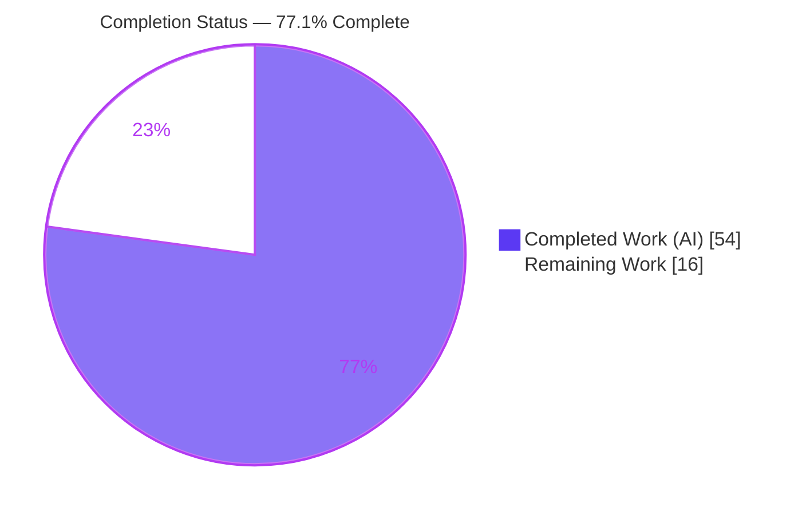
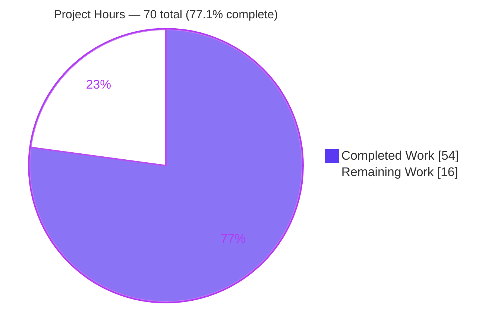
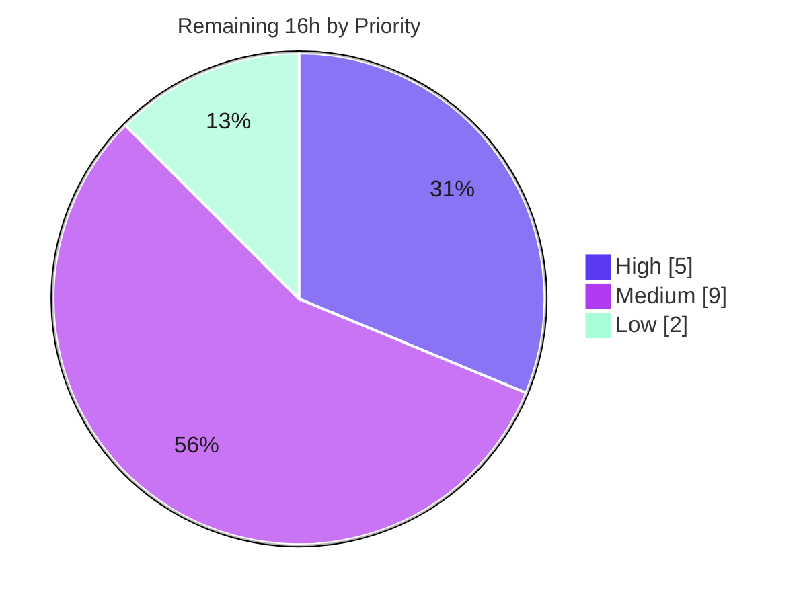

# Blitzy Project Guide — Opt-In Redis-Backed Global Rate Limiter for Celery Tasks

> Brand legend — **Completed / AI Work:** Dark Blue `#5B39F3` · **Remaining / Not Completed:** White `#FFFFFF` · **Headings / Accents:** Violet-Black `#B23AF2` · **Highlight:** Mint `#A8FDD9`

---

## 1. Executive Summary

### 1.1 Project Overview

This project adds an **opt-in, Redis-backed *global* rate limiter** to Celery so a task's existing `rate_limit` (e.g. `"100/m"`) is enforced **across the entire worker fleet** instead of independently per worker process. Today, ten workers running a `10/s` task can collectively reach `100/s`; with the feature enabled they share one Redis-coordinated token bucket and the configured limit holds globally. Target users are operators integrating with rate-capped third-party APIs and autoscaling deployments. Activation is a single new setting (`task_global_rate_limit_backend`); when unset, behavior is byte-for-byte identical to today. The change is surgical — all new logic is isolated in a dedicated `celery/rate_limiting/` package with only two minimal, commented edits to existing files.

### 1.2 Completion Status



| Metric | Hours |
|--------|-------|
| **Total Hours** | **70** |
| Completed Hours (AI + Manual) | 54 |
| Remaining Hours | 16 |
| **Percent Complete** | **77.1%** |

> **Completion formula (PA1, AAP-scoped):** `54 ÷ (54 + 16) = 54 ÷ 70 = 77.1%`. All AAP **feature** requirements are implemented and validated; the remaining 16 h is **path-to-production** work (review/merge, deployment, monitoring, CI wiring) that requires human and infrastructure access.

### 1.3 Key Accomplishments

- ✅ **Global cross-worker enforcement** delivered via `RedisTokenBucket`, validated against live Redis (cross-worker depletion + atomic burst: 10 rapid attempts → exactly 1 allowed).
- ✅ **Single opt-in setting** `task_global_rate_limit_backend` (+ legacy alias `CELERY_GLOBAL_RATE_LIMIT_BACKEND`) and `task_global_rate_limit_fail_open`, registered in the `task` namespace; defaults live-verified.
- ✅ **Zero behavior change when unset** — the per-worker `kombu` `TokenBucket` path is preserved exactly; a falsy `rate_limit` remains a pure no-op (no bucket, no Redis access).
- ✅ **Minimal-change discipline honored** — new logic isolated in `celery/rate_limiting/`; only **two** existing files touched (`defaults.py`, `consumer.py`), each with explanatory comments.
- ✅ **Atomic concurrency** via a server-side Lua token-bucket script; single key per task → Redis Cluster safe.
- ✅ **Explicit, configurable degradation** — fail-open (default) or fail-closed; lazy connection tolerates Redis being unreachable at startup; credentials redacted in all logs/errors.
- ✅ **No new dependencies** — uses `redis-py` from the existing `kombu[redis]` extra; `pip check` clean.
- ✅ **Comprehensive tests** — 11 unit tests + 3 consumer-factory tests + 2 live-Redis integration tests, all passing; flake8 zero violations; mypy clean.
- ✅ **Documentation** added to `configuration.rst`, `tasks.rst`, and `redis.rst`.

### 1.4 Critical Unresolved Issues

| Issue | Impact | Owner | ETA |
|-------|--------|-------|-----|
| _None blocking._ Feature is functionally complete and validated. | — | — | — |
| PR #3 awaiting human review/merge (reviewer's `TOKEN_BUCKET_LUA` question already answered via bot reply) | Code not yet merged to main | Maintainer / Reviewer | 0.5 day |
| Production Redis not yet provisioned/monitored (feature is opt-in; off by default) | Cannot enable in prod until done | DevOps | 1 day |

> Note (informational, **not** a feature defect): the full unit suite shows **2 pre-existing failures** in `t/unit/app/test_preload_cli.py` caused by a Click 8.4.1 error-message format change. These are **out of AAP scope**, **not a regression** (zero agent commits touched the CLI; last touched by upstream commit `64d750bb1`), and are excluded from the hours totals.

### 1.5 Access Issues

| System/Resource | Type of Access | Issue Description | Resolution Status | Owner |
|-----------------|----------------|-------------------|-------------------|-------|
| Production Redis instance | Network + credentials | No production Redis URL/credentials provisioned for the limiter backend | Open — required to enable feature | DevOps |
| CI runner (integration) | Service container | Integration tests need a live Redis service + the `integration` marker registered in the main CI config | Open — currently run via `addopts` override | CI/Platform |
| GitHub PR #3 | Repository merge rights | Awaiting human approval/merge | Open | Maintainer |

> No access issues prevented autonomous build, unit testing, or runtime validation — those completed successfully (a local Redis via Docker was used for runtime/integration validation).

### 1.6 Recommended Next Steps

1. **[High]** Review and merge **PR #3** (the reviewer's question about `TOKEN_BUCKET_LUA` is answered; it is a module-level constant at line 114 of `redis_rate_limiter.py`).
2. **[High]** Provision a dedicated, highly-available **production Redis** for the limiter and set `task_global_rate_limit_backend` (prefer `rediss://` TLS; source the URL from a secret manager).
3. **[Medium]** Deploy to **staging** and validate the aggregate rate holds with multiple workers under realistic load.
4. **[Medium]** Wire **monitoring/alerting** on Redis health and the limiter's degradation warning logs, and **add the integration test to CI** with a Redis service.
5. **[Low]** Review **TTL/capacity** defaults against real task rate profiles and validate Redis Cluster behavior if applicable.

---

## 2. Project Hours Breakdown

### 2.1 Completed Work Detail

| Component | Hours | Description |
|-----------|-------|-------------|
| Algorithm research & design | 5 | Token-bucket vs. sliding-window selection, atomic Lua vs. `INCR`+`EXPIRE`, fail-open/closed degradation, per-task key namespacing, Redis Cluster safety (AAP §0.2.2). |
| Core `RedisTokenBucket` module | 16 | `celery/rate_limiting/redis_rate_limiter.py` (322 L) + `__init__.py` (16 L): atomic Lua consume + `expected_time` scripts, lazy independent `redis.Redis.from_url` connection, fail-open/closed, per-task key + TTL, `ImproperlyConfigured` handling, credential redaction, full docstrings. |
| Configuration registration | 2 | `celery/app/defaults.py`: `global_rate_limit_backend` + `global_rate_limit_fail_open` Options in the `task` namespace; legacy alias auto-derived via `__old__`. |
| Consumer factory integration | 3 | `celery/worker/consumer/consumer.py`: single `bucket_for_task()` hook returning `RedisTokenBucket` when configured; preserves no-op and `reset_rate_limits()` funnel (startup/SIGHUP/control). |
| Unit test suite | 8 | `t/unit/rate_limiting/test_redis_rate_limiter.py` (312 L): 11 mock-based tests — allow/block, `expected_time` math + µs conversion, fail-open/closed, malformed-URL + redaction, key namespacing, no-op, inherited surface. |
| Consumer factory unit tests | 2 | `t/unit/worker/test_consumer.py` (+53 L): 3 tests — local-when-unset, global-when-set, no-op-when-falsy. |
| Integration test suite | 9 | `t/integration/test_global_rate_limit.py` (542 L): 2 `@pytest.mark.integration` end-to-end tests with real workers + live Redis (single-worker and cross-worker enforcement). |
| Documentation | 3 | `configuration.rst`, `tasks.rst`, `redis.rst`: settings, legacy alias, fail-open/closed semantics, example `redis://localhost:6379/0`, global-vs-per-worker behavior. |
| Validation, runtime testing & QA resolution | 6 | Live-Redis runtime validation; resolution of review/QA findings across commits (malformed-URL fix, integration-test fix, import placement, reverting out-of-scope edits); lint/mypy/`pip check` gates. |
| **Total Completed** | **54** | |

### 2.2 Remaining Work Detail

| Category | Hours | Priority |
|----------|-------|----------|
| Review & merge PR #3 | 2 | High |
| Production Redis provisioning & connection config (URL, credentials/secrets, TLS `rediss://`, fail-mode decision) | 3 | High |
| Staging deployment & multi-worker aggregate-rate load validation | 4 | Medium |
| Monitoring & alerting (Redis health + limiter degradation warnings) | 3 | Medium |
| CI integration-test wiring (Redis service + `integration` marker) | 2 | Medium |
| Production tuning review (TTL/capacity defaults, Redis Cluster validation) | 2 | Low |
| **Total Remaining** | **16** | |

### 2.3 Hours Reconciliation

| Roll-up | Hours |
|---------|-------|
| Completed (Section 2.1) | 54 |
| Remaining (Section 2.2) | 16 |
| **Total Project Hours (Section 1.2)** | **70** |
| Completion % = 54 ÷ 70 | **77.1%** |

---

## 3. Test Results

All tests below originate from Blitzy's autonomous validation logs and were independently re-run in this assessment session (venv Python 3.13.7, pytest 9.0.3).

| Test Category | Framework | Total Tests | Passed | Failed | Coverage % | Notes |
|---------------|-----------|-------------|--------|--------|------------|-------|
| Unit — Global Rate Limiter | pytest 9.0.3 + `unittest.mock` | 11 | 11 | 0 | All logical branches* | `t/unit/rate_limiting/test_redis_rate_limiter.py` — allow/block, `expected_time`, µs conversion, fail-open, fail-closed, malformed URL (+redaction), key namespacing, no-op, inherited surface. |
| Unit — Consumer Factory | pytest 9.0.3 | 3 | 3 | 0 | Factory paths | New tests in `t/unit/worker/test_consumer.py` (full file: 109 passed + 46 subtests). |
| Integration — End-to-End (live Redis) | pytest 9.0.3 (`@pytest.mark.integration`) | 2 | 2 | 0 | Cross-worker | `t/integration/test_global_rate_limit.py` — single-worker + cross-two-worker enforcement; live Redis (Docker), ~35.9 s. |
| Regression — Full unit suite | pytest 9.0.3 | 3,652 (+28,817 subtests) | 3,652 | 2† | n/a | 39 skipped, 3 xfailed. |

\* Numeric line-coverage tooling (`pytest-cov`/`coverage`) is intentionally **not** in `requirements/test.txt` (no new test deps per AAP); the 11 unit tests are designed to exercise every logical branch of the in-scope module (allow/deny, both degradation modes, both misconfiguration paths, no-op).

† The **2 failures are pre-existing and out of scope**: `t/unit/app/test_preload_cli.py::test_preload_options[subcommand_with_params0/1]` assert an older Click error-message substring (`"No such option: --ini"`) while Click 8.4.1 emits `"No such option '--ini'"`. No agent commit touched the CLI; **not a regression** caused by this feature.

**In-scope feature test totals: 16 tests, 16 passed, 0 failed.**

---

## 4. Runtime Validation & UI Verification

Celery has **no user interface** — it is a distributed task queue configured via settings and operated through the CLI/event surfaces. This feature is **configuration-only** and surfaces no visual component, so no UI verification applies. Runtime behavior was validated as follows:

- ✅ **Operational** — Import & interface: `from celery.rate_limiting import RedisTokenBucket`; confirmed subclass of `kombu.utils.limits.TokenBucket`.
- ✅ **Operational** — Config plumbing: `task_global_rate_limit_backend` default `None`; `task_global_rate_limit_fail_open` default `True`; legacy `CELERY_GLOBAL_RATE_LIMIT_BACKEND` resolves to the new key.
- ✅ **Operational** — Factory selection (live): backend unset → `TokenBucket`; backend set → `RedisTokenBucket` (key `celery:global-rate-limit:<task>`, TTL 61 s, `fail_open=True`); no `rate_limit` → `None` (no-op, no Redis access).
- ✅ **Operational** — Global enforcement (live Redis): two independent buckets sharing one task key → worker 1 allowed, worker 2 immediately blocked; refill after wait; burst of 10 → exactly 1 allowed (atomic, no double-spend).
- ✅ **Operational** — Degradation (unreachable Redis): `fail_open=True` → `can_consume`=allow; `fail_open=False` → block; `expected_time` bounded backoff (0.1 s); never raises into the consumer loop.
- ✅ **Operational** — Misconfiguration: malformed backend URL → `ImproperlyConfigured` with **credentials redacted**; missing `redis-py` → `ImproperlyConfigured` with install guidance.
- ✅ **Operational** — Worker CLI unchanged: `celery worker --help` shows `--concurrency` / `--autoscale`; `celery --version` → 5.6.2.

---

## 5. Compliance & Quality Review

Cross-mapping of AAP requirements and constraints to quality benchmarks. **16/16 AAP feature requirements: COMPLETED.**

| AAP Requirement / Constraint | Benchmark | Status | Evidence / Fixes Applied |
|------------------------------|-----------|--------|--------------------------|
| Global enforcement via Redis shared state | Functional | ✅ Pass | Atomic Lua; integration cross-worker depletion test. |
| Opt-in single setting + legacy alias | Functional | ✅ Pass | `defaults.py`; live-verified `__old__` derivation. |
| Configurable fail-open/fail-closed degradation | Reliability | ✅ Pass | `can_consume` returns `_fail_open` on `RedisError`; unit + runtime tests. |
| Preserve `rate()` syntax unchanged | Backward-compat | ✅ Pass | Receives parsed float; parser untouched. |
| Isolate new logic in dedicated module | Minimal-change | ✅ Pass | `celery/rate_limiting/` package. |
| Minimum hook points | Minimal-change | ✅ Pass | Single `bucket_for_task()` edit + one import. |
| No new dependency | Dependency hygiene | ✅ Pass | `redis-py` via `kombu[redis]`; `pip check` clean. |
| Interface conformance (`can_consume`/`expected_time`/`add`/`pop`/`contents`/`clear_pending`) | Integration | ✅ Pass | Subclass overrides only 2 methods; `test_inherited_tokenbucket_surface`. |
| True no-op when `rate_limit` falsy | Backward-compat | ✅ Pass | `test_falsy_rate_limit`, `test_bucket_for_task_noop`. |
| Per-task key namespacing | Correctness | ✅ Pass | `celery:global-rate-limit:<task_name>`; `test_per_task_key_namespacing`. |
| Independent Redis connection | Architecture | ✅ Pass | Own `from_url`; not broker/`result_backend`. |
| Reload/control survival | Integration | ✅ Pass | `reset_rate_limits()` funnel unchanged. |
| Atomicity under concurrency | Correctness | ✅ Pass | Server-side Lua; burst test 10→1. |
| Tolerate Redis unreachable at startup | Reliability | ✅ Pass | Lazy `_get_client()`. |
| Credentials never logged in plaintext | Security | ✅ Pass | `maybe_sanitize_url` in all log/error paths. |
| Annotate edits to existing files | Minimal-change | ✅ Pass | Explanatory comments in `defaults.py` and `consumer.py`. |
| Lint / type / style | Code quality | ✅ Pass | flake8 7.3.0 = 0 violations; mypy 1.19.1 = clean; zero placeholders/TODOs. |
| Test coverage (unit + optional integration) | Testing | ✅ Pass | 11 unit + 3 factory + 2 integration, all passing. |
| Documentation | Docs | ✅ Pass | 3 RST files updated; well-formed. |

**Fixes applied during autonomous validation:** malformed rate-limit backend URL handling + docs cross-reference; integration test corrected to actually exercise the limiter; out-of-scope edits reverted; import placement corrected (`isort:skip`).

---

## 6. Risk Assessment

| Risk | Category | Severity | Probability | Mitigation | Status |
|------|----------|----------|-------------|------------|--------|
| Fail-open default silently disables the global limit during a Redis outage (downstream could be overwhelmed) | Technical | Medium | Medium | Monitor Redis health + limiter degradation warnings; choose fail-closed for critical downstreams | Mitigated by design; monitoring is a remaining task |
| Lua refill uses Redis server clock; replica failover with clock skew could briefly skew refill | Technical | Low | Low | NTP on Redis hosts; single authoritative primary | Accepted |
| Per-worker re-check queue adds Redis `EVALSHA` load under heavy contention | Technical | Low | Low | Tune `expected_time` backoff; monitor Redis ops | Accepted |
| Redis URL may embed credentials | Security | Medium | Low | `maybe_sanitize_url` redaction in all logs/errors; source URL from secrets manager | **Resolved in code** |
| Plaintext `redis://` over untrusted network | Security | Medium | Low | Use `rediss://` (TLS) in production | Documented (operator action) |
| Shared multi-tenant Redis key tampering | Security | Low | Low | Per-task key namespacing; dedicated DB/ACLs; independent connection | Mitigated by design |
| Production Redis not yet provisioned/monitored; silent fail-open could go unnoticed | Operational | Medium | Medium | Provisioning (3 h) + monitoring/alerting (3 h) remaining tasks | Open (path-to-production) |
| Enabling the limiter makes Redis a SPOF in the dispatch hot path | Operational | Medium | Low | HA Redis; fail-open default avoids halting; monitoring | Mitigated by design |
| TTL (`MIN_KEY_TTL=60`) / `capacity=1` defaults may need tuning | Operational | Low | Medium | Tuning review task (2 h) | Open (low priority) |
| Integration tests not wired into CI (need live Redis + `integration` marker) | Integration | Medium | Medium | CI wiring task (2 h) | Open |
| Redis Cluster slot behavior | Integration | Low | Low | Single key/task is Cluster-safe (documented); validate in tuning review | Mitigated/documented |
| `redis-py` absent when backend is set | Integration | Low | Low | `ImproperlyConfigured` raised loudly with install guidance | **Resolved in code** |

---

## 7. Visual Project Status

### Project Hours Breakdown



### Remaining Hours by Priority



### Remaining Hours by Category

| Category | Hours | Bar |
|----------|-------|-----|
| Staging deploy & multi-worker load validation | 4 | ████████ |
| Production Redis provisioning & config | 3 | ██████ |
| Monitoring & alerting | 3 | ██████ |
| Review & merge PR #3 | 2 | ████ |
| CI integration-test wiring | 2 | ████ |
| Production tuning review | 2 | ████ |
| **Total** | **16** | |

> Integrity: "Remaining Work" (16) = Section 1.2 Remaining Hours (16) = Section 2.2 total (16).

---

## 8. Summary & Recommendations

**Achievements.** The opt-in, Redis-backed global rate limiter is **functionally complete and validated**. All **16/16 AAP feature requirements** are implemented with strict minimal-change discipline: new logic is isolated in `celery/rate_limiting/`, and only two existing files were edited (each annotated). The implementation enforces a task's `rate_limit` globally via an atomic Lua token bucket, preserves the existing per-worker behavior exactly when unset, degrades explicitly (fail-open/closed), adds **no new dependencies**, and is covered by 11 unit + 3 factory + 2 live-Redis integration tests (all passing), with clean lint/type gates.

**Completion.** Using the AAP-scoped hours methodology, the project is **77.1% complete** (54 of 70 hours). The remaining **16 hours** are entirely **path-to-production**: human PR review/merge, production Redis provisioning, staging/load validation, monitoring, CI wiring, and tuning — none are feature-code gaps.

**Critical path to production.** (1) Merge PR #3 → (2) provision production Redis (TLS, secrets, fail-mode) → (3) validate aggregate rate across workers in staging → (4) enable monitoring/alerting + CI integration test → (5) production tuning review.

**Production readiness assessment.** **Code: production-ready.** **Deployment: pending operator enablement.** Because the feature is off by default, merging carries no risk to existing behavior; production use begins only when an operator sets the backend. Recommended: prefer fail-open for resilience but choose fail-closed where a downstream cap is contractually strict, and always pair enablement with Redis monitoring.

| Success Metric | Target | Status |
|----------------|--------|--------|
| AAP feature requirements implemented | 16/16 | ✅ 16/16 |
| In-scope tests passing | 100% | ✅ 16/16 |
| New dependencies added | 0 | ✅ 0 |
| Existing files modified | Minimal (≤2) | ✅ 2 (commented) |
| Lint / type violations | 0 | ✅ 0 |
| Default behavior changed when unset | None | ✅ None |

---

## 9. Development Guide

### 9.1 System Prerequisites

- **Python** ≥ 3.10 (validated on 3.13.7).
- **Redis** reachable from all workers (only when the limiter is enabled; prefer `rediss://` TLS in production). Local validation used `redis:7-alpine` via Docker.
- **OS:** Linux/macOS (developed/validated on Linux). Git for source control.

### 9.2 Environment Setup

```bash
# From the repository root
python -m venv .venv
source .venv/bin/activate          # Windows: .venv\Scripts\activate
```

### 9.3 Dependency Installation

```bash
# Editable install with the Redis extra (brings redis-py via kombu[redis] — NO new dependency)
pip install -e '.[redis]'

# Developer/test dependencies
pip install -r requirements/test.txt

# Verify the environment
pip check                          # expect: No broken requirements found
celery --version                   # expect: 5.6.2 (recovery)
```

> On a PEP 668 "externally-managed" system Python, either use the venv above (preferred) or pass `--break-system-packages` for a global install.

### 9.4 Enabling the Global Rate Limiter

```python
from celery import Celery

app = Celery('proj', broker='redis://localhost:6379/0')

# Opt in: point the limiter at a Redis URL (new-style key)
app.conf.task_global_rate_limit_backend = 'redis://localhost:6379/0'
# Optional: fail-closed instead of the default fail-open
app.conf.task_global_rate_limit_fail_open = True

@app.task(rate_limit='100/m')      # existing syntax, now enforced GLOBALLY
def call_third_party():
    ...
```

Equivalent via environment / legacy alias: `export CELERY_GLOBAL_RATE_LIMIT_BACKEND=redis://localhost:6379/0`.

### 9.5 Application Startup

```bash
# Start one or more workers (the 100/m limit holds across ALL of them)
celery -A proj worker --concurrency=4 --loglevel=info
# Autoscaling deployments work transparently:
celery -A proj worker --autoscale=10,0
```

### 9.6 Verification Steps

```bash
# 1) Import & interface
python -c "from celery.rate_limiting import RedisTokenBucket; from kombu.utils.limits import TokenBucket; print(issubclass(RedisTokenBucket, TokenBucket))"   # -> True

# 2) Config resolution (defaults + legacy alias)
python -c "from celery import Celery; c=Celery(); print(c.conf.task_global_rate_limit_backend, c.conf.task_global_rate_limit_fail_open)"   # -> None True

# 3) In-scope unit tests
python -m pytest t/unit/rate_limiting/ t/unit/worker/test_consumer.py --timeout=300 -q

# 4) Optional integration tests (require a live Redis)
docker run -d -p 6379:6379 redis:7-alpine
TEST_BROKER=redis://localhost:6379/0 TEST_BACKEND=redis://localhost:6379/0 \
  python -m pytest t/integration/test_global_rate_limit.py -p celery.contrib.pytest -o addopts=''
```

### 9.7 Example Usage / Expected Behavior

- Backend **unset** → per-worker `TokenBucket` (today's behavior, unchanged).
- Backend **set** + truthy `rate_limit` → `RedisTokenBucket`; the configured rate holds across the whole fleet.
- Task **without** `rate_limit` → no bucket, no Redis access (pure no-op).

### 9.8 Troubleshooting

| Symptom | Cause | Resolution |
|---------|-------|------------|
| `ImproperlyConfigured: ... redis library is not installed` | Backend set but `redis-py` absent | `pip install 'celery[redis]'` |
| `ImproperlyConfigured: ... not a valid Redis URL` | Malformed backend URL | Use a `redis://`, `rediss://`, or `unix://` URL (e.g. `redis://localhost:6379/0`) |
| Tasks still limited per-worker | Backend unset, `worker_disable_rate_limits=True`, or falsy `rate_limit` | Set the backend, ensure rate limits enabled, give the task a truthy `rate_limit` |
| Log: `Global rate limiter degraded ... failing open/closed` | Redis unreachable | Check Redis connectivity/credentials; the limiter is in its configured degradation mode |
| Integration tests skipped/error on markers | `integration` marker / Redis missing | Provide live Redis and run with `-p celery.contrib.pytest -o addopts=''` |

---

## 10. Appendices

### A. Command Reference

| Command | Purpose |
|---------|---------|
| `pip install -e '.[redis]'` | Editable install with Redis extra |
| `pip check` | Verify dependency integrity |
| `celery --version` | Show Celery version (5.6.2) |
| `celery -A proj worker --concurrency=4` | Start a worker |
| `python -m pytest t/unit/rate_limiting/ -q` | Run limiter unit tests |
| `python -m pytest t/unit/worker/test_consumer.py -q` | Run consumer factory tests |
| `python -m pytest t/integration/test_global_rate_limit.py -p celery.contrib.pytest -o addopts=''` | Run integration tests (live Redis) |
| `python -m flake8 celery/rate_limiting/` | Lint in-scope sources |

### B. Port Reference

| Port | Service | Notes |
|------|---------|-------|
| 6379 | Redis | Default broker/result/limiter port; limiter URL e.g. `redis://localhost:6379/0` |
| 6379 (TLS) | Redis over TLS | Use `rediss://` scheme in production |

### C. Key File Locations

| Path | Lines | Role |
|------|-------|------|
| `celery/rate_limiting/redis_rate_limiter.py` | 322 | `RedisTokenBucket` implementation (Lua at L114/L140; class L160) |
| `celery/rate_limiting/__init__.py` | 16 | Package marker; re-exports `RedisTokenBucket` |
| `celery/app/defaults.py` | +6 | Registers `global_rate_limit_backend` (L291) + `global_rate_limit_fail_open` (L294) |
| `celery/worker/consumer/consumer.py` | +16 | `bucket_for_task()` factory hook + import |
| `t/unit/rate_limiting/test_redis_rate_limiter.py` | 312 | 11 unit tests |
| `t/unit/worker/test_consumer.py` | +53 | 3 factory tests |
| `t/integration/test_global_rate_limit.py` | 542 | 2 integration tests |
| `docs/userguide/configuration.rst`, `tasks.rst`, `docs/getting-started/backends-and-brokers/redis.rst` | +74/-4 | Documentation |

### D. Technology Versions

| Component | Version |
|-----------|---------|
| Python | 3.13.7 (requires ≥ 3.10) |
| Celery | 5.6.2 (editable) |
| kombu | 5.6.2 |
| redis-py | 6.4.0 (via `kombu[redis]`) |
| pytest | 9.0.3 |
| flake8 | 7.3.0 |
| mypy | 1.19.1 |
| Click | 8.4.1 (range `>=8.1.2,<9.0`) |

### E. Environment Variable Reference

| Variable / Setting | Default | Purpose |
|--------------------|---------|---------|
| `task_global_rate_limit_backend` (new) | `None` | Redis URL enabling the global limiter; unset = per-worker behavior |
| `CELERY_GLOBAL_RATE_LIMIT_BACKEND` (legacy alias) | `None` | Same as above; resolves to the new key |
| `task_global_rate_limit_fail_open` | `True` | `True` = allow on Redis error (fail-open); `False` = block (fail-closed) |
| `worker_disable_rate_limits` | `False` | When `True`, all rate limiting (incl. global) is disabled |
| `TEST_BROKER` / `TEST_BACKEND` | — | Point integration tests at a live Redis |

### F. Developer Tools Guide

| Tool | Usage |
|------|-------|
| flake8 7.3.0 | `python -m flake8 <paths>` — style/lint (zero violations on in-scope files) |
| mypy 1.19.1 | `python -m mypy --config-file pyproject.toml` — type checking (clean) |
| pytest 9.0.3 | Test runner; `--timeout=300` guards hangs; `-p celery.contrib.pytest` enables integration fixtures |
| Docker | `docker run -d -p 6379:6379 redis:7-alpine` — local Redis for runtime/integration validation |

### G. Glossary

| Term | Definition |
|------|------------|
| Token bucket | Rate-limiting algorithm allowing bursts up to a capacity while enforcing an average refill rate. |
| Global rate limit | A `rate_limit` enforced across the entire worker fleet via shared Redis state, vs. per-worker. |
| Fail-open / fail-closed | Degradation policy on Redis error: allow the task (open) or block it (closed). |
| `bucket_for_task()` | Consumer factory that builds a task's rate-limit bucket; the single feature hook point. |
| `reset_rate_limits()` | Consumer method that rebuilds buckets on startup, SIGHUP reload, and runtime control. |
| Lua `EVAL`/`EVALSHA` | Server-side atomic script execution in Redis, used for race-free token accounting. |
| `ImproperlyConfigured` | Celery exception raised for misconfiguration (missing `redis-py` or malformed URL). |