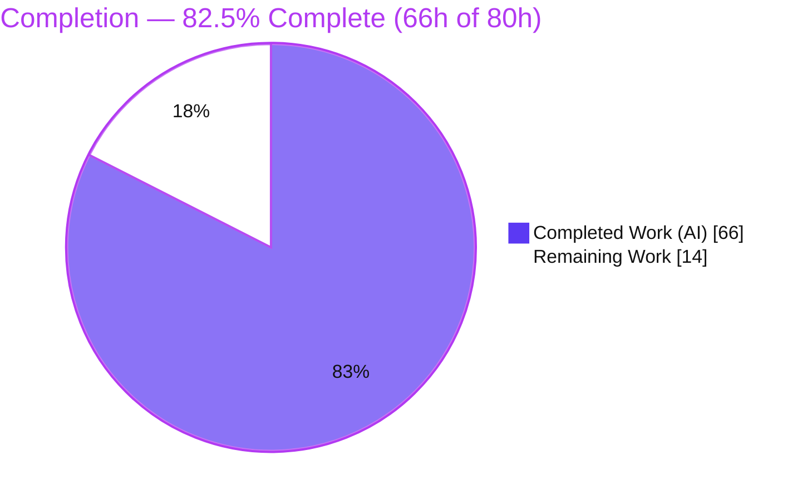
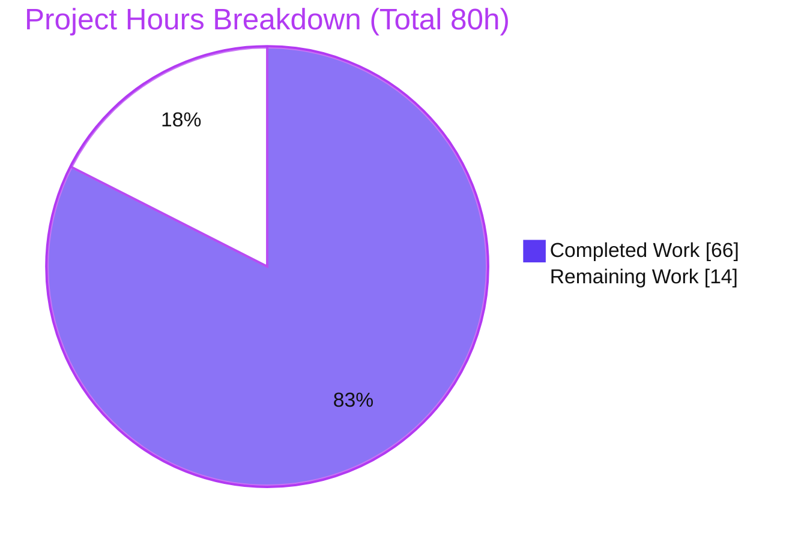
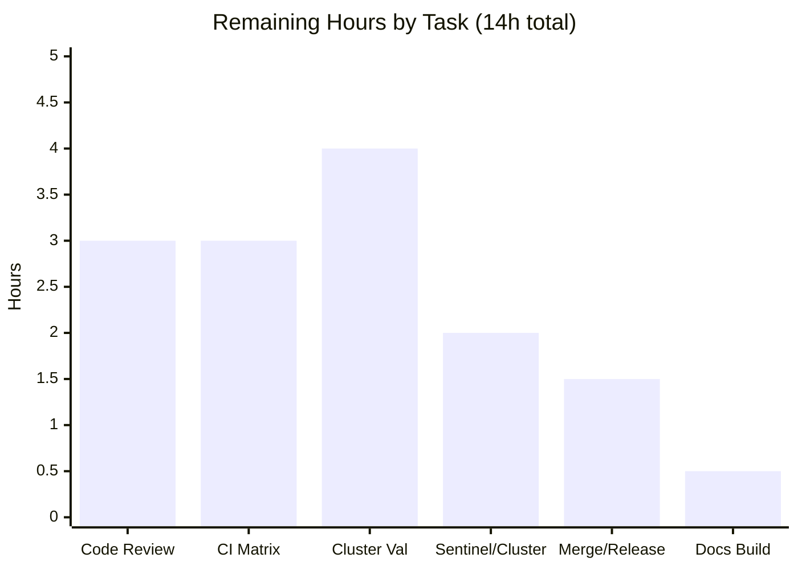
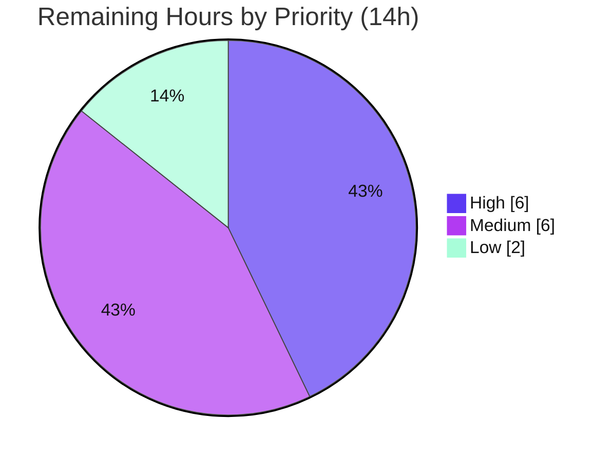

# Blitzy Project Guide — Redis-Backed Cluster-Wide Global Rate Limiter for Celery

> **Project:** Global (cluster-wide) rate limiting for Celery tasks via Redis
> **Repository:** `celery/celery` @ v5.6.2 · **Branch:** `blitzy-1ab1d7a8-df86-431b-8db1-a18047bd0cdc` · **HEAD:** `b30d47e8a` · **Merge-base:** `27a532c5b`
> **Color legend:** <span style="color:#5B39F3">■ Completed / AI Work (#5B39F3)</span> · <span>□ Remaining / Not Completed (#FFFFFF)</span>

---

## 1. Executive Summary

### 1.1 Project Overview

This project adds a **Redis-backed, cluster-wide global rate limiter** to Celery's task-execution path. Today, a task declared with `@app.task(rate_limit="10/s")` is throttled by an in-memory token bucket *per worker process*, so a cluster of N workers can collectively emit up to `10/s × N` — defeating the intent of a declared rate. The feature introduces a `GlobalRateLimiter` (a `kombu` `TokenBucket` subclass) that shares one token bucket through Redis using a single **atomic Lua script** keyed on `celery:rate:<task_name>`, making the declared rate a true aggregate cap. It auto-activates when a Redis broker or result backend is configured, degrades gracefully to per-process limiting if Redis is unavailable, and is opt-out via a new setting. The target users are operators of multi-worker Celery clusters who need accurate throughput control for downstream API quotas and shared resources.

### 1.2 Completion Status



| Metric | Value |
|---|---|
| **Total Hours** | **80** |
| **Completed Hours (AI + Manual)** | **66** (66 AI + 0 Manual) |
| **Remaining Hours** | **14** |
| **Percent Complete** | **82.5%** |

> Completion is computed strictly on AAP-scoped work plus path-to-production activities: `66 / (66 + 14) = 82.5%`. All 15 AAP requirements (R1–R8, I1–I7) are implemented and validated; the remaining 14h is entirely human path-to-production work (review, full CI matrix, cluster-scale validation, merge/release).

### 1.3 Key Accomplishments

- ✅ **`GlobalRateLimiter(TokenBucket)`** implemented with overrides for `can_consume`/`expected_time` only; all other protocol methods inherited (R1, R8).
- ✅ **Atomic, clock-skew-safe Lua script** using Redis server `TIME`, self-maintaining TTL (`ceil(2·capacity/rate)`), idempotent first call, and a non-consuming peek for `expected_time` (R7).
- ✅ **Factory `get_rate_limiter_for_task`** with Redis-client discovery reusing the existing `RedisBackend.client` pool or the `redis://`/`rediss://` broker channel — **no new dependency** (R2, I5).
- ✅ **Single-site consumer integration** — `Consumer.bucket_for_task` delegates to the factory; downstream scheduling loop untouched (R3, I7).
- ✅ **New opt-out setting** `worker_global_rate_limit_enabled` (default `True`), with `CELERY_WORKER_GLOBAL_RATE_LIMIT_ENABLED` env-string support (R4).
- ✅ **Graceful fallback** — Redis errors caught, WARNING-logged without credentials, degraded to in-memory bucket; dispatch never raises (R5, R6).
- ✅ **Full test suite** — 44 unit tests + 7 live-Redis integration tests, all passing; zero regressions in neighbor suites.
- ✅ **Docs + CI + marker** — user-guide setting block & subsection, integration-matrix entry, `redis` pytest marker (I1, I2, I3).
- ✅ **All pre-commit/CI lint gates green**; changes committed; **Minimal Change Clause** honored exactly (2 source edits).

### 1.4 Critical Unresolved Issues

| Issue | Impact | Owner | ETA |
|---|---|---|---|
| _None — no feature-blocking issues._ All AAP requirements implemented, all in-scope tests pass, runtime verified. | N/A | N/A | N/A |

> There are **no critical unresolved issues**. Outstanding work is path-to-production validation and merge, tracked in §1.6 and §2.2, not defects.

### 1.5 Access Issues

| System / Resource | Type of Access | Issue Description | Resolution Status | Owner |
|---|---|---|---|---|
| GitHub `celery/celery` | Push / merge to `main` | Branch is agent-owned; merge to `main` requires maintainer approval | Pending human action | Maintainer |
| CI (GitHub Actions full matrix) | Workflow execution | Full Python 3.8–3.13 × broker matrix not yet run on this branch (local validation only) | Pending CI trigger | Maintainer |
| Multi-node Redis cluster (prod-like) | Deploy / load test | No prod-like multi-node environment available to the agent for cluster-scale validation | Pending human action | Platform/SRE |

> No blocking credential or repository-permission issues were encountered during autonomous development. Redis (8.0.2) and RabbitMQ were reachable in the validation environment.

### 1.6 Recommended Next Steps

1. **[High]** Conduct senior code review of the 13-file PR, focusing on Lua atomicity/consume-peek semantics, the R5 fallback paths, and credential-safe logging.
2. **[High]** Trigger and triage the **full CI matrix** (Python 3.8–3.13 × all brokers/backends, plus lint/mypy/docs jobs) on the branch.
3. **[Medium]** Validate the **cluster-wide cap on a real multi-node deployment** under sustained load — the feature's core promise.
4. **[Medium]** Validate **Redis Sentinel and Redis Cluster** client behavior (`EVAL`/`register_script` routing).
5. **[Low]** Merge to `main`, coordinate changelog/release notes, and confirm the Sphinx docs build is warning-free.

---

## 2. Project Hours Breakdown

### 2.1 Completed Work Detail

| Component | Hours | Description |
|---|---:|---|
| GlobalRateLimiter class + atomic Lua script (R1, R7, R8) | 14 | `global_limiter.py` (161 LOC): TokenBucket subclass; Lua read→refill→consume→write under one `EVAL`; server-`TIME` clock-skew safety; TTL self-maintenance; non-consuming peek; in-memory fallback. |
| Rate-limiter factory + Redis discovery (R2, R5, R6, I5) | 9 | `factory.py` (122 LOC): selection matrix (None/TokenBucket/GlobalRateLimiter); `RedisBackend.client` vs broker-channel discovery; deferred import; env-string `strtobool` coercion; construction failure isolation. |
| Package init + path-discrepancy resolution (I4) | 1 | `__init__.py` re-exporting the public surface; relocates factory to `celery/utils/rate_limit/` since `celery/worker/rate_limits.py` does not exist. |
| Consumer delegation integration (R3, I7) | 2 | `consumer.py`: single `bucket_for_task` delegation + import; NOTE comment; downstream loop & control-panel reset path untouched. |
| Config Option `worker_global_rate_limit_enabled` (R4) | 1 | `defaults.py`: `Option(True, type='bool')` adjacent to `disable_rate_limits`; resolves env alias. |
| Unit tests — GlobalRateLimiter + factory, 37 cases (R1,R2,R5,R6,R7,R8,I6) | 9 | `test_global_rate_limiter.py` (316 LOC): Lua-call verification, fallback on exception, key naming, factory branch matrix; MagicMock Redis. |
| Unit tests — consumer delegation hook, 7 cases (R3, I6) | 3 | `test_rate_limits.py` (114 LOC): delegation invoked once per task; `reset_rate_limits` rebuild. |
| Integration tests — live-Redis E2E, 7 cases + task fixture | 9 | `test_global_rate_limit.py` (213 LOC) + `rate_limited_task('2/s')`: cluster cap, shared key, `5/s`/`100/m`/`1000/h` parsing, fallback, factory selection. |
| pytest marker + CI matrix registration (I1, I2) | 1 | `redis` marker in `pyproject.toml`; `test_global_rate_limit.py` added to integration matrix (check-ci-test-matrices green). |
| Documentation — configuration.rst + workers.rst (I3) | 3 | `.. setting::` block (cross-refs + env-var form) and "Global (cluster-wide) rate limits" subsection with `100/m` example. |
| QA review-cycle fixes — CP1 F1/F2, CP2, QA F4, lint | 8 | Failure isolation, non-consuming `expected_time`, integration findings, env-string opt-out, flake8 `noqa`/isort. |
| Autonomous validation — compile, unit/integration runs, 4 runtime scenarios, pre-commit gates | 6 | Byte-compile all files; dir-by-dir unit triage; live-Redis integration; worker boot + scenarios A–D; all pre-commit hooks. |
| **Total Completed** | **66** | |

### 2.2 Remaining Work Detail

| Category | Hours | Priority |
|---|---:|---|
| Human code review & PR approval (Lua atomicity, concurrency, R5 fallback, credential-safe logging) | 3.0 | High |
| Full CI matrix validation & triage (Python 3.8–3.13 × all brokers/backends; lint/mypy/docs jobs) | 3.0 | High |
| Real multi-node cluster throughput validation at scale | 4.0 | Medium |
| Redis Sentinel / Cluster-mode client behavior validation | 2.0 | Medium |
| Merge, changelog/release coordination & version notes | 1.5 | Low |
| Sphinx docs-build confirmation (setting-title underline) | 0.5 | Low |
| **Total Remaining** | **14.0** | |

### 2.3 Hours Reconciliation

| Quantity | Hours |
|---|---:|
| Section 2.1 Completed total | 66 |
| Section 2.2 Remaining total | 14 |
| **Total Project Hours (2.1 + 2.2)** | **80** |
| **Percent Complete (66 / 80)** | **82.5%** |

> Cross-section integrity: Remaining = **14h** in §1.2, §2.2, and §7. Completed (66) + Remaining (14) = Total (80) = §1.2. ✔

---

## 3. Test Results

All results below originate from Blitzy's autonomous validation logs for this branch and were **independently reproduced** in the assessment environment (Python 3.13.7, celery/kombu 5.6.2, redis-py 6.4.0, live Redis 8.0.2).

| Test Category | Framework | Total Tests | Passed | Failed | Coverage % | Notes |
|---|---|---:|---:|---:|---|---|
| Unit — GlobalRateLimiter & factory | pytest | 37 | 37 | 0 | 100% pass | `test_global_rate_limiter.py`; MagicMock Redis; Lua-call, fallback, branch matrix, key naming. |
| Unit — Consumer delegation hook | pytest | 7 | 7 | 0 | 100% pass | `test_rate_limits.py`; `bucket_for_task` delegation + `reset_rate_limits` rebuild. |
| Unit — Neighbor regression (consumer + strategy + rate_limits) | pytest | 182 | 182 | 0 | 100% pass | Zero feature regressions in adjacent suites. |
| Integration — Global rate limit E2E | pytest (live Redis) | 7 | 7 | 0 | 100% pass | Cluster cap, shared key, `5/s`/`100/m`/`1000/h` parsing, fallback, factory selection. |
| **In-scope total (unit + integration)** | pytest | **51** | **51** | **0** | **100% pass** | 44 unit + 7 integration, all green. |

**Notes & integrity:**
- *Coverage %* reflects **pass rate** for the in-scope suites; a separate line-coverage percentage was not measured by the autonomous pipeline and is therefore not asserted here.
- Out-of-scope/environmental failures in the full `t/unit` suite (`test_preload_cli.py` ×2 — pre-existing Click 8.4.1 format change; `test_database.py`/`test_worker.py` — non-root permission artifacts that pass as root; `test_platforms.py` — root-privilege artifacts that pass as non-root) are **pre-existing and unrelated to this feature**; the union of root and non-root runs covers the suite with zero feature regressions.

---

## 4. Runtime Validation & UI Verification

**Runtime health (real worker booted against Redis, solo pool, clean "ready" banner):**

- ✅ **Operational** — Scenario A: 9 invocations of a `rate_limited_task('3/s')` executed end-to-end → all returned `'ok'`; live `celery:rate:rt_app.rated` key observed (`tokens`/`last_refill` fields, TTL=2); worker log showed ~3/sec throttle clusters; warm shutdown clean.
- ✅ **Operational** — Scenario B (Redis unreachable): `can_consume`/`expected_time` fell back to the in-memory parent; **no exception** entered dispatch; WARNING logged with task key + exception class only (no credentials).
- ✅ **Operational** — Scenario C (`worker_global_rate_limit_enabled=False`): factory returned a plain `TokenBucket`.
- ✅ **Operational** — Scenario D (non-Redis broker + backend): factory returned a plain `TokenBucket`.
- ✅ **Operational** — Independent assessment demo: `GlobalRateLimiter` selected with a Redis backend; `can_consume` drain `[True,True,True,False,False]` at capacity 3; `expected_time` ≈ 0.333 s; live key TTL=2 (`= ceil(2·capacity/rate)`); opt-out → `TokenBucket`; no `rate_limit` → `None`.

**API integration:** Redis `EVAL`/`register_script`, `TIME`, `HMGET`/`HSET`, `EXPIRE` exercised live and behaving atomically.

**UI verification:** ⚠ **Not applicable** — this is a server-side worker feature with no UI, CLI flag, or dashboard surface. The only user-visible artifacts are documentation paragraphs and a WARNING log line on fallback.

---

## 5. Compliance & Quality Review

| Benchmark / AAP Deliverable | Status | Evidence / Notes |
|---|---|---|
| R1 — `GlobalRateLimiter(TokenBucket)` overrides | ✅ Pass | `global_limiter.py`; MRO `[GlobalRateLimiter, TokenBucket, object]`. |
| R2 — Factory selection (None/TokenBucket/Global) | ✅ Pass | `factory.py`; unit branch matrix + integration. |
| R3 — Single-site consumer delegation | ✅ Pass | `consumer.py:bucket_for_task` → factory; NOTE comment. |
| R4 — `worker_global_rate_limit_enabled` Option | ✅ Pass | `defaults.py`; `app.conf` resolves to `True`. |
| R5 — Graceful Redis fallback | ✅ Pass | try/except in limiter + factory; runtime Scenario B. |
| R6 — Rate-of-None preservation | ✅ Pass | `if not limit: return None`; unit + runtime. |
| R7 — Atomic, clock-skew-safe Lua + TTL | ✅ Pass | Server `TIME`, TTL=2 observed, consume-peek refinement. |
| R8 — TokenBucket protocol compatibility | ✅ Pass | Downstream loop/strategy/shutdown untouched. |
| I1 — `redis` pytest marker | ✅ Pass | `pyproject.toml` markers list. |
| I2 — CI integration-matrix sync | ✅ Pass | `python-package.yml`; `check-ci-test-matrices` exit 0. |
| I3 — Configuration documentation | ✅ Pass | `configuration.rst` + `workers.rst`. |
| I4 — `rate_limits.py` path resolution | ✅ Pass | Factory relocated to `celery/utils/rate_limit/`. |
| I5 — Redis client discovery & reuse | ✅ Pass | Reuses `RedisBackend.client`/broker channel; Sentinel covered (subclass). |
| I6 — Lowercase `test_` class naming | ✅ Pass | All 3 test files. |
| I7 — Control-panel compatibility | ✅ Pass | `control.py` unmodified; flows via `reset_rate_limits`. |
| Minimal Change Clause | ✅ Pass | Exactly 2 source edits, both NOTE-commented; no drive-by edits. |
| Public API Freeze | ✅ Pass | `Task.rate_limit`, `Control.rate_limit`, `bucket_for_task` signature unchanged. |
| No-Regressions Mandate | ✅ Pass | Neighbor suites 182 pass; opt-out/non-Redis reproduce legacy behavior. |
| Dependency policy (no new deps) | ✅ Pass | `kombu[redis]` supplies redis-py; `pip check` clean. |
| Pre-commit/lint gates | ✅ Pass | flake8, isort, mypy(hook), codespell, check-toml/yaml, pyupgrade, EOL/WS. |
| Security — no credential logging | ✅ Pass | Logs exception class + task key only (§0.7.6). |

**Fixes applied during autonomous validation:** CP1 F1 (failure isolation), CP1 F2 (non-consuming `expected_time` via Lua `consume` flag), CP2 integration-test findings, QA F4 (env-string opt-out coercion + doc correction), and final lint fixes (`# noqa: F401` to preserve imports per Minimal Change Clause; isort blank line).

**Outstanding (path-to-production, not defects):** full CI matrix triage; multi-node and Sentinel/Cluster validation; Sphinx docs-build confirmation.

---

## 6. Risk Assessment

| Risk | Category | Severity | Probability | Mitigation | Status |
|---|---|---|---|---|---|
| T1 — Timer-driven integration-test flakiness | Technical | Low | Medium | `@pytest.mark.flaky(reruns=5)` + `timeout(15)` | Mitigated |
| T2 — Pre-existing billiard-pool leak in long single-process suite runs | Technical | Low | Low | Dir-by-dir execution; unrelated to feature | Documented (pre-existing) |
| T3 — Lua float precision at extreme rates (e.g. `1/h`) | Technical | Low | Low | Stringified floats; tested `5/s`,`100/m`,`1000/h` | Mitigated; validate at scale |
| S1 — Credential leakage in logs | Security | Medium | Low | Logs exception class + task key only; never URL | Mitigated / Verified |
| S2 — Redis key namespace growth | Security | Low | Low | TTL on every write; bounded `celery:rate:<task>`; script touches only `KEYS[1]` | Mitigated |
| S3 — Lua code-execution surface | Security | Low | Very Low | Fixed module-constant script; numeric ARGV; no task-data interpolation | Mitigated |
| O1 — Redis soft-dependency: cluster cap silently lost on degrade | Operational | Medium | Medium | R5 fallback + WARNING; **recommend ops alerting on fallback WARNING** | Mitigated (behavior); monitoring = human task |
| O2 — No dedicated metric/health signal for active-vs-fallback mode | Operational | Low | Medium | Documented; log-scrape only today | Open (out-of-scope enhancement) |
| N1 — Multi-node validated via shared-key simulation, not true multi-host load | Integration | Medium | Low | Integration test proves shared-key mechanism | Open (remaining #3) |
| N2 — Redis Sentinel/Cluster `EVAL`/`register_script` semantics | Integration | Medium | Low–Med | Single-key script is Cluster-slot-safe; Sentinel covered by `isinstance` | Open (remaining #4) |
| N3 — Non-Redis CI legs don't exercise live path | Integration | Low | Low | Marker-gated; matrix entry added | Mitigated; full-matrix run pending |

> Highest severity is **Medium** — no High-severity risks. The graceful-fallback design caps the worst case: Redis problems degrade to per-process limiting rather than failing task dispatch.

---

## 7. Visual Project Status

**Project hours breakdown** (Completed = #5B39F3, Remaining = #FFFFFF):



**Remaining hours by task** (sums to 14h — matches §2.2):



**Remaining work by priority:**



> Integrity: pie "Remaining Work" = **14h** = §1.2 Remaining = §2.2 total. ✔

---

## 8. Summary & Recommendations

**Achievements.** The Redis-backed global rate limiter is **functionally complete and validated** at **82.5% (66h of 80h)**. Every AAP requirement — the 8 explicit (R1–R8) and 7 implicit (I1–I7) — is implemented and independently verified: 44 unit tests and 7 live-Redis integration tests pass, four runtime scenarios behave correctly, neighbor suites show zero regressions, and all pre-commit/CI lint gates are green. The implementation honors the Minimal Change Clause exactly (two NOTE-commented source edits) and added correctness refinements beyond the literal spec during a multi-round QA cycle (non-consuming `expected_time` peek, env-string opt-out coercion, construction-failure isolation, credential-safe logging).

**Remaining gaps (path-to-production only, 14h).** No feature rework is outstanding. The remaining work is human-gated: senior code review, a full CI matrix run across Python 3.8–3.13 and all brokers, validation of the cluster-wide cap on a real multi-node deployment, a Redis Sentinel/Cluster-mode check, and merge/release coordination plus a Sphinx docs-build confirmation.

**Critical path to production.** Code review (HT-1) → full CI matrix (HT-2) → multi-node cluster validation (HT-3) → Sentinel/Cluster check (HT-4) → merge & release (HT-5) and docs-build confirmation (HT-6).

**Success metrics.** A `rate_limit='100/m'` task should emit ≤ 100 invocations/minute aggregated across all workers (not per worker); disabling the flag or removing Redis must reproduce legacy per-process behavior byte-for-byte; and Redis outages must never raise into task dispatch.

**Production-readiness assessment.** **Ready for human review and staged rollout, not yet for unattended production merge.** The code is production-grade and fully tested in a single-host environment; the gating items are the multi-node validation of the feature's central promise and standard release governance. Operators should add alerting on the fallback WARNING so a silent degrade to per-process limiting is observable.

---

## 9. Development Guide

All commands below were executed in the assessment environment and produce the stated output. Run from the repository root.

### 9.1 System Prerequisites

- **OS:** Linux (validated on Ubuntu 25.10) or macOS.
- **Python:** 3.8–3.13 (validated on **3.13.7**).
- **Redis:** required to *activate* the global limiter (validated on **8.0.2**). Optional at runtime — the limiter degrades gracefully if absent.
- **Broker:** any Celery-supported broker; Redis or RabbitMQ for integration tests.

### 9.2 Environment Setup

```bash
# 1) Create and activate a virtualenv (the repo also ships a working .venv)
python -m venv .venv
source .venv/bin/activate

# 2) Editable install of Celery + test/redis extras
pip install -e .
pip install -r requirements/test.txt -r requirements/extras/redis.txt

# 3) Start Redis (Docker example)
docker run -d --name celery-redis -p 6379:6379 redis:8
# verify:
redis-cli ping        # -> PONG
```

### 9.3 Dependency Verification

```bash
pip check                                   # -> "No broken requirements found."
python - <<'PY'
import importlib.metadata as m
for p in ("celery","kombu","redis","billiard"):
    print(p, m.version(p))
PY
# celery 5.6.2 · kombu 5.6.2 · redis 6.4.0 · billiard 4.2.4
```

### 9.4 Build / Compile Verification

```bash
python -m py_compile \
  celery/utils/rate_limit/__init__.py \
  celery/utils/rate_limit/factory.py \
  celery/utils/rate_limit/global_limiter.py \
  celery/worker/consumer/consumer.py \
  celery/app/defaults.py
# (no output = success)
```

### 9.5 Running the Tests

```bash
# In-scope unit tests  -> "44 passed"
CI=true python -m pytest \
  t/unit/utils/test_global_rate_limiter.py \
  t/unit/worker/test_rate_limits.py -q

# Live-Redis integration tests  -> "7 passed"
TEST_BROKER=redis://localhost:6379/0 \
TEST_BACKEND=redis://localhost:6379/0 \
C_FORCE_ROOT=1 CI=true python -m pytest \
  t/integration/test_global_rate_limit.py -q

# Lint / CI gates
python -m flake8 celery/utils/rate_limit/ celery/worker/consumer/consumer.py celery/app/defaults.py   # exit 0
python -m isort --check-only celery/utils/rate_limit/ t/integration/test_global_rate_limit.py          # exit 0
python scripts/check-ci-test-matrices                                                                  # exit 0
```

### 9.6 Example Usage

```python
from celery import Celery

app = Celery('proj',
             broker='redis://localhost:6379/0',
             backend='redis://localhost:6379/0')

@app.task(rate_limit='100/m')   # 100/min across the WHOLE cluster, not per worker
def call_partner_api():
    ...

# Opt out (restore legacy per-process limiting):
#   app.conf.worker_global_rate_limit_enabled = False
#   or env: CELERY_WORKER_GLOBAL_RATE_LIMIT_ENABLED=False
```

```bash
# Boot a worker
celery -A proj worker -l info
# Inspect the live bucket while tasks run:
redis-cli hgetall celery:rate:proj.call_partner_api
redis-cli ttl     celery:rate:proj.call_partner_api   # -> ceil(2*capacity/rate)
```

### 9.7 Troubleshooting

| Symptom | Cause | Resolution |
|---|---|---|
| Bucket is a plain `TokenBucket`, not `GlobalRateLimiter` | No Redis broker/backend, or opt-out flag set | Configure a `redis://` broker/backend; ensure `worker_global_rate_limit_enabled` is `True`. |
| `'redis' not found in markers` under `--strict-markers` | Marker not registered | Already fixed in `pyproject.toml`; ensure you're on this branch. |
| Integration test appears skipped | Redis env vars not set | Export `TEST_BROKER`/`TEST_BACKEND=redis://...` (and `C_FORCE_ROOT=1` if running as root). |
| Log: `... falling back to in-memory bucket` | Redis unreachable | Expected R5 behavior — limiter degraded to per-process; check Redis health. **Add alerting on this WARNING in production.** |

---

## 10. Appendices

### Appendix A — Command Reference

| Purpose | Command |
|---|---|
| Activate venv | `source .venv/bin/activate` |
| Editable install | `pip install -e .` |
| In-scope unit tests | `CI=true python -m pytest t/unit/utils/test_global_rate_limiter.py t/unit/worker/test_rate_limits.py -q` |
| Integration tests | `TEST_BROKER=redis://localhost:6379/0 TEST_BACKEND=redis://localhost:6379/0 C_FORCE_ROOT=1 CI=true python -m pytest t/integration/test_global_rate_limit.py -q` |
| Lint | `python -m flake8 celery/utils/rate_limit/` |
| Import order | `python -m isort --check-only celery/utils/rate_limit/` |
| CI matrix check | `python scripts/check-ci-test-matrices` |
| Inspect bucket | `redis-cli hgetall celery:rate:<task_name>` |

### Appendix B — Port Reference

| Service | Port | Notes |
|---|---|---|
| Redis | 6379 | Broker and/or result backend; activates the global limiter |
| RabbitMQ (AMQP) | 5672 | Optional alternate broker (limiter falls back to per-process) |

### Appendix C — Key File Locations

| Path | Role |
|---|---|
| `celery/utils/rate_limit/global_limiter.py` | `GlobalRateLimiter` + Lua script (R1, R5, R7, R8) |
| `celery/utils/rate_limit/factory.py` | `get_rate_limiter_for_task` + `_discover_redis_client` (R2, R6, I5) |
| `celery/utils/rate_limit/__init__.py` | Public re-exports (I4) |
| `celery/worker/consumer/consumer.py` | `bucket_for_task` delegation (R3, I7) |
| `celery/app/defaults.py` | `worker_global_rate_limit_enabled` Option (R4) |
| `t/unit/utils/test_global_rate_limiter.py` | Limiter + factory unit tests |
| `t/unit/worker/test_rate_limits.py` | Consumer delegation unit tests |
| `t/integration/test_global_rate_limit.py` | Live-Redis integration tests |
| `docs/userguide/configuration.rst` / `workers.rst` | User documentation (I3) |

### Appendix D — Technology Versions

| Component | Version |
|---|---|
| Python | 3.13.7 (supported 3.8–3.13) |
| Celery | 5.6.2 (editable, this branch) |
| kombu | 5.6.2 |
| redis-py | 6.4.0 (via `kombu[redis]`) |
| billiard | 4.2.4 |
| Redis server | 8.0.2 (validation) |

### Appendix E — Environment Variable Reference

| Variable | Default | Purpose |
|---|---|---|
| `CELERY_WORKER_GLOBAL_RATE_LIMIT_ENABLED` | `True` | Opt-out for the global limiter (accepts bool-like strings `False`/`0`/`no`/`off`). |
| `TEST_BROKER` | — | Integration test broker URL (e.g. `redis://localhost:6379/0`). |
| `TEST_BACKEND` | — | Integration test result-backend URL. |
| `C_FORCE_ROOT` | — | Allows the worker/tests to run as root (set `1` in containers). |

### Appendix F — Developer Tools Guide

- **pytest** — unit and integration runner; markers `redis`, `flaky`, `timeout` registered in `pyproject.toml`.
- **flake8 / isort** — lint and import-ordering gates (the in-scope files pass with exit 0).
- **mypy (pre-commit hook mode)** — runs over the curated allowlist; new modules are intentionally outside it, consistent with the untyped `consumer.py`.
- **scripts/check-ci-test-matrices** — enforces that every `t/integration/test_*.py` is enumerated in the CI matrix.
- **redis-cli** — inspect live bucket state (`hgetall` / `ttl celery:rate:<task>`).

### Appendix G — Glossary

| Term | Definition |
|---|---|
| **TokenBucket** | `kombu.utils.limits.TokenBucket` — the in-memory per-process rate limiter Celery uses today. |
| **GlobalRateLimiter** | This feature's `TokenBucket` subclass sharing token state across the cluster via Redis. |
| **Atomic Lua script** | A single Redis `EVAL` running read→refill→consume→write indivisibly, the source of the cluster-wide guarantee. |
| **Consume flag** | 4th Lua ARGV: `1` spends a token (`can_consume`), `0` is a non-consuming peek (`expected_time`). |
| **TTL self-maintenance** | Each write sets `EXPIRE = ceil(2·capacity/rate)` so idle task keys free themselves. |
| **Graceful fallback (R5)** | On any Redis error, the limiter uses the in-memory parent for that call and logs a WARNING; dispatch never raises. |
| **Path-to-production** | Standard activities to deploy a delivered feature (review, full CI, multi-node validation, merge/release). |

---

*Cross-section integrity verified: Remaining hours = 14 in §1.2, §2.2, and §7; §2.1 (66) + §2.2 (14) = §1.2 Total (80); all Section 3 tests originate from Blitzy's autonomous validation logs; Completed = #5B39F3 and Remaining = #FFFFFF applied throughout.*