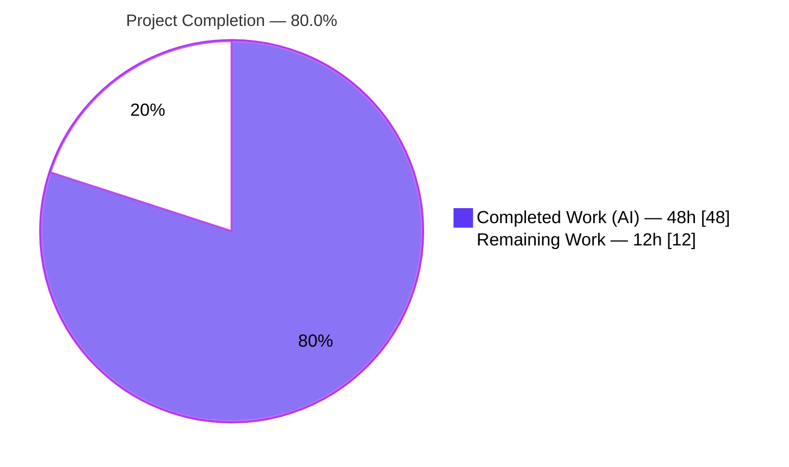
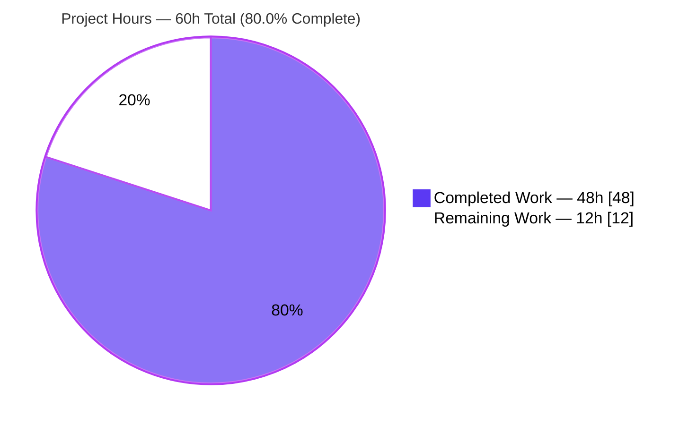
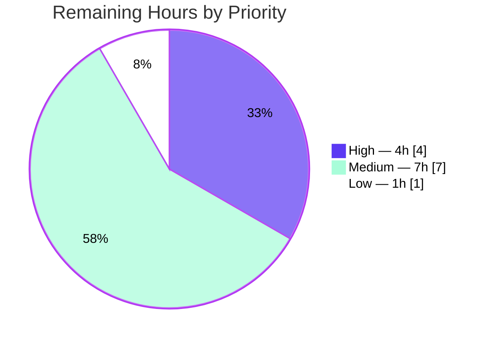

# Blitzy Project Guide — Feature F-010: Redis-Backed Global Task Rate Limiter

> **Project:** Opt-in, Redis-backed global (cluster-wide) rate limiter for Celery tasks
> **Repository:** `celery/celery` (Celery 5.6.2) · **Branch:** `blitzy-f73d3a46-9c97-4342-b95b-cb0eac19a4d0` · **HEAD:** `b97cda921`
> **Brand legend:** <span style="color:#5B39F3">■</span> Completed / AI Work = Dark Blue `#5B39F3` · □ Remaining = White `#FFFFFF`

---

## 1. Executive Summary

### 1.1 Project Overview

This project adds an **opt-in, Redis-backed global (cluster-wide) rate limiter** to Celery's worker-side task subsystem (existing feature F-010). Today Celery enforces `Task.rate_limit` with an in-memory token bucket **per worker**, so the effective cluster rate equals `rate_limit × number_of_workers` — ten `"10/s"` workers admit ~100/s, overrunning third-party API quotas and triggering HTTP 429s. When the new `worker_rate_limits_global` flag is enabled, a task's existing `rate_limit` becomes the **aggregate** ceiling across all workers, coordinated through a single atomic Redis Lua script. The feature targets Celery operators integrating rate-limited external APIs. It is default-off and byte-for-byte backward compatible, with a fail-open degradation to per-worker limiting on Redis failure.

### 1.2 Completion Status



| Metric | Value |
|--------|-------|
| **Total Hours** | **60h** |
| **Completed Hours (AI + Manual)** | **48h** (48h AI · 0h manual) |
| **Remaining Hours** | **12h** |
| **Percent Complete** | **80.0%** |

> **Calculation (PA1, AAP-scoped):** `Completion % = Completed ÷ (Completed + Remaining) = 48 ÷ (48 + 12) = 48 ÷ 60 = 80.0%`. All AAP-scoped implementation (requirements R1–R8) is 100% complete and validated; the remaining 12h is exclusively path-to-production work that cannot be performed autonomously (human review, CI matrix registration, staging validation, operational readiness, release).

### 1.3 Key Accomplishments

- ✅ **Core limiter module** `celery/worker/rate_limits.py` (341 lines) — `RedisTokenBucket` subclass, atomic Lua token bucket, client factory, app-namespaced key builder, fail-open shadow.
- ✅ **Atomic distributed enforcement (R4)** — single server-side Lua script over a per-task Redis hash using Redis server `TIME` (immune to worker clock skew).
- ✅ **Fail-open resilience (R5)** — on Redis error, logs a throttled, **credential-safe** warning (task name + exception class only) and degrades to per-worker limiting.
- ✅ **Consumer integration (R3)** — 5-line guarded branch in `bucket_for_task()`; lazy import; `reset_rate_limits()` left intact.
- ✅ **Two new settings (R1/R2)** — `worker_rate_limits_global` (default `False`) and `worker_rate_limit_url` (default `None`) with full URL-precedence resolution.
- ✅ **Runtime control parity (R6)** — `app.control.rate_limit()` now takes effect cluster-wide (proven by integration test).
- ✅ **Documentation (R7)** — both settings in the configuration reference + a global-behavior subsection in the task user guide.
- ✅ **Test coverage (R8)** — 22 unit tests + a 2-worker real-Redis integration test; extended consumer/defaults suites.
- ✅ **Minimal-change clause honored** — 9 files, **+1,295 / −0 lines** (zero deletions, no refactoring of existing code).
- ✅ **All 5 production-readiness gates passed**, independently re-verified this session.

### 1.4 Critical Unresolved Issues

| Issue | Impact | Owner | ETA |
|-------|--------|-------|-----|
| New integration test `test_global_rate_limit.py` not registered in the CI integration matrix | The cluster-wide test runs standalone but will **not** execute in CI until added to `.github/workflows/python-package.yml` (a REFERENCE-only file under the minimal-change clause); future regressions could go uncaught in CI | Maintainer / Reviewer | 1h |

> No issues block compilation, the in-scope test suite, or runtime — all pass. The item above is a CI-configuration gap in an out-of-scope file, not a code defect.

### 1.5 Access Issues

| System / Resource | Type of Access | Issue Description | Resolution Status | Owner |
|-------------------|----------------|-------------------|-------------------|-------|
| Redis (localhost:6379) | Service | Required for integration test & runtime | ✅ Available (Redis 8.0.2, `PONG`) | — |
| GitHub Actions CI | Repository config | `python-package.yml` integration matrix is REFERENCE-only per AAP; cannot be edited autonomously under minimal-change clause | ⚠ Requires human edit (HT-1) | Maintainer |
| Production / staging Redis (HA, TLS) | Infrastructure | Not provisioned in this environment; needed for path-to-production validation | ⚠ Pending (HT-3) | Ops |

### 1.6 Recommended Next Steps

1. **[High]** Register `test_global_rate_limit.py` in the CI integration matrix and confirm it runs green (HT-1, 1h).
2. **[High]** Senior-engineer code review & PR merge of the 1,295-line distributed-systems diff (HT-2, 3h).
3. **[Medium]** Validate against production-like Redis HA (Sentinel/Cluster), TLS (`rediss://`), and induced-outage fail-open under eventlet/gevent (HT-3, 4h).
4. **[Medium]** Add monitoring/alerting on the fail-open warning + Redis health checks; write an enablement runbook (HT-4, 3h).
5. **[Low]** Add a `Changelog.rst` entry and coordinate the release note (HT-5, 1h).

---

## 2. Project Hours Breakdown

### 2.1 Completed Work Detail

| Component | Hours | Description |
|-----------|------:|-------------|
| Redis-backed limiter core module (`rate_limits.py`) — `RedisTokenBucket`, Lua script, `get_limiter_client`, `rate_limit_key`, fail-open shadow **[R2, R4, R5]** | 18 | 341-line distributed-systems module: atomic Lua token bucket (server-time refill), kombu `TokenBucket` subclass overriding only `can_consume`/`expected_time`, URL-precedence client resolution with `ImproperlyConfigured` validation, per-app `WeakKeyDictionary` cache, credential-safe throttled fail-open warning. Includes design + distributed-rate-limiting research. |
| Consumer bucket-selection integration (`consumer.py`) **[R3]** | 2 | 5-line guarded branch in `bucket_for_task()` gating on `worker_rate_limits_global`; lazy import; `reset_rate_limits()` left structurally intact. |
| Worker settings registry (`defaults.py`) **[R1, R2]** | 1 | Two `Option` entries (`rate_limits_global=Option(False,'bool')`, `rate_limit_url=Option(None,'string')`) adjacent to `disable_rate_limits`. |
| Documentation (`configuration.rst` + `tasks.rst`) **[R7]** | 3 | `.. setting::` blocks for both settings (global behavior, redis extra, URL fallback, fail-open, schemes) + task-guide global subsection with both user examples. |
| Unit test suite (`test_rate_limits.py` 22 + `test_consumer.py` +5 + `test_defaults.py` +1) **[R8]** | 11 | Mocked-redis coverage: key scheme, subclass/inherited-queue, fail-open, sub-1/s positive wait, URL precedence/caching, `ImproperlyConfigured` paths; consumer bucket-selection cases; defaults assertion. |
| Integration test suite (`test_global_rate_limit.py`) **[R6, R8]** | 10 | 463-line test booting 2 prefork subprocess workers against real Redis; asserts aggregate throughput ≈ configured limit (not `limit × workers`) with single-worker baseline; exercises runtime `app.control.rate_limit` broadcast. |
| Autonomous validation & remediation (5 gates) | 3 | compileall, flake8/isort/pyupgrade/codespell/mypy, fail-open-warning fix, integration subprocess refactor; clean commit. |
| **Total Completed** | **48** | |

### 2.2 Remaining Work Detail

| Category | Hours | Priority |
|----------|------:|----------|
| CI integration-matrix registration (add `test_global_rate_limit.py` to `python-package.yml` module list) | 1 | High |
| Human code review & PR merge (1,295-line distributed-systems diff) | 3 | High |
| Staging validation vs production Redis HA / TLS (`rediss://`) / induced-outage fail-open (eventlet/gevent) | 4 | Medium |
| Operational readiness: monitoring/alerting on fail-open warning + enablement runbook | 3 | Medium |
| Changelog entry & release coordination | 1 | Low |
| **Total Remaining** | **12** | |

### 2.3 Hours Reconciliation

| Check | Result |
|-------|--------|
| Section 2.1 total (Completed) | 48h |
| Section 2.2 total (Remaining) | 12h |
| Section 2.1 + Section 2.2 | **60h** = Total (Section 1.2) ✅ |
| Remaining consistent across §1.2, §2.2, §7 | 12h ✅ |
| Completion % | 48 ÷ 60 = **80.0%** ✅ |

---

## 3. Test Results

All tests below originate from Blitzy's autonomous validation logs and were **independently re-executed this session** (same results).

| Test Category | Framework | Total Tests | Passed | Failed | Coverage | Notes |
|---------------|-----------|------------:|-------:|-------:|----------|-------|
| Unit — Global limiter (`test_rate_limits.py`) | pytest 9.0.3 | 22 | 22 | 0 | Full feature surface | `rate_limit_key` (×3), `RedisTokenBucket` subclass/inherited-queue/fail-open/sub-1s wait (×11), `get_limiter_client` URL-precedence/caching/`ImproperlyConfigured` (×8) |
| Unit — Consumer bucket selection (`test_consumer.py`) | pytest 9.0.3 | 109 (+46 subtests) | 109 (+46) | 0 | Existing + new | 3 new bucket-selection cases (`local_when_global_off`, `redis_when_global_on`, `none_without_rate_limit`); all existing cases unchanged |
| Unit — Defaults (`test_defaults.py`) | pytest 9.0.3 | 5 | 5 | 0 | New setting asserted | Incl. `test_rate_limit_global_settings` (both settings resolve `False`/`None`) |
| Integration — Cluster-wide enforcement (`test_global_rate_limit.py`) | pytest + real Redis 8.0.2 | 1 | 1 | 0 | End-to-end | 2 prefork subprocess workers; aggregate ≈ 10/s (not 10/s × 2); runtime `app.control.rate_limit` broadcast verified (R6); 32.34s |
| **In-scope unit total** | pytest | **136 (+46 subtests)** | **136 (+46)** | **0** | — | Full in-scope run: **0.65s** |
| **Integration total** | pytest | **1** | **1** | **0** | — | Real Redis, 2 workers |

> **Coverage note:** A single numeric per-file coverage % was not separately emitted by the autonomous logs; the unit suite exercises the complete in-scope feature surface (every public symbol, both branches of the opt-in gate, the fail-open path, and all URL-resolution branches).
>
> **Out-of-scope (not regressions):** `t/unit/bin/test_preload_cli.py::test_preload_options[0,1]` fail due to a Click 8.4.1 error-text format change. These files are byte-identical to the branch base, were never touched by F-010, and are not among the 9 in-scope files.

---

## 4. Runtime Validation & UI Verification

**UI Verification:** Not applicable — Celery is a backend distributed task-queue library; this feature is a configuration-gated, server-side behavioral change with no user interface, component library, or design system (per AAP §0.4.3).

**Runtime Validation (31/31 autonomous smoke checks + live re-verification this session):**

- ✅ **Operational — Cluster-wide enforcement (R4):** Integration test boots real Celery workers (subprocesses) against live Redis 8.0.2; aggregate two-worker throughput stays ≈ configured 10/s rather than ~20/s.
- ✅ **Operational — Live `RedisTokenBucket`:** `can_consume()` transitions `True → False` with correct positive `expected_time`; Redis hash populated (`tokens`, `last_refill` from server `TIME`); `EXPIRE` TTL = 60s set. *(Re-verified live: key `celery:rate_limit:demo:tasks.send_sms`, 1st consume `True`/0.0s, 2nd `False`/0.1s.)*
- ✅ **Operational — Sub-1/s rates:** strictly-positive `expected_time` (no hot reschedule loop).
- ✅ **Operational — Subclass contract:** `RedisTokenBucket` is a kombu `TokenBucket` subclass; inherited queue protocol (`add`/`pop`/`contents`/`clear_pending`) intact.
- ✅ **Operational — Fail-open (R5):** on `RedisError`, falls back to a local bucket and emits **exactly one** throttled warning that leaks **no** URL/credentials. *(Re-verified live: broken client → local fallback `can_consume()=True`.)*
- ✅ **Operational — URL resolution (R2):** precedence `worker_rate_limit_url → result_backend → broker_url`; per-app caching; `ImproperlyConfigured` on missing/non-Redis scheme.
- ✅ **Operational — Backward compatibility:** default-off path returns **exactly** kombu `TokenBucket`, imports nothing from `celery.worker.rate_limits`, opens no connection.
- ✅ **Operational — Runtime control (R6):** `app.control.rate_limit()` broadcast rebuilds buckets cluster-wide.

**Overall runtime status: ✅ Operational** across all validated dimensions.

---

## 5. Compliance & Quality Review

### 5.1 AAP Requirement Compliance Matrix

| Req | Description | Status | Evidence |
|-----|-------------|--------|----------|
| **R1** | Opt-in flag `worker_rate_limits_global` (default `False`) | ✅ Pass | `defaults.py`; `test_rate_limit_global_settings`; backward-compat verified |
| **R2** | Coordinating Redis URL `worker_rate_limit_url` + resolution | ✅ Pass | `get_limiter_client` precedence/validation/caching; 8 unit tests |
| **R3** | Bucket selection in `bucket_for_task` | ✅ Pass | `consumer.py` 5-line branch; 3 consumer cases |
| **R4** | Atomic distributed enforcement via Lua + server time | ✅ Pass | `TOKEN_BUCKET_LUA` (`redis.call('TIME')`, HMGET/HSET/EXPIRE); integration + unit |
| **R5** | Fail-open resilience | ✅ Pass | `_get_local_bucket` + `_warn_fail_open` (credential-safe); 2 unit tests |
| **R6** | Runtime control parity (cluster-wide) | ✅ Pass | Unchanged `reset_rate_limits()` callers; integration broadcast assertion |
| **R7** | Documentation | ✅ Pass | `configuration.rst` (both settings) + `tasks.rst` (global subsection) |
| **R8** | Unit + integration test coverage | ✅ Pass | 22 unit + 1 integration + extended consumer/defaults |

### 5.2 Constraint & Quality Compliance Matrix

| Benchmark | Status | Notes |
|-----------|--------|-------|
| Minimal-change clause (one module, ~6-line consumer branch, 2 settings, docs, tests) | ✅ Pass | 9 files, **+1,295 / −0** lines; consumer branch = 5 lines |
| No refactoring (`reset_rate_limits()` intact) | ✅ Pass | Zero deletions in diff |
| Subclass, don't abstract (kombu `TokenBucket`) | ✅ Pass | Overrides only `can_consume`/`expected_time` |
| Backward compatibility (default-off identical) | ✅ Pass | Zero new imports/connections when disabled |
| No dependency/build/schema changes | ✅ Pass | redis-py transitive via `kombu[redis]` |
| Security — URL scheme validation + no credential logging | ✅ Pass | `_is_redis_url`; `ImproperlyConfigured`; warning logs task name + exc class only |
| Performance — single atomic round trip, TTL, cached client/script | ✅ Pass | One Lua call per decision; `expected_time` cached |
| Lint/format/type (flake8, isort, pyupgrade, codespell, mypy) | ✅ Pass | All clean; re-verified flake8 rc=0 |
| Compilation | ✅ Pass | `compileall` rc=0 |
| Zero placeholders/stubs/TODOs in in-scope files | ✅ Pass | Scanned; the one consumer TODO is pre-existing in base |

**Fixes applied during autonomous validation:** (1) guaranteed the first fail-open warning even at low `monotonic()` and routed the consumer key through `rate_limit_key` (commit `fbeebfc42`); (2) refactored the integration test to boot workers as subprocesses (commit `b97cda921`). **Outstanding:** CI matrix registration (out-of-scope file — see §1.4).

---

## 6. Risk Assessment

| Risk | Category | Severity | Probability | Mitigation | Status |
|------|----------|----------|-------------|------------|--------|
| T1 — New integration test not in CI matrix (`python-package.yml` lists 11 of 12) | Technical | Medium | High | Add `test_global_rate_limit.py` to the integration matrix | ⚠ Open (path-to-prod, HT-1) |
| T2 — Fail-open degrades to per-worker under Redis outage (transient quota overrun) | Technical | Medium | Medium | Monitor/alert on fail-open warning; Redis HA | ✅ Mitigated by-design (availability-over-strictness, documented) |
| S1 — Credential leak in logs | Security | Low | Low | Warning logs task name + exception class only, never URL | ✅ Resolved (verified by unit test + runtime smoke) |
| S2 — Plaintext transit if `redis://` used instead of `rediss://` | Security | Low | Low | `rediss://` TLS supported via redis-py `from_url`; documented | ✅ Supported (operator choice) |
| O1 — No production alerting on fail-open warning yet | Operational | Medium | Medium | Add log-based alert + Redis health monitoring | ⚠ Open (path-to-prod, HT-4) |
| O2 — Idle bucket key growth in Redis | Operational | Low | Low | Lua sets `EXPIRE` TTL (60s) so idle buckets self-expire | ✅ Mitigated by-design |
| I1 — Production Redis topology variance (Sentinel/Cluster/managed) | Integration | Medium | Medium | Staging validation vs target topology; single-key design is cluster-safe | ⚠ Open (path-to-prod, HT-3) |
| I2 — eventlet/gevent hub under slow Redis not CI-validated | Integration | Low | Low | 2.0s socket timeout prevents stall; validate in staging | ⚠ Designed-for; needs validation |

> **No High-severity risks.** Because the feature is opt-in and default-off, merging ships it dormant with negligible production risk. All Medium risks are path-to-production validation/monitoring items, not code defects.

---

## 7. Visual Project Status

**Project Hours Breakdown (Completed vs Remaining):**



**Remaining Work by Priority (12h):**



**Remaining Hours per Category (from §2.2):**

| Category | Hours | Bar |
|----------|------:|-----|
| Staging Redis HA/TLS validation | 4 | ████████ |
| Operational readiness (monitoring/runbook) | 3 | ██████ |
| Human code review & merge | 3 | ██████ |
| CI matrix registration | 1 | ██ |
| Changelog & release | 1 | ██ |
| **Total** | **12** | |

> **Integrity:** "Remaining Work" = **12h** matches Section 1.2 (Remaining), Section 2.2 (sum of Hours), and the human task list total.

---

## 8. Summary & Recommendations

**Achievements.** Feature F-010 is **implementation-complete and fully validated**. All eight AAP requirements (R1–R8) plus every implicit requirement are delivered across exactly the nine in-scope files (**+1,295 / −0 lines**), honoring the strict minimal-change clause. The implementation passed all five autonomous production-readiness gates — 136 unit tests + 46 subtests, a 2-worker real-Redis integration test, clean compilation/lint/types, and a clean committed tree — all independently re-verified in this session.

**Remaining gaps.** The project is **80.0% complete** (48h delivered of 60h total). The remaining **12h is exclusively path-to-production** work that an autonomous agent cannot perform: registering the new integration test in the CI matrix (an out-of-scope, REFERENCE-only file), senior-engineer code review and merge, staging validation against production-like Redis HA/TLS, operational monitoring/runbook setup, and a changelog/release note.

**Critical path to production.** (1) Register the integration test in CI → (2) code review & merge → (3) staging HA/TLS validation → (4) enable monitoring on the fail-open warning → (5) release note. Because the feature is opt-in and default-off, it can be merged safely while these steps proceed; it remains dormant until an operator opts in.

**Success metrics.** The headline metric is met: with the flag enabled, aggregate throughput across N workers approximates the configured `rate_limit` rather than `rate_limit × N`, as proven by the integration test. Backward compatibility is preserved exactly when disabled.

**Production-readiness assessment.** **Ready for human review and staging.** Code quality is high (no placeholders, comprehensive tests, security-conscious logging, atomic enforcement). The principal pre-merge action is CI matrix registration so the cluster-wide test runs in the pipeline.

| Metric | Value |
|--------|-------|
| AAP requirements complete (R1–R8) | 8 / 8 |
| In-scope files delivered | 9 / 9 |
| In-scope tests passing | 136 (+46 subtests) + 1 integration |
| Net lines (added / deleted) | +1,295 / −0 |
| Completion | **80.0%** |
| Remaining | **12h** (path-to-production) |

---

## 9. Development Guide

### 9.1 System Prerequisites

- **OS:** Linux/macOS (validated on Ubuntu 25.10).
- **Python:** 3.13 (validated 3.13.7; Celery supports 3.8+).
- **Redis:** a reachable Redis server (validated 8.0.2) — required only when the global limiter is enabled or to run the integration test.
- **Tooling:** `git`, `python3 -m venv`, `pip`.

### 9.2 Environment Setup

```bash
# From the repository root
cd /path/to/celery

# Create and activate a virtual environment
python -m venv .venv
source .venv/bin/activate

# Start Redis (local, ephemeral — no persistence) if not already running
redis-server --daemonize yes --save "" --appendonly no
redis-cli ping        # expect: PONG
```

### 9.3 Dependency Installation

```bash
# Editable install WITH the redis extra (pulls redis-py transitively via kombu[redis])
pip install -e ".[redis]"

# Verify versions
python -c "import celery, kombu, redis; print(celery.__version__, kombu.__version__, redis.__version__)"
# expect (validated): 5.6.2 5.6.2 6.4.0
```

### 9.4 Build / Compile Verification

```bash
python -m compileall celery          # expect: exit code 0 (no syntax errors)
```

### 9.5 Running the Tests

```bash
# In-scope unit tests (no Redis required — redis is mocked)
.venv/bin/python -m pytest \
  t/unit/worker/test_rate_limits.py \
  t/unit/app/test_defaults.py \
  t/unit/worker/test_consumer.py \
  -q --timeout=120 --timeout-method=thread
# expect: 136 passed, 46 subtests passed

# Integration test (requires real Redis)
TEST_BROKER=redis://localhost:6379// \
TEST_BACKEND=redis://localhost:6379/ \
REDIS_HOST=localhost \
.venv/bin/python -m pytest t/integration/test_global_rate_limit.py -v --timeout=320
# expect: 1 passed (~32s)

# Lint (read-only, no autofix)
.venv/bin/python -m flake8 celery/worker/rate_limits.py celery/worker/consumer/consumer.py celery/app/defaults.py
# expect: exit code 0

# Full unit suite — run as a NON-root user (root/non-root env-specific tests
# and a pre-existing Click 8.4.1 test_preload_cli failure are out-of-scope)
python -m pytest t/unit -q --timeout=120 --timeout-method=thread
```

### 9.6 Enabling & Using the Feature

**Static configuration:**

```python
from celery import Celery

app = Celery("myapp", broker="redis://localhost:6379//",
             backend="redis://localhost:6379/0")

# Opt in to the global (cluster-wide) limiter
app.conf.worker_rate_limits_global = True
# Optional: name the coordinating Redis explicitly
# (falls back to result_backend, then broker_url, when unset)
app.conf.worker_rate_limit_url = "redis://localhost:6379/0"

@app.task(rate_limit="10/s")
def send_sms(to):
    ...
# Scaling from 1 to 10 workers keeps observed aggregate throughput ~10/s.
```

**Runtime adjustment (cluster-wide):**

```python
# Takes effect across the whole cluster because bucket state lives in Redis
app.control.rate_limit("myapp.send_sms", "5/m")
```

### 9.7 Verification (tested live this session)

```bash
.venv/bin/python - <<'PY'
from celery import Celery
from celery.worker.rate_limits import RedisTokenBucket, get_limiter_client, rate_limit_key

app = Celery('demo')
app.conf.worker_rate_limits_global = True
app.conf.worker_rate_limit_url = 'redis://localhost:6379/0'

client = get_limiter_client(app)
key = rate_limit_key(app, 'tasks.send_sms')   # 'celery:rate_limit:demo:tasks.send_sms'
client.delete(key)
bucket = RedisTokenBucket(10.0, capacity=1, client=client, key=key)

print('1st can_consume:', bucket.can_consume(), 'wait:', round(bucket.expected_time(), 4))  # True 0.0
print('2nd can_consume:', bucket.can_consume(), 'wait:', round(bucket.expected_time(), 4))  # False 0.1
print('TTL:', client.ttl(key))   # 60
client.delete(key)
PY
```

### 9.8 Troubleshooting

| Symptom | Cause | Resolution |
|---------|-------|------------|
| `ImproperlyConfigured: ... redis ... not installed` | redis extra missing while flag enabled | `pip install "celery[redis]"` |
| `ImproperlyConfigured: ... no Redis URL ...` | No Redis-scheme URL resolvable | Set `worker_rate_limit_url`, or use a Redis `result_backend`/`broker_url` |
| Log warning: *"could not reach Redis … falling back to per-worker"* | Redis unreachable (connection/timeout) — fail-open active | Check Redis connectivity/credentials; limiting temporarily degrades to per-worker |
| Limit appears per-worker, not global | Flag not enabled, or fail-open active | Confirm `worker_rate_limits_global=True`; verify Redis reachable |
| Unix-socket Redis | Scheme handling | Use `redis+socket:///path` (mapped internally to `unix://`) |

---

## 10. Appendices

### Appendix A — Command Reference

| Purpose | Command |
|---------|---------|
| Start Redis (ephemeral) | `redis-server --daemonize yes --save "" --appendonly no` |
| Redis health check | `redis-cli ping` → `PONG` |
| Install (editable + redis) | `pip install -e ".[redis]"` |
| Compile check | `python -m compileall celery` |
| In-scope unit tests | `pytest t/unit/worker/test_rate_limits.py t/unit/app/test_defaults.py t/unit/worker/test_consumer.py -q --timeout=120 --timeout-method=thread` |
| Integration test | `TEST_BROKER=redis://localhost:6379// TEST_BACKEND=redis://localhost:6379/ REDIS_HOST=localhost pytest t/integration/test_global_rate_limit.py -v --timeout=320` |
| Lint | `flake8 celery/worker/rate_limits.py celery/worker/consumer/consumer.py celery/app/defaults.py` |
| Per-file diff | `git diff 8f28367e4 HEAD -- <file>` |

### Appendix B — Port Reference

| Service | Port | Notes |
|---------|-----:|-------|
| Redis | 6379 | Coordinating store for the global limiter / integration test |

### Appendix C — Key File Locations

| File | Mode | Role |
|------|------|------|
| `celery/worker/rate_limits.py` | CREATE (+341) | `RedisTokenBucket`, Lua script, `get_limiter_client`, `rate_limit_key`, fail-open |
| `celery/worker/consumer/consumer.py` | UPDATE (+5) | `bucket_for_task()` global branch |
| `celery/app/defaults.py` | UPDATE (+2) | `worker_rate_limits_global`, `worker_rate_limit_url` |
| `docs/userguide/configuration.rst` | UPDATE (+59) | Settings reference |
| `docs/userguide/tasks.rst` | UPDATE (+28) | Global limiter subsection |
| `t/unit/worker/test_rate_limits.py` | CREATE (+338) | 22 unit tests |
| `t/integration/test_global_rate_limit.py` | CREATE (+463) | 2-worker real-Redis test |
| `t/unit/app/test_defaults.py` | UPDATE (+6) | Settings assertion |
| `t/unit/worker/test_consumer.py` | UPDATE (+53) | Bucket-selection cases |

### Appendix D — Technology Versions (validated)

| Component | Version |
|-----------|---------|
| Python | 3.13.7 |
| Celery | 5.6.2 (editable) |
| kombu | 5.6.2 |
| redis-py | 6.4.0 |
| Redis server | 8.0.2 |
| pytest | 9.0.3 |

### Appendix E — Environment Variable Reference

| Variable | Used by | Example |
|----------|---------|---------|
| `TEST_BROKER` | Integration test | `redis://localhost:6379//` |
| `TEST_BACKEND` | Integration test | `redis://localhost:6379/` |
| `REDIS_HOST` | Integration test | `localhost` |

**Celery settings (not env vars):**

| Setting | Type | Default | Meaning |
|---------|------|---------|---------|
| `worker_rate_limits_global` | bool | `False` | Opt in to global (cluster-wide) rate limiting |
| `worker_rate_limit_url` | string | `None` | Coordinating Redis URL (falls back to `result_backend` → `broker_url`) |

### Appendix F — Developer Tools Guide

| Tool | Command | Notes |
|------|---------|-------|
| flake8 | `flake8 <files>` | Style/lint; no autofix |
| isort | `isort --check-only <files>` | Import ordering |
| mypy | `mypy <files>` (CI config) | Static types |
| compileall | `python -m compileall celery` | Syntax/byte-compile |
| pytest | `pytest -q --timeout=120` | Use `--timeout-method=thread` for unit |

### Appendix G — Glossary

| Term | Definition |
|------|------------|
| **Token bucket** | Rate-limiting algorithm: tokens refill at a fixed rate; a request is admitted if a token is available. |
| **Global / cluster-wide limit** | A single shared limit enforced across all workers (vs. per-worker). |
| **Fail-open** | On coordinator (Redis) failure, the limiter degrades to per-worker limiting rather than blocking task consumption — an explicit availability-over-strictness trade-off. |
| **Lua script (atomic)** | A server-side script Redis runs atomically; here it performs the refill-check-consume cycle in one round trip. |
| **`rate_limit_key`** | App-namespaced Redis key `celery:rate_limit:{app.main or 'celery'}:{task_name}` for a task's bucket. |
| **AAP** | Agent Action Plan — the primary directive enumerating the project's scope and requirements. |
| **Path-to-production** | Standard activities required to deploy delivered work (review, CI registration, staging validation, monitoring, release). |

---

*Cross-section integrity validated: Remaining hours = 12h across §1.2, §2.2, §7; §2.1 (48h) + §2.2 (12h) = 60h Total; completion 80.0% consistent in §1.2, §7, §8; all tests sourced from Blitzy's autonomous validation logs; brand colors applied (Completed = `#5B39F3`, Remaining = `#FFFFFF`).*