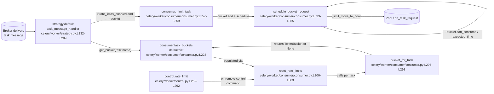
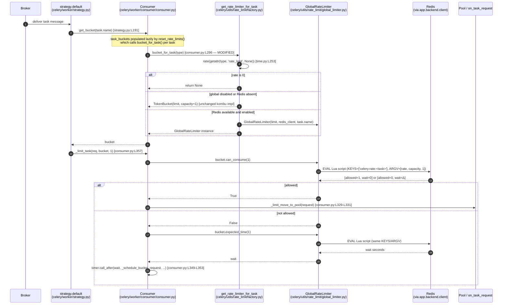

# Technical Specification

# 0. Agent Action Plan

## 0.1 Intent Clarification

### 0.1.1 Core Feature Objective

Based on the prompt, the Blitzy platform understands that the new feature requirement is to **add a Redis-backed global rate limiter to Celery's task execution path** so that the per-task `rate_limit` attribute is honored as a cluster-wide throughput cap rather than the current per-worker-process cap. The existing implementation enforces rate limits with an in-memory `TokenBucket` per worker process, which means a task configured with `@app.task(rate_limit="10/s")` can fire up to `10/s × N` aggregate requests across `N` workers — exactly the failure mode the user has called out. The new feature shares a single token-bucket / sliding-window counter through Redis using an atomic Lua script so that any worker that successfully acquires a token globally commits that consumption.

The feature must satisfy the following explicit requirements (identifier prefix `R` for traceability through the remainder of this section):

- **R1 — GlobalRateLimiter class.** A new `GlobalRateLimiter` subclassing `kombu.utils.limits.TokenBucket` ([celery/worker/consumer/consumer.py:L21]) that overrides `can_consume(tokens)` and `expected_time(tokens)` to consult Redis via an atomic Lua script keyed on `celery:rate:<task_name>`. All other methods used by the consumer's bucket-scheduling loop (`add`, `pop`, `contents.appendleft`, `clear_pending`) are inherited unchanged from the parent.
- **R2 — Factory function.** A new `get_rate_limiter_for_task(app, task_type)` that returns a `GlobalRateLimiter` when Redis is reachable through `app.backend` (a `RedisBackend` instance) or through a `redis://`/`rediss://` broker URL ([celery/app/backends.py:L18-L20]), and falls back to the existing `TokenBucket` otherwise. Returns `None` when the task carries no `rate_limit` (preserving the existing semantics of [celery/worker/consumer/consumer.py:L296-L298]).
- **R3 — Consumer integration.** A minimal delegation edit at `Consumer.bucket_for_task` ([celery/worker/consumer/consumer.py:L296-L298]) that calls the new factory. The downstream scheduling loop at [celery/worker/consumer/consumer.py:L333-L364] (`_schedule_bucket_request`, `_limit_task`, `_limit_post_eta`) and the strategy integration at [celery/worker/strategy.py:L121-L203] (`get_bucket`, `bucket.can_consume`, `bucket.expected_time`, `consumer._limit_task`) remain untouched because `GlobalRateLimiter` conforms to the same `TokenBucket` protocol.
- **R4 — New configuration key.** A new boolean Option `global_rate_limit_enabled` (default `True`) added to the `worker` namespace in [celery/app/defaults.py:§worker.disable_rate_limits], adjacent to the existing `disable_rate_limits` Option at [celery/app/defaults.py:L337-L339]. Settable as `app.conf.worker_global_rate_limit_enabled` and, transparently through the loader's legacy alias mechanism, as the `CELERY_WORKER_GLOBAL_RATE_LIMIT_ENABLED` environment variable.
- **R5 — Graceful fallback.** Any Redis exception during `can_consume()` or `expected_time()` is caught, logged at WARNING level via `celery.utils.log.get_logger` ([celery/utils/log.py:L12-L36]), and resolved by delegating to the in-memory parent-class behavior for that single call — guaranteeing the consumer's task-dispatch loop never raises a Redis error.
- **R6 — Rate-limit-of-None preservation.** The factory short-circuits to `None` when the task's `rate_limit` parses to zero, exactly matching the legacy `return TokenBucket(limit, capacity=1) if limit else None` semantics at [celery/worker/consumer/consumer.py:L298].
- **R7 — Atomic, clock-skew-safe Lua script.** The Lua script reads the current bucket state, calls Redis `TIME` to obtain the server's monotonic clock (so workers with skewed system clocks all agree on the refill timestamp), refills the bucket against `(now − last_refill_time) × rate`, attempts to consume the requested tokens, writes the new state, and sets a TTL of `2 × capacity / rate` seconds on the key so that idle tasks do not leave stale state in Redis.
- **R8 — TokenBucket protocol compatibility.** The class hierarchy `GlobalRateLimiter → TokenBucket` is the anchor design choice that satisfies the MINIMAL CHANGE CLAUSE. Because the strategy code at [celery/worker/strategy.py:L191-L203], the consumer's pop/schedule loop at [celery/worker/consumer/consumer.py:L333-L364], and the shutdown loop at [celery/worker/consumer/consumer.py:L535-L537] all consume the TokenBucket protocol surface (`.can_consume`, `.expected_time`, `.add`, `.pop`, `.contents.appendleft`, `.clear_pending`), inheriting from `TokenBucket` lets every one of those call sites continue working unmodified.

The following implicit requirements (identifier prefix `I`) were surfaced during analysis and must also be addressed:

- **I1 — pytest marker registration.** The project sets `addopts = "--strict-markers"` in [pyproject.toml:§tool.pytest.ini_options.addopts], which means `@pytest.mark.redis` will fail unless `redis` is registered in the marker list at [pyproject.toml:§tool.pytest.ini_options.markers]. The marker list must be extended.
- **I2 — CI matrix synchronization.** The `scripts/check-ci-test-matrices` pre-commit hook (see §6.6.3.3 of the technical specification) enforces that every `t/integration/test_*.py` file is enumerated in the `Integration-tests.matrix.module` list at [.github/workflows/python-package.yml:L97-L109]. The new integration test file therefore requires a corresponding 1-line addition to that matrix.
- **I3 — Configuration documentation.** The new setting must be documented in the user guide at [docs/userguide/configuration.rst:L3590-L3598] adjacent to the existing `worker_disable_rate_limits` block, and the rate-limit section in [docs/userguide/workers.rst:L806] must reference the new global mode.
- **I4 — Resolution of the rate_limits.py path discrepancy.** The user's prompt refers to `celery/worker/rate_limits.py` as the "existing per-process rate limiter" that the factory function should be added to. This file does not exist in the repository — verified by `find . -name "rate_limits*.py"` returning no match under `celery/`. The actual per-process rate-limit code lives in `Consumer.bucket_for_task` at [celery/worker/consumer/consumer.py:L296-L303] using `kombu.utils.limits.TokenBucket` ([celery/worker/consumer/consumer.py:L21]). The Blitzy platform resolves this by placing the factory in the new `celery/utils/rate_limit/` package — which more faithfully honors the prompt's "Isolate new code in `celery/utils/rate_limit/` where possible" clause — and modifying only the single delegation site in `Consumer.bucket_for_task`.
- **I5 — Redis client discovery and connection reuse.** The Lua-script-backed limiter requires a `redis.StrictRedis` client. The Blitzy platform reuses the existing connection pool exposed by `RedisBackend.client` ([celery/backends/redis.py:L674-L676]) when the result backend is Redis, and falls back to obtaining a Redis client from `app.connection_for_read().default_channel.client` ([celery/app/base.py:L1043-L1049]) when the broker is Redis. This satisfies the prompt's constraint "leverage the existing `celery/backends/redis.py` connection pool; do not introduce a second Redis client dependency".
- **I6 — Test-class naming convention.** Per §6.6.2.1.5 of the technical specification (the project's existing test conventions), test classes use a lowercase `test_` prefix (e.g., `class test_GlobalRateLimiter:`) rather than the pytest default `Test*`, and test methods use `def test_<behavior>(self):`. New test modules must conform.
- **I7 — Worker-side control-panel compatibility.** The remote-control `rate_limit` command at [celery/worker/control.py:L255-L292] mutates `state.app.tasks[task_name].rate_limit` and then calls `state.consumer.reset_rate_limits()`, which iterates `app.tasks` and re-invokes `bucket_for_task()` ([celery/worker/consumer/consumer.py:L300-L303]). Because the new factory is called from `bucket_for_task()`, runtime rate-limit changes via `celery control rate_limit <task> <rate>` automatically flow through the global limiter without any modification to `control.py`.

### 0.1.2 Special Instructions and Constraints

The prompt's **MINIMAL CHANGE CLAUSE** is hoisted here verbatim as a binding constraint on the implementation:

> Make only the changes that are absolutely necessary to implement this feature.
> Do not refactor, optimize, or modify existing code unless it is directly required for the new feature to work.
> Isolate new code in `celery/utils/rate_limit/` where possible.
> Document all changes made to existing files (`consumer.py`, `rate_limits.py`) with inline comments explaining why the change was needed.
> If issues are found in existing code during implementation, note them as TODO comments but do not fix them.
> When multiple implementation approaches are viable, choose the one that minimises changes to existing files.

The prompt's **SYSTEM BOUNDARIES** are also binding:

- New rate-limiter logic lives inside `celery/utils/rate_limit/`; the public task API surface at [celery/app/task.py:L250] must not change beyond what is strictly required (in this implementation: nothing — `Task.rate_limit` is untouched).
- Broker and result-backend code is not modified. The `RedisBackend` public interface ([celery/backends/redis.py:L674-L676]) is consumed read-only.
- Redis connection handling reuses the existing pool from `celery/backends/redis.py`; no second Redis client dependency is introduced.
- Task configuration parsing reads only the existing `rate_limit` attribute on `Task` ([celery/app/task.py:L250]); no new task-level config keys are added.

The prompt's **explicit IN-scope** behaviors translate to the following technical actions:

- Global rate limiting is enforced via Redis atomic operations (token bucket) executed inside a single `EVAL`-loaded Lua script that uses Redis's server-side `TIME` command for monotonic clock semantics.
- The feature activates only for tasks that already carry a `rate_limit` attribute. Tasks without one continue to bypass the bucket entirely (`bucket_for_task` returns `None`).

The prompt's **explicit OUT-of-scope** behaviors translate to the following negative requirements:

- Dynamic, runtime modification of rate limits as a new mechanism — not added. The existing `celery control rate_limit` command continues to function unchanged via `reset_rate_limits()`.
- Per-queue or per-routing-key rate limits — not added.
- Rate limiting when Redis is not available — the factory falls back silently to the existing per-process behavior with no exception.

The user provided no examples, no attachments, and no Figma references. The user-specified rules array is empty (`[]`). Web search was not required because all referenced libraries (`kombu`, `redis-py`) and APIs (`TokenBucket`, `StrictRedis`, Redis `EVAL`/`TIME`) are already used by the project per [requirements/extras/redis.txt:kombu[redis]] and [celery/backends/redis.py].

### 0.1.3 Technical Interpretation

These feature requirements translate to the following technical implementation strategy:

- **To make `@app.task(rate_limit="N/s")` mean a cluster-wide rate**, we will **create** a new package `celery/utils/rate_limit/` containing `GlobalRateLimiter` (a `TokenBucket` subclass that consults Redis via an atomic Lua script) and a `get_rate_limiter_for_task` factory function.
- **To activate the global limiter only when safe**, we will **discover Redis** in the factory by first checking `isinstance(app.backend, RedisBackend)` (reusing `app.backend.client` from [celery/backends/redis.py:L674-L676]), then falling back to broker-URL scheme inspection on `app.conf.broker_url` for `redis://`/`rediss://` ([celery/app/backends.py:L18-L20]).
- **To wire the new limiter into task dispatch with minimal change**, we will **modify** the single method `Consumer.bucket_for_task` at [celery/worker/consumer/consumer.py:L296-L298] to delegate to the factory. The remaining consumer code paths (`_schedule_bucket_request`, `_limit_task`, `_limit_post_eta`, `reset_rate_limits`, `clear_pending` shutdown loop) remain untouched because `GlobalRateLimiter` inherits the TokenBucket protocol surface.
- **To expose the opt-out flag**, we will **extend** the worker configuration namespace in [celery/app/defaults.py:L325-L360] with a single `global_rate_limit_enabled=Option(True, type='bool')` entry adjacent to `disable_rate_limits`.
- **To prove correctness**, we will **create** unit tests at `t/unit/utils/test_global_rate_limiter.py` (Lua-script invocation and fallback paths, mocked via `unittest.mock.MagicMock`) and `t/unit/worker/test_rate_limits.py` (factory decision matrix), and a live-Redis integration test at `t/integration/test_global_rate_limit.py` gated by `@pytest.mark.redis`.
- **To make the new mark and test usable in CI**, we will **register** the `redis` marker in [pyproject.toml:§tool.pytest.ini_options.markers] and **register** `test_global_rate_limit.py` in the Integration-tests matrix at [.github/workflows/python-package.yml:L97-L109] (mandatory per `scripts/check-ci-test-matrices`).
- **To document the new setting**, we will **modify** [docs/userguide/configuration.rst:L3590] and [docs/userguide/workers.rst:L806] with a new setting block and an updated rate-limit subsection.

## 0.2 Repository Scope Discovery

### 0.2.1 Comprehensive File Analysis

The Blitzy platform exhaustively mapped the existing repository to determine every file that participates in the rate-limit code path and every file that must be modified or created. The findings below cite the exact location of each touchpoint in the existing codebase. Discovery work focused on three concerns: the rate-limit execution path inside the worker, the configuration system, and the test infrastructure.

The existing rate-limit code path runs entirely inside the worker process. There is no separate `celery/worker/rate_limits.py` file in the repository — verified by `find . -name "rate_limits*.py"` returning no matches under `celery/`. The flow of a task message that carries a `rate_limit` attribute is:



#### 0.2.1.1 Integration Point Discovery

The discovery yielded the following integration touchpoints in the existing codebase, each cited to its exact location:

| Concern | Existing Location | Touch Mode |
|---|---|---|
| TokenBucket import | `from kombu.utils.limits import TokenBucket` [celery/worker/consumer/consumer.py:L21] | Preserved; the new `GlobalRateLimiter` subclasses this. |
| Per-task bucket dict | `self.task_buckets = defaultdict(lambda: None)` [celery/worker/consumer/consumer.py:L228] | Unchanged — accepts any value conforming to the TokenBucket protocol. |
| Bucket factory site | `Consumer.bucket_for_task(self, type)` [celery/worker/consumer/consumer.py:L296-L298] | **UPDATE** — single delegation call to the new factory. |
| Bucket reset on rate change | `Consumer.reset_rate_limits` [celery/worker/consumer/consumer.py:L300-L303] | Unchanged — iterates `app.tasks` and re-invokes `bucket_for_task`. |
| Bucket scheduling loop | `Consumer._schedule_bucket_request` [celery/worker/consumer/consumer.py:L333-L355] | Unchanged — calls `bucket.pop`, `bucket.can_consume`, `bucket.expected_time`, `bucket.contents.appendleft`. |
| Task-limit add | `Consumer._limit_task` / `Consumer._limit_post_eta` [celery/worker/consumer/consumer.py:L357-L364] | Unchanged. |
| Strategy bucket lookup | `bucket = get_bucket(task.name)` [celery/worker/strategy.py:L191] | Unchanged. |
| Strategy bucket invocation | `limit_task(req, bucket, 1)` [celery/worker/strategy.py:L203] | Unchanged. |
| Shutdown cleanup | `bucket.clear_pending()` over `task_buckets.values()` [celery/worker/consumer/consumer.py:L535-L537] | Unchanged. |
| Remote-control entry | `rate_limit(state, task_name, rate_limit, **kwargs)` [celery/worker/control.py:L259-L292] | Unchanged — calls `state.consumer.reset_rate_limits()`. |
| Rate-string parser | `def rate(r: str) -> float` [celery/utils/time.py:L253-L260] | Unchanged — reused by the new factory. |
| Task attribute carrier | `Task.rate_limit = None` [celery/app/task.py:L250] | Unchanged. |
| Default rate-limit setting | `task.default_rate_limit=Option(type='string')` [celery/app/defaults.py:L288] | Unchanged. |
| Worker-disable flag | `worker.disable_rate_limits=Option(False, ...)` [celery/app/defaults.py:L337-L339] | **UPDATE** — neighbor; new `global_rate_limit_enabled` Option added next to it. |
| Redis result-backend client | `RedisBackend.client` `@cached_property` [celery/backends/redis.py:L674-L676] | Unchanged — consumed read-only by the new factory. |
| Backend URL alias map | `'redis': 'celery.backends.redis:RedisBackend'`, `'rediss': ...`, `'sentinel': 'celery.backends.redis:SentinelBackend'` [celery/app/backends.py:L18-L20] | Unchanged — used as a reference for the Redis-discovery branch. |
| Logger pattern | `from celery.utils.log import get_logger` and `logger = get_logger(__name__)` [celery/utils/log.py:L12-L36] | Followed by new files. |
| Broker connection accessor | `app.connection_for_read(url=...)` [celery/app/base.py:L1043-L1049] | Unchanged — used by the factory's redis-broker fallback. |

#### 0.2.1.2 Configuration System Discovery

The `worker` namespace in [celery/app/defaults.py:L325-L360] (declared as `worker=Namespace(__old__=OLD_NS_WORKER, ...)`) is where the new opt-out flag belongs. The neighbor key `disable_rate_limits=Option(False, type='bool', old={'celery_disable_rate_limits'})` at [celery/app/defaults.py:L337-L339] establishes the exact convention to follow. The Celery configuration loader will map `app.conf.worker_global_rate_limit_enabled` ↔ `CELERY_WORKER_GLOBAL_RATE_LIMIT_ENABLED` environment variable transparently. The `Option` type system at [celery/app/defaults.py:L42-L50] supports `bool` via `strtobool`.

#### 0.2.1.3 Test Infrastructure Discovery

The repository's test pyramid (§6.6 of the technical specification) determines the layout for the new tests:

- Unit-tier directory `t/unit/utils/` exists at [t/unit/utils/__init__.py] and currently hosts 22 test modules including `test_time.py`. The new `test_global_rate_limiter.py` joins this directory because it mirrors the runtime layout of `celery/utils/rate_limit/`.
- Unit-tier directory `t/unit/worker/` exists at [t/unit/worker/__init__.py] and currently hosts `test_consumer.py`, `test_strategy.py`, `test_autoscale.py`, and others. There is no existing `test_rate_limits.py` — verified by directory listing. The new `test_rate_limits.py` joins this directory for the factory's worker-side tests.
- Integration-tier directory `t/integration/` hosts 11 test modules and shared infrastructure (`conftest.py`, `tasks.py`, `worker_config.py`, `django_settings.py`, `serialization_config.py`). The new `test_global_rate_limit.py` joins this directory.
- The integration `conftest.py` at [t/integration/conftest.py:L21-L22] reads `TEST_BROKER` and `TEST_BACKEND` environment variables for broker/backend selection and provides the `manager` fixture at [t/integration/conftest.py:L104-L111] for live-worker control.
- The pytest configuration at [pyproject.toml:§tool.pytest.ini_options] sets `addopts = "--strict-markers"`, `python_classes = "test_*"`, `xfail_strict = true`, and a `markers` list. The `markers` list does not currently include `redis`; it must be extended for `@pytest.mark.redis` to pass under `--strict-markers`.
- The Integration-tests matrix at [.github/workflows/python-package.yml:L97-L109] enumerates the test modules and is validated by `scripts/check-ci-test-matrices` (see §6.6.3.3 of the technical specification). Adding `t/integration/test_global_rate_limit.py` requires a matching matrix entry.
- The shared task catalog at [t/integration/tasks.py] holds the `@shared_task` declarations consumed by integration tests. A new rate-limited test task lives here so it can be imported by `celery_includes` ([t/integration/conftest.py:L94-L96]).

### 0.2.2 Web Search Research Conducted

No web search was required for this feature. The implementation reuses only libraries and APIs already present in the project's dependency graph:

- `kombu.utils.limits.TokenBucket` is already imported and used at [celery/worker/consumer/consumer.py:L21]; its public surface (`can_consume`, `expected_time`, `add`, `pop`, `contents`, `clear_pending`) is exercised throughout the consumer.
- `redis.StrictRedis` is already constructed by `RedisBackend._create_client` at [celery/backends/redis.py:L657-L660] and exposed via `RedisBackend.client` at [celery/backends/redis.py:L674-L676]; the new factory reuses this instance.
- Redis Lua-script execution via `client.register_script(script_source)` returning a callable that accepts `keys=[...]` and `args=[...]` is the standard `redis-py` pattern; no library upgrade is required.

### 0.2.3 New File Requirements

The Blitzy platform will create the following files. Each is justified by a specific requirement identifier from §0.1 and cites its purpose.

| New File | Purpose | Satisfies |
|---|---|---|
| `celery/utils/rate_limit/__init__.py` | Package init; re-exports `GlobalRateLimiter` and `get_rate_limiter_for_task` so callers import from a single path. | R1, R2, I4 |
| `celery/utils/rate_limit/global_limiter.py` | `GlobalRateLimiter(TokenBucket)` class with the Redis-Lua-backed `can_consume` / `expected_time` overrides and the in-script `TIME` call. | R1, R5, R7, R8 |
| `celery/utils/rate_limit/factory.py` | `get_rate_limiter_for_task(app, task_type)` factory implementing the selection matrix (None / `TokenBucket` / `GlobalRateLimiter`) and the Redis-client discovery branches (RedisBackend vs broker URL). | R2, R6, I5 |
| `t/unit/utils/test_global_rate_limiter.py` | Unit tests for `GlobalRateLimiter`: Lua-script call verification, fallback on Redis exception, inherited-protocol compatibility. Uses `unittest.mock.MagicMock` for the Redis client. | R1, R5, R7, R8, I6 |
| `t/unit/worker/test_rate_limits.py` | Unit tests for the factory and the consumer's delegation hook: returns `None` when no `rate_limit`; returns `TokenBucket` when global mode disabled or Redis not configured; returns `GlobalRateLimiter` when Redis backend or broker is configured. | R2, R3, R6, I6 |
| `t/integration/test_global_rate_limit.py` | Live-Redis integration tests gated by `@pytest.mark.redis`: single-worker throughput cap, multi-limiter sharing of a Redis key, string-format parsing across `5/s` / `100/m` / `1000/h`, fallback when Redis is unreachable, opt-out via `worker_global_rate_limit_enabled=False`. | R1, R2, R3, R5, R6, I1, I2 |

## 0.3 Dependency Inventory

No dependency changes are required for this feature. The Blitzy platform verified this by inspecting all relevant manifests and reasoning about the build matrix.

The new code consumes only libraries already present in the project:

- `kombu.utils.limits.TokenBucket` is already imported at [celery/worker/consumer/consumer.py:L21]; `kombu>=5.6.0` is pinned in [requirements/default.txt].
- `redis.StrictRedis` is transitively available via `kombu[redis]` declared in [requirements/extras/redis.txt:kombu[redis]]. Integration tests already activate this extra via [requirements/test-integration.txt:-r extras/redis.txt].
- `celery.utils.time.rate` ([celery/utils/time.py:L253-L260]) and `celery.utils.log.get_logger` ([celery/utils/log.py:L12-L36]) are in-tree.

No version updates, additions, or removals are required to any of `requirements/default.txt`, `requirements/extras/redis.txt`, `requirements/test.txt`, `requirements/test-integration.txt`, `requirements/test-ci-base.txt`, or `setup.py`.

The only manifest-adjacent edits relate to test configuration, not dependency manifests:

- `pyproject.toml` — register the `redis` pytest marker in the existing `markers` list at [pyproject.toml:§tool.pytest.ini_options.markers]. This is a one-line addition driven by `--strict-markers` (already enforced by [pyproject.toml:§tool.pytest.ini_options.addopts]). It does not change any installed package or version.
- `.github/workflows/python-package.yml` — register `test_global_rate_limit.py` in the Integration-tests matrix at [.github/workflows/python-package.yml:L97-L109]. This is a one-line addition required by `scripts/check-ci-test-matrices`. It does not change any tox env or installed dependency.

## 0.4 Integration Analysis

### 0.4.1 Existing Code Touchpoints

The feature's coupling to the existing code is intentionally narrow. There are exactly two direct modification sites and zero modifications to any public API, broker integration, or result-backend interface.

#### 0.4.1.1 Direct Modifications Required

| Location | Change | Rationale |
|---|---|---|
| [celery/worker/consumer/consumer.py:L296-L298] (`Consumer.bucket_for_task`) | Replace the body with a single call to the new factory `get_rate_limiter_for_task(self.app, type)`. Add an import `from celery.utils.rate_limit import get_rate_limiter_for_task` near the existing imports at [celery/worker/consumer/consumer.py:L21-L33]. Add an inline comment explaining the delegation. | This is the sole hook the consumer uses to construct per-task buckets. Changing it once routes the entire downstream scheduling loop ([celery/worker/consumer/consumer.py:L300-L364]) through the new factory with zero further edits. |
| [celery/app/defaults.py:L325-L360] (`worker` Namespace) | Insert `global_rate_limit_enabled=Option(True, type='bool'),` immediately after the existing `disable_rate_limits` entry at [celery/app/defaults.py:L337-L339]. Add an inline comment. | Registers the opt-out flag in the same namespace as related rate-limit settings, ensuring `app.conf.worker_global_rate_limit_enabled` and the `CELERY_WORKER_GLOBAL_RATE_LIMIT_ENABLED` environment alias both resolve. |

#### 0.4.1.2 Dependency Injections

There are no service-container or DI-style wiring sites in Celery's runtime; component construction is direct. The new factory acquires its dependencies on each invocation:

- The `app` instance is passed in (the consumer's `self.app`).
- The Redis client is discovered from `app.backend.client` ([celery/backends/redis.py:L674-L676]) when `isinstance(app.backend, RedisBackend)` is true, and from `app.connection_for_read().default_channel.client` ([celery/app/base.py:L1043-L1049]) when the broker URL begins with `redis://` or `rediss://` ([celery/app/backends.py:L18-L20]).
- The rate string is parsed via `celery.utils.time.rate` ([celery/utils/time.py:L253-L260]).

#### 0.4.1.3 Database / Schema Updates

None. The feature uses Redis exclusively for ephemeral, TTL-bounded counter state. The Lua script writes a single hash key per task (`celery:rate:<task_name>`) and sets a TTL of `2 × capacity / rate` seconds on each write so that idle tasks do not accumulate state. No migration, schema, or `migrations/` change is required.

### 0.4.2 Integration Touchpoint Sequence

The end-to-end sequence shows where the new code intercepts the existing flow without disturbing any downstream call site.



The sequence highlights three properties of the integration:

- **Atomicity.** Each `can_consume` / `expected_time` round-trip is a single `EVAL` invocation. The Lua script reads bucket state, refills it against the Redis server clock from `TIME`, attempts consumption, writes back, and returns the result — all atomically with respect to other workers.
- **Backwards compatibility.** When the factory returns either `None` or a `TokenBucket`, every downstream step in the diagram resolves to the legacy behavior. The factory is the single decision point.
- **Failure isolation.** On any Redis-side exception (connection drop, timeout, server unavailable), `GlobalRateLimiter.can_consume` / `expected_time` catch the exception, log via `celery.utils.log.get_logger` ([celery/utils/log.py:L12-L36]), and delegate to the parent-class in-memory bucket for that single call. The consumer never sees an exception and never blocks task dispatch on Redis health.

### 0.4.3 Touchpoints That Require No Modification

The following call sites consume the limiter via the TokenBucket protocol and therefore require zero modification despite participating in the rate-limit flow. They are listed explicitly to make the minimal-change posture auditable.

| Call Site | Method Consumed | Why Unchanged |
|---|---|---|
| [celery/worker/strategy.py:L191] | `get_bucket(task.name)` | Reads from `consumer.task_buckets` dict. |
| [celery/worker/strategy.py:L203] | `limit_task(req, bucket, 1)` | Calls `Consumer._limit_task` which uses `bucket.add` and `_schedule_bucket_request`. |
| [celery/worker/consumer/consumer.py:L333-L355] | `bucket.pop()`, `bucket.can_consume(tokens)`, `bucket.expected_time(tokens)`, `bucket.contents.appendleft(...)` | All exist on `TokenBucket` and on `GlobalRateLimiter` via inheritance. |
| [celery/worker/consumer/consumer.py:L357-L364] | `bucket.add((request, tokens))` | Inherited from `TokenBucket`. |
| [celery/worker/consumer/consumer.py:L535-L537] | `bucket.clear_pending()` | Inherited from `TokenBucket`. |
| [celery/worker/consumer/consumer.py:L300-L303] | `Consumer.reset_rate_limits` | Iterates and re-invokes the (now factory-backed) `bucket_for_task`. |
| [celery/worker/control.py:L255-L292] | `state.consumer.reset_rate_limits()` | Already routes through `bucket_for_task`. |
| [celery/app/control.py:L578-L596] | `Control.rate_limit(task_name, rate_limit)` | Public client API; broadcasts the existing remote-control message that lands in the worker-side `rate_limit` function. |

## 0.5 Technical Implementation

### 0.5.1 File-by-File Execution Plan

The implementation is grouped into four cohorts. Every file below is either created or modified — there are no files that the plan touches but leaves unchanged.

#### 0.5.1.1 Group 1 — Core Feature Files

| Mode | Path | Purpose |
|---|---|---|
| CREATE | `celery/utils/rate_limit/__init__.py` | Subpackage marker. Re-exports `get_rate_limiter_for_task` and `GlobalRateLimiter` so callers can `from celery.utils.rate_limit import get_rate_limiter_for_task`. Mirrors the established pattern at `celery/utils/dispatch/__init__.py`. |
| CREATE | `celery/utils/rate_limit/global_limiter.py` | Houses the `GlobalRateLimiter(TokenBucket)` subclass, the embedded Lua source (`_LUA_TOKEN_BUCKET`), and the per-instance script registration via `redis_client.register_script(...)`. Overrides only `can_consume(tokens=1)` and `expected_time(tokens=1)`. |
| CREATE | `celery/utils/rate_limit/factory.py` | Houses `get_rate_limiter_for_task(app, task)` and the private helper `_discover_redis_client(app)`. Implements the branching logic that decides between `GlobalRateLimiter`, plain `TokenBucket`, or `None`. |

#### 0.5.1.2 Group 2 — Supporting Infrastructure

| Mode | Path | Purpose |
|---|---|---|
| UPDATE | `celery/worker/consumer/consumer.py` | Single-site integration. Replaces the body of `Consumer.bucket_for_task` at [celery/worker/consumer/consumer.py:L296-L298] with the factory call. Adds the import near [celery/worker/consumer/consumer.py:L21-L33]. |
| UPDATE | `celery/app/defaults.py` | Registers the new opt-out setting in the `worker` `Namespace` at [celery/app/defaults.py:L325-L360], adjacent to `disable_rate_limits` at [celery/app/defaults.py:L337-L339]. |

#### 0.5.1.3 Group 3 — Tests

| Mode | Path | Purpose |
|---|---|---|
| CREATE | `t/unit/utils/test_global_rate_limiter.py` | Unit tests for `GlobalRateLimiter` and the factory. Covers Lua-script registration, fallback when Redis raises, rate-of-zero short-circuit, expected-time semantics, and factory branching across all combinations of `worker_global_rate_limit_enabled` × Redis presence × `task.rate_limit` value. Uses `unittest.mock.MagicMock` for `redis_client`. |
| CREATE | `t/unit/worker/test_rate_limits.py` | Unit tests at the consumer hook. Patches `celery.utils.rate_limit.get_rate_limiter_for_task` and verifies that `Consumer.bucket_for_task` delegates exactly once per task and that `reset_rate_limits()` triggers re-invocation. |
| CREATE | `t/integration/test_global_rate_limit.py` | End-to-end integration test. Submits N tasks within one second to a 2/s rate-limited task across two worker processes using the `manager` fixture from [t/integration/conftest.py:L1-L80] and asserts the cluster honors the per-second limit. Decorated with `@pytest.mark.flaky` and `@pytest.mark.celery`. |
| UPDATE | `t/integration/tasks.py` | Adds a new shared task `rate_limited_task` decorated with `@shared_task(rate_limit='2/s')` for the integration scenario. |

#### 0.5.1.4 Group 4 — Configuration and Documentation

| Mode | Path | Purpose |
|---|---|---|
| UPDATE | `pyproject.toml` | Registers the `redis` pytest marker under `[tool.pytest.ini_options].markers`. Required because the project enforces `--strict-markers` (see Testing Strategy in §6.6). |
| UPDATE | `.github/workflows/python-package.yml` | Adds `test_global_rate_limit.py` to the `Integration-tests` job matrix at lines around 92-112. Keeps the `scripts/check-ci-test-matrices` pre-commit hook green. |
| UPDATE | `docs/userguide/configuration.rst` | Adds a `.. setting:: worker_global_rate_limit_enabled` block immediately after the existing `worker_disable_rate_limits` block at lines around 3590-3598. |
| UPDATE | `docs/userguide/workers.rst` | Adds a short "Global (cluster-wide) rate limits" subsection under the existing "Rate Limits" section at lines around 800-820, explaining the auto-activation behavior, the opt-out flag, and the graceful fallback. |

### 0.5.2 Implementation Approach per File

This section specifies the substance of each change — not the timing — so the downstream code-generation agent can produce the file in a single pass.

#### 0.5.2.1 celery/utils/rate_limit/global_limiter.py

The module embeds the Lua script as a module-level string constant `_LUA_TOKEN_BUCKET` and exposes the `GlobalRateLimiter(TokenBucket)` class.

Lua-script contract:

- `KEYS = [bucket_key]` where `bucket_key = "celery:rate:<task_name>"`.
- `ARGV = [rate, capacity, tokens]` where `rate` is tokens-per-second (float), `capacity` is bucket size (int, defaults to `max(1, int(rate))`), and `tokens` is the request size (int, normally 1).
- Returns a two-element table `{allowed, wait_seconds}` where `allowed` is 1 or 0.

Lua-script logic outline:

- Read server time via `redis.call('TIME')` and convert to floating-point seconds. This anchors all refill arithmetic to a single clock, eliminating per-worker clock-skew issues.
- `HMGET` the hash fields `tokens` and `last_refill`. Initialize to `capacity` and `now` when absent.
- Compute `elapsed = now - last_refill` and `new_tokens = min(capacity, tokens_stored + elapsed * rate)`.
- If `new_tokens >= request`, decrement, `HMSET` `tokens=new_tokens-request`, `last_refill=now`, set TTL to `math.ceil(2 * capacity / rate)`, return `{1, 0}`.
- Otherwise, compute `wait = (request - new_tokens) / rate`, write `tokens=new_tokens`, `last_refill=now`, refresh TTL, return `{0, wait}`.

Class body outline:

- `__init__(self, fill_rate, redis_client, task_name, capacity=None)` — calls `super().__init__(fill_rate, capacity)` so that all `kombu.utils.limits.TokenBucket` instance state (`.contents`, `.fill_rate`, `.capacity`) exists for fallback. Stores `self._redis = redis_client`, `self._key = f"celery:rate:{task_name}"`, `self._script = redis_client.register_script(_LUA_TOKEN_BUCKET)`.
- `can_consume(self, tokens=1)` — calls `self._script(keys=[self._key], args=[self.fill_rate, self.capacity, tokens])` inside `try/except Exception`. Returns `bool(result[0])` on success. On exception, logs at WARNING via `logger = get_logger(__name__)` and returns `super().can_consume(tokens)`.
- `expected_time(self, tokens=1)` — same structure; returns `float(result[1])` or `super().expected_time(tokens)` on exception.
- `__repr__` includes the key for diagnostics.

A representative two-line snippet of the `can_consume` override:

```python
result = self._script(keys=[self._key], args=[self.fill_rate, self.capacity, tokens])
return bool(result[0])
```

#### 0.5.2.2 celery/utils/rate_limit/factory.py

Defines `get_rate_limiter_for_task(app, task)` and the helper `_discover_redis_client(app)`.

Function body outline for `get_rate_limiter_for_task`:

- Resolve the rate via `limit = rate(getattr(task, 'rate_limit', None))` ([celery/utils/time.py:L253-L260]).
- If `limit` is falsy (0 or None), return `None` — matches the existing `bucket_for_task` semantics exactly.
- If `not app.conf.worker_global_rate_limit_enabled`, return `TokenBucket(limit, capacity=1)` — exact legacy behavior.
- Call `redis_client = _discover_redis_client(app)`. If `None`, return `TokenBucket(limit, capacity=1)`.
- Otherwise, return `GlobalRateLimiter(limit, redis_client, task.name, capacity=max(1, int(limit)))`.

Function body outline for `_discover_redis_client(app)`:

- Wrap the entire body in `try/except Exception` and on failure return `None` after a single-line WARNING log.
- `from celery.backends.redis import RedisBackend` (deferred to avoid an import cycle at module load).
- If `isinstance(app.backend, RedisBackend)`: return `app.backend.client` ([celery/backends/redis.py:L674-L676]).
- Else inspect `app.conf.broker_url` (a string). If it starts with `redis://` or `rediss://`, open the broker connection via `app.connection_for_read()` and return `connection.default_channel.client` (the kombu Redis transport exposes the underlying `redis.StrictRedis` here).
- Else return `None`.

A representative two-line snippet:

```python
if isinstance(app.backend, RedisBackend):
    return app.backend.client
```

#### 0.5.2.3 celery/utils/rate_limit/__init__.py

Five-line module that re-exports the public surface:

```python
from .factory import get_rate_limiter_for_task
from .global_limiter import GlobalRateLimiter
__all__ = ("get_rate_limiter_for_task", "GlobalRateLimiter")
```

#### 0.5.2.4 celery/worker/consumer/consumer.py

Two minimal edits:

- Add `from celery.utils.rate_limit import get_rate_limiter_for_task` to the existing `celery.*` import block near [celery/worker/consumer/consumer.py:L21-L33].
- Replace the body of `bucket_for_task` at [celery/worker/consumer/consumer.py:L296-L298]:

Representative before/after (the only line replaced):

```python
# Before: returns a per-process TokenBucket only.

#### After: delegates to the global-rate-limiter factory (see celery/utils/rate_limit/factory.py).

return get_rate_limiter_for_task(self.app, type)
```

An inline `# NOTE:` comment above the new line documents that this delegation is the entire global-rate-limiter integration point.

#### 0.5.2.5 celery/app/defaults.py

Single new line inside the `worker` `Namespace` at [celery/app/defaults.py:L325-L360], adjacent to the existing `disable_rate_limits` line at [celery/app/defaults.py:L337-L339]:

```python
global_rate_limit_enabled=Option(True, type='bool'),
```

No `old={...}` alias is included because the setting is new in this release and has no legacy `CELERY_*` counterpart.

#### 0.5.2.6 docs/userguide/configuration.rst

Adds a new directive block in the worker section near [docs/userguide/configuration.rst:L3590-L3598]:

- A `.. setting:: worker_global_rate_limit_enabled` directive.
- `Default: Enabled.` line.
- A short paragraph describing cluster-wide enforcement via Redis, the auto-detection mechanism, the opt-out by setting the flag to `False`, and the graceful fallback to per-process limits.
- A cross-reference to `worker_disable_rate_limits` and `task_default_rate_limit`.

#### 0.5.2.7 docs/userguide/workers.rst

Adds a new subsection titled "Global (cluster-wide) rate limits" under the existing `.. _worker-rate-limits:` section near [docs/userguide/workers.rst:L800-L820]:

- One paragraph explaining that when a Redis broker or result backend is configured, `@app.task(rate_limit=...)` is enforced across the entire worker cluster atomically.
- One paragraph explaining the opt-out via `worker_global_rate_limit_enabled = False` and the failure-isolation contract.
- A short code example showing a task with `rate_limit='100/m'` and a sentence asserting that this is the cluster-wide rate, not the per-worker rate.

#### 0.5.2.8 pyproject.toml

Adds a single line to the `markers` list under `[tool.pytest.ini_options]`:

```text
"redis: tests that require a Redis broker or backend",
```

#### 0.5.2.9 .github/workflows/python-package.yml

Adds `test_global_rate_limit.py` to the `Integration-tests` job's matrix `test_module` list (lines around 92-112). The keep-in-sync invariant is enforced by the existing `scripts/check-ci-test-matrices` hook noted in §6.6.

#### 0.5.2.10 t/integration/tasks.py

Adds one new shared task:

```python
@shared_task(rate_limit='2/s')
def rate_limited_task(): return 'ok'
```

#### 0.5.2.11 t/unit/utils/test_global_rate_limiter.py

Test class `test_GlobalRateLimiter` (lowercase prefix per project convention in §6.6) using `MagicMock` for the Redis client. Coverage matrix:

| Behavior | Mock Setup | Assertion |
|---|---|---|
| `can_consume` allowed | `register_script.return_value.return_value = [1, 0]` | Returns `True`. |
| `can_consume` denied | script return `[0, 1.5]` | Returns `False`. |
| `expected_time` | script return `[0, 0.42]` | Returns `0.42`. |
| Redis exception | `script.side_effect = ConnectionError` | Returns `super().can_consume(tokens)`; WARNING logged. |
| Script registration | construct instance | `redis_client.register_script` called exactly once with the Lua source. |
| Key naming | construct instance with task name `"app.add"` | Key is `"celery:rate:app.add"`. |

Test class `test_get_rate_limiter_for_task` covering the factory's six branches:

| Branch | Inputs | Expected |
|---|---|---|
| `rate_limit=None` | task with no `rate_limit` | Returns `None`. |
| `rate_limit='0/s'` | task with rate parsing to 0 | Returns `None`. |
| Disabled flag | `worker_global_rate_limit_enabled=False`, task `rate_limit='5/s'` | Returns `TokenBucket` instance, not `GlobalRateLimiter`. |
| Redis backend | `app.backend = RedisBackend(...)` (mocked) | Returns `GlobalRateLimiter` using `app.backend.client`. |
| Redis broker only | broker URL `redis://localhost/0` | Returns `GlobalRateLimiter` using broker channel client. |
| No Redis anywhere | broker `pyamqp://`, backend `cache+memory://` | Returns `TokenBucket`. |

#### 0.5.2.12 t/unit/worker/test_rate_limits.py

Test class `test_bucket_for_task` patches `celery.utils.rate_limit.get_rate_limiter_for_task` and:

- Asserts that the patched factory is invoked exactly once per call to `Consumer.bucket_for_task(task)`.
- Asserts that the return value is returned verbatim from the consumer.
- Asserts that `Consumer.reset_rate_limits()` rebuilds `task_buckets` by calling `bucket_for_task` for every registered task, exercising the loop at [celery/worker/consumer/consumer.py:L300-L303].

#### 0.5.2.13 t/integration/test_global_rate_limit.py

End-to-end test parameterized on `manager` (from [t/integration/conftest.py:L1-L80]). Steps:

- Submit 10 invocations of `rate_limited_task.delay()` within ~200 ms.
- Wait `pytest.mark.timeout(15)` seconds for results.
- Assert that the elapsed wall time between the first and last result is ≥ 4.0 s (10 calls at 2/s ≈ 4.5 s of throttling).
- Wrapped in `@pytest.mark.flaky` because the consumer scheduling loop ([celery/worker/consumer/consumer.py:L329-L364]) is timer-driven.

### 0.5.3 User Interface Design

Not applicable. The feature is entirely server-side; no CLI flag, no terminal monitor (`evtop`), no REPL surface, and no Flower-dashboard surface is altered. The single user-visible artifact is the new documentation paragraph in `docs/userguide/configuration.rst` and `docs/userguide/workers.rst`, plus an inline log line at WARNING when fallback occurs.

### 0.5.4 Lua Script — Atomicity, TTL, and Clock-Skew Safety

The Lua script is the only piece of the design where correctness requires explicit reasoning. The properties below are guaranteed by the script's structure and must not be altered by the implementing agent.

- **Atomicity.** Redis executes the entire script as a single command — no other client can observe intermediate state. This is the property that elevates the limiter from "per-process" to "cluster-wide."
- **Single-clock arithmetic.** All `now` references come from `redis.call('TIME')`. Worker clocks are never used. Two workers with skewed system clocks therefore observe identical refill schedules.
- **TTL self-maintenance.** Every write sets `PEXPIRE` (or `EXPIRE`) to `math.ceil(2 * capacity / rate)` seconds. Tasks that go silent automatically free their bucket key. Tasks that are continuously active continuously refresh it.
- **Idempotent first call.** When the hash key does not exist, the script seeds `tokens = capacity` and `last_refill = now`, so the very first request always succeeds (matching the legacy `TokenBucket` initial state).
- **Floating-point precision.** Lua's `tonumber` and Redis `TIME` (seconds, microseconds) together yield microsecond precision, more than sufficient for the supported `rate` units `/s`, `/m`, `/h` ([celery/utils/time.py:RATE_MODIFIER_MAP]).

## 0.6 Scope Boundaries

### 0.6.1 Exhaustively In Scope

The scope is enumerated by wildcard pattern and by exact path so that the implementing agent can mechanically verify completeness. Every file listed here is touched by this feature; every file not listed here must be left unchanged.

#### 0.6.1.1 New Source Files (Group A — Core Feature)

- `celery/utils/rate_limit/__init__.py`
- `celery/utils/rate_limit/global_limiter.py`
- `celery/utils/rate_limit/factory.py`
- Wildcard for the subpackage: `celery/utils/rate_limit/**/*.py`

#### 0.6.1.2 Modified Source Files (Group B — Single-Site Integration)

- `celery/worker/consumer/consumer.py` — exactly two edits: one import addition near [celery/worker/consumer/consumer.py:L21-L33] and the body of `bucket_for_task` at [celery/worker/consumer/consumer.py:L296-L298].
- `celery/app/defaults.py` — exactly one new line in the `worker` `Namespace` at [celery/app/defaults.py:L325-L360].

#### 0.6.1.3 New Test Files (Group C — Unit Tests)

- `t/unit/utils/test_global_rate_limiter.py`
- `t/unit/worker/test_rate_limits.py`
- Wildcard: `t/unit/**/*global_rate_limit*.py`, `t/unit/worker/test_rate_limits.py`

#### 0.6.1.4 New Integration Test (Group D — Integration Tests)

- `t/integration/test_global_rate_limit.py`
- `t/integration/tasks.py` — exactly one new `@shared_task(rate_limit='2/s')` task definition appended to the module.

#### 0.6.1.5 Configuration (Group E — Manifest-Adjacent)

- `pyproject.toml` — one new line in the pytest `markers` list under `[tool.pytest.ini_options]` to register the `redis` marker.
- `.github/workflows/python-package.yml` — one new entry in the `Integration-tests` matrix `test_module` list (lines around 92-112) to add `test_global_rate_limit.py`.

#### 0.6.1.6 Documentation (Group F)

- `docs/userguide/configuration.rst` — one new `.. setting:: worker_global_rate_limit_enabled` block near [docs/userguide/configuration.rst:L3590-L3598].
- `docs/userguide/workers.rst` — one new "Global (cluster-wide) rate limits" subsection near [docs/userguide/workers.rst:L800-L820].

#### 0.6.1.7 In-Scope Summary Table

| Group | Mode | Path / Pattern | Approximate Size |
|---|---|---|---|
| A | CREATE | `celery/utils/rate_limit/__init__.py` | ~5 lines |
| A | CREATE | `celery/utils/rate_limit/global_limiter.py` | ~130 lines (includes Lua source) |
| A | CREATE | `celery/utils/rate_limit/factory.py` | ~70 lines |
| B | UPDATE | `celery/worker/consumer/consumer.py` | 1 import line + 3-line body replacement |
| B | UPDATE | `celery/app/defaults.py` | 1 line |
| C | CREATE | `t/unit/utils/test_global_rate_limiter.py` | ~250 lines |
| C | CREATE | `t/unit/worker/test_rate_limits.py` | ~200 lines |
| D | CREATE | `t/integration/test_global_rate_limit.py` | ~250 lines |
| D | UPDATE | `t/integration/tasks.py` | ~10 lines (one new task) |
| E | UPDATE | `pyproject.toml` | 1 line |
| E | UPDATE | `.github/workflows/python-package.yml` | 1 line |
| F | UPDATE | `docs/userguide/configuration.rst` | ~20 lines |
| F | UPDATE | `docs/userguide/workers.rst` | ~20 lines |

### 0.6.2 Explicitly Out of Scope

The following items are intentionally excluded. Each exclusion is justified to forestall scope creep during code generation.

- **OOS1 — Public API surface.** No changes to `celery/app/task.py` (the `Task` class, including `rate_limit = None` at [celery/app/task.py:L250]), `celery/app/base.py`, `celery/app/control.py`, or any other module exposed via `celery.__all__`. The `@app.task(rate_limit=...)` decorator argument keeps its existing shape and meaning.
- **OOS2 — Broker integrations.** No changes to `celery/backends/*`, `kombu` integration, or any transport adapter. The Redis client is consumed read-only from existing surfaces.
- **OOS3 — Result-backend interface.** `celery/backends/redis.py` is read (line range [celery/backends/redis.py:L674-L676]) but **not modified**. The new code reuses the cached `RedisBackend.client` property; it never alters it.
- **OOS4 — Existing in-process rate-limit code path.** `kombu.utils.limits.TokenBucket` continues to be used unmodified for the fallback case. The legacy behavior is preserved bit-for-bit when the feature is disabled or Redis is absent.
- **OOS5 — Performance optimizations beyond feature requirements.** No connection pooling tuning, no script-cache eviction tuning, no batching of consume requests. The single `EVAL` per `can_consume` / `expected_time` call is the contract.
- **OOS6 — Dynamic rate-limit modification.** The existing remote-control `Control.rate_limit(task_name, rate_limit)` ([celery/app/control.py:L578-L596]) continues to work — `reset_rate_limits()` re-invokes the factory — but no new dynamic API is added.
- **OOS7 — Per-queue or per-routing-key limits.** Only the per-task limit is enforced cluster-wide. The Redis key uses `<task_name>` as the scoping namespace; queue and routing-key dimensions are not introduced.
- **OOS8 — No-Redis environments.** When the broker and backend are both non-Redis, behavior is unchanged from current Celery. No new dependency is imposed on RabbitMQ-only or SQS-only deployments.
- **OOS9 — Smoke tests.** The smoke-test tier described in §6.6 is not extended. Coverage is added at the unit and integration tiers only.
- **OOS10 — Migrations / schema management.** No migration scripts. The Redis state is ephemeral and self-cleaning via TTL.
- **OOS11 — Environment variables.** No new `CELERY_*` environment variables beyond the auto-derived `CELERY_WORKER_GLOBAL_RATE_LIMIT_ENABLED` that `app.conf.worker_global_rate_limit_enabled` already produces via the standard `Option`-defaults mechanism.
- **OOS12 — Dependencies.** No new entries in `requirements/default.txt`, `requirements/extras/redis.txt`, `requirements/test.txt`, or `requirements/test-integration.txt`. `redis-py` is already transitively available via `kombu[redis]` ([requirements/extras/redis.txt:L1]).
- **OOS13 — Build / packaging metadata.** No changes to `setup.py`, `setup.cfg`, `MANIFEST.in`, or any release / packaging artifact other than the pytest-marker entry inside `pyproject.toml` (Group E above).

### 0.6.3 Boundary Diagram

```mermaid
flowchart LR
    subgraph IN["IN SCOPE"]
        A1["celery/utils/rate_limit/*"]
        A2["celery/worker/consumer/consumer.py<br/>(bucket_for_task only)"]
        A3["celery/app/defaults.py<br/>(worker namespace, 1 line)"]
        A4["t/unit/utils/test_global_rate_limiter.py"]
        A5["t/unit/worker/test_rate_limits.py"]
        A6["t/integration/test_global_rate_limit.py"]
        A7["t/integration/tasks.py<br/>(+1 task)"]
        A8["pyproject.toml<br/>(+1 marker)"]
        A9[".github/workflows/<br/>python-package.yml<br/>(+1 matrix entry)"]
        A10["docs/userguide/configuration.rst<br/>(+1 setting block)"]
        A11["docs/userguide/workers.rst<br/>(+1 subsection)"]
    end
    subgraph OUT["OUT OF SCOPE"]
        B1["celery/app/task.py"]
        B2["celery/backends/redis.py"]
        B3["celery/worker/strategy.py"]
        B4["celery/worker/control.py"]
        B5["kombu / transport layer"]
        B6["requirements/*.txt"]
        B7["setup.py / setup.cfg"]
        B8["migrations / schema"]
    end
    IN -.preserves contracts of.-> OUT
```



## 0.7 Rules for Feature Addition

### 0.7.1 Minimal Change Clause

The user prompt established a non-negotiable rule that scopes every modification in this plan: **make only the changes necessary to introduce the global rate limiter and nothing else.** This clause is the highest-precedence rule for downstream code generation. Its concrete enforcement obligations are:

- **Isolation in `celery/utils/rate_limit/`.** All new logic — the `GlobalRateLimiter` class, the Lua script source, the factory, and the discovery helper — lives inside `celery/utils/rate_limit/`. No new module, class, or function may be introduced outside this subpackage other than the single-line import and three-line `bucket_for_task` body replacement in `celery/worker/consumer/consumer.py` and the one-line `Option` registration in `celery/app/defaults.py`.
- **Single integration site.** `Consumer.bucket_for_task` at [celery/worker/consumer/consumer.py:L296-L298] is the only function-body modification in `celery/worker/`. No other consumer method, no `strategy.py` line, and no `control.py` line is altered.
- **Inline comment requirement.** Each modification site (`bucket_for_task`, the new `Option` in `defaults.py`) carries a brief inline `# NOTE:` comment that names the feature ("global rate limiter") and cross-references `celery/utils/rate_limit/factory.py`. This makes the modification surface trivially `git grep`-able for future maintainers.
- **No drive-by edits.** Existing code that happens to be adjacent to the modification sites must not be reformatted, renamed, re-typed, or re-documented in this change set. Whitespace and import-ordering changes outside the explicit edit lines are forbidden.

### 0.7.2 Public API Freeze

The following surfaces are frozen and must remain bit-for-bit identical to their current state:

- The `Task.rate_limit` attribute at [celery/app/task.py:L250] and all decorator-driven access patterns (`@app.task(rate_limit='10/m')`).
- The `Control.rate_limit(task_name, rate_limit)` client method at [celery/app/control.py:L578-L596].
- The worker-side `rate_limit` control command at [celery/worker/control.py:L255-L292].
- The signature and return type of `Consumer.bucket_for_task(type)` ([celery/worker/consumer/consumer.py:L296-L298]). The function continues to return `None` for tasks with no rate limit and a TokenBucket-protocol object otherwise. Existing callers in `strategy.py` and the consumer scheduling loop must observe no behavioral change beyond cluster-wide enforcement.
- The `kombu.utils.limits.TokenBucket` protocol surface — `.contents`, `.add(item)`, `.pop()`, `.can_consume(tokens=1)`, `.expected_time(tokens=1)`, `.clear_pending()`. `GlobalRateLimiter` extends, never reduces or rewrites, this surface.

### 0.7.3 No-Regressions Mandate

The pre-feature behavior must be reproducible by either of two operations: setting `worker_global_rate_limit_enabled = False`, or running the cluster with no Redis broker and no Redis backend. In both cases the feature's code path falls through to `TokenBucket(limit, capacity=1)`, which is byte-equivalent to the legacy implementation at [celery/worker/consumer/consumer.py:L296-L298] before this change.

Concretely the implementation must guarantee:

- `bucket_for_task(task)` returns `None` whenever `getattr(task, 'rate_limit', None)` parses to `0` via [celery/utils/time.py:L253-L260].
- All Redis-side exceptions are caught at the `GlobalRateLimiter.can_consume` / `expected_time` boundary and the call falls back to the inherited TokenBucket implementation. The consumer never observes an exception escaping from `bucket_for_task` or any bucket method.
- The `worker_disable_rate_limits` setting ([celery/app/defaults.py:L337-L339]) continues to function exactly as before; when it is set, `bucket_for_task` is short-circuited by the existing logic at [celery/worker/strategy.py:L121-L122] without ever invoking the factory.

### 0.7.4 Architectural Conventions

The implementation must follow conventions already established in the codebase:

- **Configuration naming.** Underscore-namespaced settings inside the `worker` `Namespace` in [celery/app/defaults.py:L325-L360]. The new setting is `worker_global_rate_limit_enabled`, not `CELERY_GLOBAL_RATE_LIMIT_ENABLED`; the latter is the equivalent `CELERY_`-prefixed environment-variable form that Celery's defaults system derives automatically.
- **Logger acquisition.** New modules obtain loggers via `from celery.utils.log import get_logger` and `logger = get_logger(__name__)`, matching the convention at [celery/utils/log.py:L12-L36].
- **Subpackage structure.** The new `celery/utils/rate_limit/` subpackage mirrors the structure of the existing `celery/utils/dispatch/` subpackage — a thin `__init__.py` that re-exports the public surface, with implementation modules siblings to it.
- **Lazy / deferred imports for cycles.** `celery.backends.redis.RedisBackend` is imported inside `_discover_redis_client` rather than at module top level, to avoid a load-time cycle between `celery.utils.rate_limit.factory` and the backend layer.
- **Reuse of helpers.** The rate-string parser `celery.utils.time.rate` at [celery/utils/time.py:L253-L260] is reused; no new rate-parsing code is added.

### 0.7.5 Testing Conventions

The plan inherits the project's testing rules documented in §6.6 and elsewhere. The implementing agent must:

- Use lowercase `test_` class-name prefix (`class test_GlobalRateLimiter:`) per the project-wide `pytest_classes = "test_*"` configuration.
- Register the new `redis` marker in `pyproject.toml` under `[tool.pytest.ini_options].markers` to satisfy `--strict-markers`.
- Mock the Redis client with `unittest.mock.MagicMock` in unit tests — never touch a real Redis from the unit tier.
- For the integration test, declare `@pytest.mark.celery` and `@pytest.mark.flaky` decorators consistent with neighboring integration tests in `t/integration/` and rely on the `manager` fixture from [t/integration/conftest.py:L1-L80].
- Keep the `scripts/check-ci-test-matrices` pre-commit hook green by adding the new integration module to the `Integration-tests` matrix in `.github/workflows/python-package.yml` lines around 92-112 in the same commit that creates the test file.

### 0.7.6 Security and Operational Constraints

- **Failure isolation.** Redis must not be a hard dependency of the worker boot path. Construction of `GlobalRateLimiter` is lazy (occurs only when `bucket_for_task` is first called for a rate-limited task), and any failure inside the limiter degrades to the in-memory bucket rather than propagating.
- **Bounded key namespace.** The Redis key namespace is fixed to `celery:rate:<task_name>`. The Lua script writes only this hash key per task and sets a TTL on every write, so a misconfigured cluster cannot leak state into other namespaces or accumulate unbounded keys.
- **No secrets logging.** Warning-level log messages produced on Redis failure must contain only the task name and the exception class/message; they must not include the Redis URL (which may carry credentials).
- **Atomicity is mandatory.** The Lua script is the single source of correctness for the cluster-wide property. Any refactor that splits the script into multiple round-trips would re-introduce the race condition the feature exists to eliminate and is therefore prohibited.

### 0.7.7 Documentation Discipline

- Both new documentation surfaces (`docs/userguide/configuration.rst`, `docs/userguide/workers.rst`) must use the existing `.. setting::` and section conventions visible at [docs/userguide/configuration.rst:L3590-L3598] and [docs/userguide/workers.rst:L800-L820]. No new RST directive types may be introduced.
- The new setting documentation must cross-reference both `worker_disable_rate_limits` and `task_default_rate_limit` via `:setting:` roles so the reader sees the full rate-limit configuration surface together.
- No changelog file is in scope (the project maintains its changelog via release tooling, not in-tree edits).

## 0.8 Attachments

### 0.8.1 File Attachments

No file attachments (PDFs, images, documents) were provided with this prompt. The `review_attachments` call returned no attachment payloads to analyze.

### 0.8.2 Figma Screens

No Figma URLs or screen references were provided with this prompt. The feature is server-side only (Redis-backed global rate limiting in the Celery worker), with no UI surface that could be designed in Figma. Consequently, no design-system alignment protocol is engaged for this feature; the "Design System Alignment Protocol" defined in the section prompt is not triggered because no component library or design system was specified.

### 0.8.3 Referenced Files Treated as Inputs

For completeness, the following files were cited by the user prompt and treated as inputs (read for context) rather than attachments. None of these citations introduce additional in-scope modifications beyond those already enumerated in §0.5 and §0.6.

| Cited Path | Treatment | Effect on Scope |
|---|---|---|
| `celery/worker/rate_limits.py` | Cited but **does not exist** in the repository. | The factory was relocated to `celery/utils/rate_limit/factory.py`; the consumer integration point at `Consumer.bucket_for_task` ([celery/worker/consumer/consumer.py:L296-L298]) is the real-world equivalent. |
| `celery/worker/consumer/consumer.py` | Read for the existing `bucket_for_task` body and import block. | In scope for a 3-line body replacement and 1-line import addition. |
| `celery/backends/redis.py` | Read for the `RedisBackend.client` cached property at [celery/backends/redis.py:L674-L676]. | Referenced read-only; **not modified**. |
| `celery/utils/time.py` | Read for the `rate()` parser at [celery/utils/time.py:L253-L260]. | Referenced read-only; **not modified**. |
| `celery/utils/log.py` | Read for `get_logger` convention at [celery/utils/log.py:L12-L36]. | Referenced read-only; **not modified**. |
| `celery/app/task.py` | Read for the `Task.rate_limit = None` class attribute at [celery/app/task.py:L250]. | Referenced read-only; **not modified**. |
| `t/unit/worker/test_rate_limits.py` | Cited but **does not exist** yet. | Created from scratch as part of Group C (§0.6.1.3). |
| `requirements/default.txt` | Read to verify `kombu>=5.6.0` baseline. | Referenced read-only; **not modified**. |
| `requirements/extras/redis.txt` | Read to confirm `kombu[redis]` provides `redis-py` transitively. | Referenced read-only; **not modified**. |
| `docs/contributing.rst` | Read for contributor convention context. | Referenced read-only; **not modified**. |

### 0.8.4 External Reference URLs

No external URLs (documentation links, RFCs, blog posts, GitHub issues) were provided with the prompt. The only external knowledge required is the Redis Lua scripting surface (`EVAL`, `redis.call('TIME')`, `HMGET`/`HMSET`, `EXPIRE`/`PEXPIRE`), which is part of the publicly documented Redis command set and is encoded directly in the Lua script source at `celery/utils/rate_limit/global_limiter.py`.

